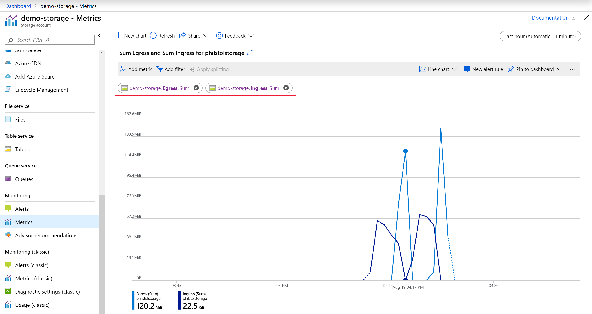
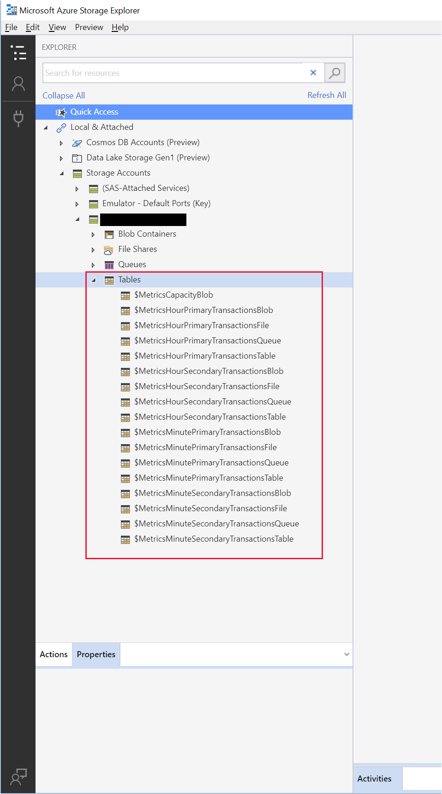

You've decided that the issues that the new Customer Portal is experiencing could be something to do with the way files are stored or uploaded. You want to determine why the problem occurs by capturing the metrics for blob storage. You can use these metrics to find out how many errors occur, and whether the errors are associated with a particular time of day (possible peak periods), or some other factor.

> [!IMPORTANT]
> This exercise is in two parts. You can only perform the second part after waiting for several minutes. This structure is due to how Azure Storage Analytics processes the operations that it monitors to generate aggregated results. You may wish to leave the exercise after you've uploaded files to blob storage, and come back to it after the metrics have been generated.

In this exercise, we'll use Azure portal, and PowerShell, to configure storage metrics for our storage account. We'll then run an application that simulates uploading and downloading many files to and from blob storage in our account.

Later, we'll examine the metrics generated by the application.

## Create a storage account

1. Open the [Azure portal](https://portal.azure.com/learn.docs.microsoft.com?azure-portal=true), and select **Create a resource** at the top left of the page.

1. In the **Search the Marketplace** box, search for and select **Storage account**, and then press <kbd>Enter</kbd>.

1. On the **Storage account** panel, select **Create**. The **Create storage account** panel appears.

1. On the **Basics** tab, enter the following values for each setting.

    > [!NOTE]
    > Your storage account must have a unique name. We suggest using something like **\<*your name or initials*\>storage**. Use this name wherever you see *\<your-storage-account-name\>* in this exercise.

    | Setting  | Value  |
    |---|---|
    | **Project details** |
    | Subscription | Concierge Subscription  |
    | Resource group | <rgn>[Sandbox resource group]</rgn> |
    | **Instance details** |
    | Storage account name | *\<your-storage-account-name\>* |
    | Location | Use the *(US) Central US* |
    | Performance | Standard |
    | Account kind | StorageV2 (general purpose v2) |
    | Replication | Read-access geo-redundant storage (RA-GRS) |

1. Select the **Advanced** tab, and enter the following value.

    | Setting  | Value  |
    |---|---|
    | **Blob storage** |
    | Blob access tier (default) | Hot |

    Leave the remaining settings with their default values.

1. Select **Review + create**, wait for validation to pass, and then select **Create**. Wait for the storage account to successfully  deploy.

## View storage metrics in Azure portal

1. On the deployment panel, select **Go to resource** to navigate to your storage account.

1. In the menu pane, under **Monitoring**, select **Metrics**.

1. Examine the properties of the file, table, and queue services. The default configuration should be similar to that of the blob service.

## Configure minute-level metrics using PowerShell

1. In the Azure portal, in the menu pane for your storage account, under **Settings**, select **Access keys**. Make a note of your storage account key (**key1**).

1. Switch to the Azure Cloud Shell. This shell should display a PowerShell prompt.

1. To create an Azure storage context object, run the following command. Specify your storage account name, and account key where indicated.

    ```powershell
    $context = New-AzureStorageContext -StorageAccountName <your-storage-account-name> -StorageAccountKey <your-storage-account-key>
    ```

1. To configure minute-level storage metrics, with a retention period of seven days, run the `Set-AzStorageServiceMetricsProperty` command.

    ```PowerShell
    Set-AzureStorageServiceMetricsProperty -Context $context -ServiceType Blob -MetricsType Minute -MetricsLevel ServiceAndApi -PassThru -RetentionDays 7
    ```

    Verify that the command completes successfully and generates the following output.

    ```Text
    Version              MetricsLevel                   RetentionDays
    -------              ------------                   -------------
    1.0                  ServiceAndApi                  7
    ```

1. To view the metrics configuration for the blob service in your storage account, run the following command.

    ```powershell
    Get-AzureStorageServiceProperty -Context $context -ServiceType Blob
    ```

    Verify that the output looks similar to the following output.

    ```Text
    Logging.Version                     : 1.0
    Logging.LoggingOperations           : None
    Logging.RetentionDays               :
    HourMetrics.Version                 : 1.0
    HourMetrics.MetricsLevel            : ServiceAndApi
    HourMetrics.RetentionDays           : 7
    MinuteMetrics.Version               : 1.0
    MinuteMetrics.MetricsLevel          : ServiceAndApi
    MinuteMetrics.RetentionDays         : 7
    DeleteRetentionPolicy.Enabled       : False
    DeleteRetentionPolicy.RetentionDays :
    StaticWebsite.Enabled               : False
    StaticWebsite.IndexDocument         :
    StaticWebsite.ErrorDocument404Path  :
    Cors                                :
    DefaultServiceVersion               :
    ```

    The important items are the **HourMetrics** and **MinuteMetrics** properties.

1. Return to the Azure portal. On the **Diagnostics settings (classic)** panel for your storage account, verify that the **Minute metrics** for the blob storage service are enabled.

    

## Upload files to blob storage

1. In the Azure portal, on the page for your storage account, in the menu pane, under **Blob service**, select **Containers**.

1. In the blobs panel, select **+Container**.

1. Add a container named **testcontainer**, using the **Private (no anonymous access)** access level, and then select **OK**.

1. Select **Access keys** on the menu pane for your storage account, under **Settings**. Make a note of the connection string for **key1**.

1. In the Azure Cloud Shell, return to the PowerShell prompt.

1. To switch to download the sample code for this exercise, run the following command.

    ```powershell
    git clone https://github.com/MicrosoftDocs/mslearn-monitor-diagnose-and-troubleshoot-azure-storage storageapps
    ```

1. Move to the **storageapps/StorageTest** folder:

    ```powershell
    cd $HOME/storageapps/StorageTest
    ```

1. Run the sample app that simulates uploading files to blob storage. Replace *\<your connection string\>* with the connection string for your storage account. Ensure that you surround your connection string with double-quotes.

    ```powershell
    dotnet run "<your connection string>" testcontainer
    ```

    As the app runs, a series of *Uploading blob* messages appear, followed by an equal number of *Downloading blob* messages.

1. Wait for one minute, and then repeat the command.

1. Wait for another minute, and then repeat the command again.

1. Wait for several more minutes before continuing with Part 2 of the exercise.

## Visualize metrics using the Azure portal

1. In the Azure portal, navigate to the page for your storage account.

1. In the menu pane, under **Monitoring**, select **Metrics**.

1. In the top right, select **Last Hour** for the time range.

1. Under **Chart Title**, select **Add metric**.

1. Change the **metric namespace** to **Blob**, select **Egress** for **metric**.

1. Under **Chart Title**, select **Add metric**.

1. Change the **metric namespace** to **Blob**, select **Ingress** for **metric**.

    

    > [!NOTE]
    > If your graphs do not display any data, you'll need to wait for a few more minutes while Azure Storage Analytics processes the metrics.

## Examine metrics using Azure Storage Explorer

1. On your desktop, download and install [Azure Storage Explorer](https://azure.microsoft.com/features/storage-explorer/)

1. Start Azure Storage Explorer.

1. On the **View** menu, select **Account Management**.

1. In the **SETTINGS** panel, select **Add an account**.

1. In the **Connect to Azure Storage** dialog box, select **Use a connection string**, and then select **Next**.

1. In the **Attach with Connection String** dialog box, set **Display name** to the name of your storage account, enter the connection string for your account that you noted earlier, select **Next**, and then select **Connect**.

1. In the **SETTINGS** panel, select **Apply**.

1. Expand **Local & Attached**, expand **Storage Accounts**, expand your storage account, and then expand **Tables**. You'll see the **\$Metrics** tables.

    

1. Select **\$MetricsMinutePrimaryTransactionsBlob**. This table contains the minute-by-minute summary of the transactions done in blob storage.

1. In the toolbar, select **Column Options**, and select the following columns:

    - RowKey
    - Timestamp
    - TotalEgress
    - TotalIngress
    - TotalRequests
    - Success
    - AverageE2ELatency
    - AverageServerLatency
    - ServerTimeoutError
    - ThrottlingError
    - NetworkError

    Use the **Move Up** and **Move Down** buttons to arrange the columns in the order previously shown, and then select **OK**.

    :::image type="content" source="../media/4-metrics-data.png" alt-text="Screenshot of Storage Explorer displaying the minute metrics data for blobs.":::

1. Examine the metrics. You should see three sets of **user: All**, **user:GetBlob**, and **user:PutBlob** corresponding to the requests made for each run of the sample app. You can see how many requests failed (ideally none), the reasons for these failures (if any), and the average latency from end-to-end and at the server. The end-to-end latency includes the time messages spend traversing the network. The average server latency is the time that the storage service spends doing the work for the request.
