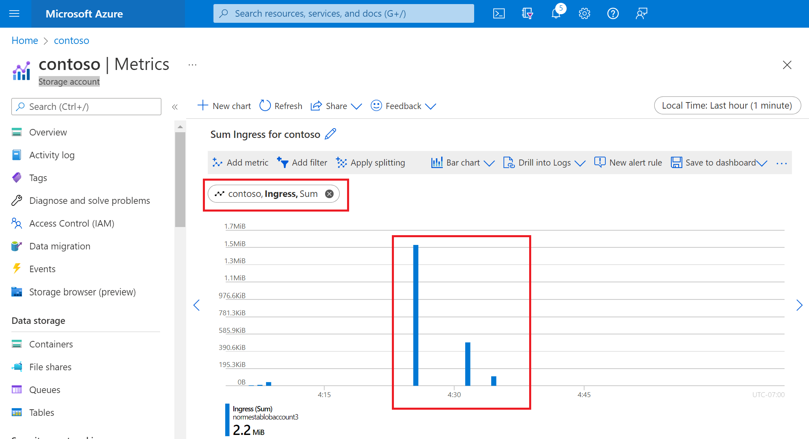
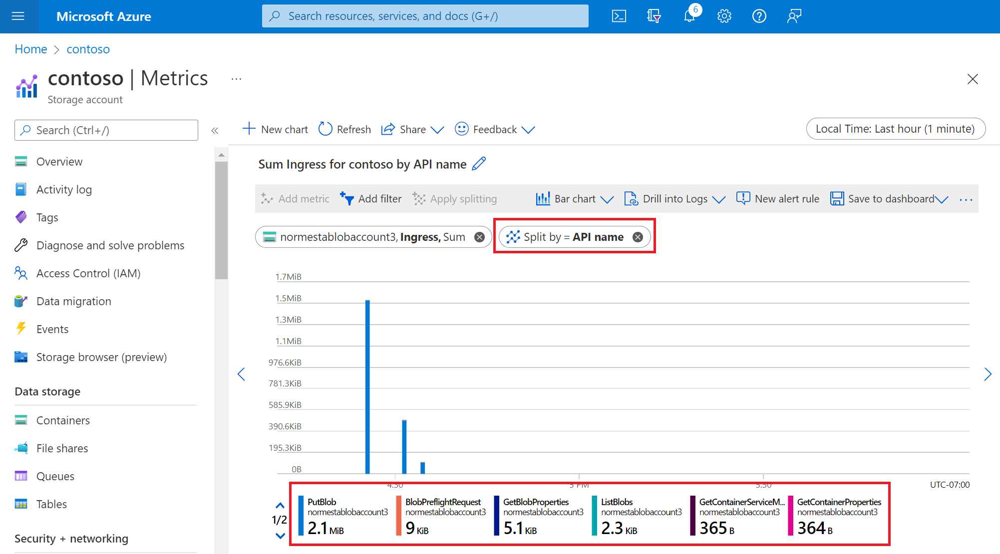

In this exercise, we'll use Azure portal and PowerShell to configure storage metrics for our storage account. We'll upload some files to Blob Storage, and then look at metrics in Metrics Explorer.

## Create a storage account

1. Sign in to the [Azure portal](https://portal.azure.com/learn.learn.microsoft.com?azure-portal=true) by using the same account with which you activated the sandbox.

2. In the Azure portal, select **Create a resource**.

3. In the **Search services and Marketplace** box, search for and select **Storage account**.

   The **Storage account** panel appears.

4. Select **Create**.

   The **Create storage account** panel appears.

5. On the **Basics** tab, fill in the following values for each setting.

    | Setting  | Value  |
    |---|---|
    | **Project details** |
    | Subscription | **Concierge Subscription**  |
    | Resource group | <rgn>[Sandbox resource group]</rgn> |
    | **Instance details** |
    | Storage account name | *\<your-storage-account-name\>*, which is 3 to 24 characters and consists of only lowercase letters and numbers; for example, **monitorstorageaccount** |
    | Region | Use the default region |
    | Performance | **Standard** |
    | Redundancy | **Geo-redundant storage (GRS)** |

6. Select the **Advance** tab. In the **Blob storage** section, make sure that **access tier** is set to **Hot**.

7. Select **Review + create**. After validation passes, select **Create**.

8. On the **Your deployment is complete** panel, select **Go to resource**.

## Add a blob container

Before you can add blobs to a storage account, you need to create a blob container.

1. Under **Data storage**, select **Containers**.  

2. In the **Containers** panel, select **Container**.

3. In the **Name** field, enter **monitor-blobs-container**, and then select **Create**.

## Upload files to the blob container

To upload a single file to the blob container:

1. Open the **monitor-blobs-container** container, and then select **Upload**.

2. On the **Upload blob** pane, select the folder icon.

3. In the **Open** dialog box, select a small text file from your local file system, and select **Open**.

4. Wait for one minute, and then repeat these steps to upload a different file.

5. Wait for another minute, and then repeat these steps to upload another file.

6. Wait for several more minutes before continuing with the next section.

## Visualize metrics in the Azure portal

Transaction metrics are emitted on every request to a storage account, so you should see changes in these values relatively quickly. To create a transaction metrics chart, complete the following steps:

1. In the Azure portal, navigate to the page for your storage account.

2. In the menu pane, under **Monitoring**, select **Metrics**.

3. In the top right, select **Last Hour** for the time range.

4. Under **Time** granularity, select **1 minute**, and then select **Apply**.

5. On the bar that appears beneath the chart title, select **Line chart**, and then **Bar chart**.

6. Under **Chart Title**, select **Add metric**.

7. Change the **metric namespace** to **Blob**, select **ingress** for **metric**.

   The following image shows a bar for every file upload operation in the last hour.

   > [!div class="mx-imgBorder"]
   > 

## Split a metric

Splitting a metric enables you to view additional dimensions in the data. For each file that you uploaded, the Azure portal made several API calls. Each request resulted in bytes transferred. You can split the ingress metric by the API dimension to see the breakdown of bytes transferred by API call. To split a metric, complete the following steps:

1. Select **Apply splitting**

2. In the **Splitting** oval, from the drop-down list, select **API name**.

   View the output in the chart window. The following image shows bytes transferred by API call.

   > [!div class="mx-imgBorder"]
   > 

## Add a filter

Filtering enables you to look at the metrics with greater granularity. You can use a filter to look only at specific API calls used for your upload operation. In this case, we are interested only in bytes related to the file transfer. We want to exclude traffic related to other API calls used to complete the transfer.

1. Select **Add filter**.

2. Under **Property**, select **API name**.

3. Under **Values**, select **PutBlob**.

   The chart shows bars that represent the REST call to the **Put Blob** API.

   > [!div class="mx-imgBorder"]
   > 

4. Select the **X** to the right of the filter oval to remove the filter.
