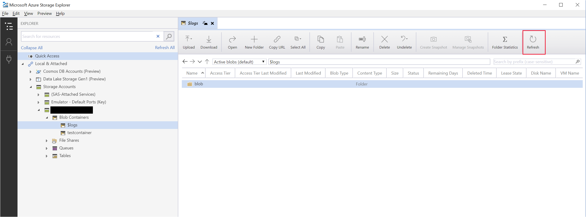

In the Customer Portal scenario, you've decided that you need more detailed information on the operations being performed rather than just the metrics that summarize performance. In this exercise, you'll enable logging for your storage account, rerun the sample application, and then download the log data that is generated.

## Enable Storage Analytics logging

1. In the Azure portal, navigate to the storage account that you created in the previous exercise.

2. In the menu pane, under **Monitoring (classic)**, click **Diagnostic settings (classic)**.

3. Verify that **Status** is still set to **On**.

4. On the **Blob properties** tab, set **Logging version** to **2.0**, select **Read**, **Write**, **Delete**, and **Delete data**. Set the retention period to seven days.

5. Click **Save**.

    

6. Switch to the Cloud Shell running PowerShell.

7. Run the following command, to verify that logging for blob storage has been enabled successfully. Specify your storage account name, and account key where indicated:

    ```powershell
    $context = New-AzureStorageContext -StorageAccountName <your-storage-account-name> -StorageAccountKey <your-storage-account-key>

    Get-AzureStorageServiceLoggingProperty -Context $context -ServiceType Blob
    ```

    The output should look like this:

    ```Text
    Version              LoggingOperations              RetentionDays
    -------              -----------------              -------------
    2.0                  All                            7
    ```

## Run the sample app

1. Move to the **storageapps/StorageTest** folder. This folder contains the code for the sample app that you ran in the previous exercise. The app simulates uploading and downloading files to and from blob storage:

    ```powershell
    cd $HOME/storageapps/StorageTest
    ```

2. Run the sample app as shown below. Replace *\<your connection string\>* with the connection string for your storage account. Ensure that you surround your connection string with double-quotes:

    ```powershell
    dotnet run "<your connection string>" testcontainer
    ```

## Download log data

1. On your desktop, return to Azure Storage Explorer.

2. Under **Storage Accounts**, under your storage account, expand **Blob Containers**, you should see a container named **\$logs**, with a folder named **blob**. If this container does not appear, wait for a few minutes while Storage Analytics processes the log data, and then click **Refresh** in the toolbar:

    
  
3. Double-click **blob** in the detail pane, and then navigate down through the folder structure to the folder containing the latest set of log files. You should see a set of files similar to those in the following image (your folder names will vary, as might the number of log files):

    


////////////// Remove content below ////////////

4. Return to the desktop, and download and install the [AzCopy utility](https://docs.microsoft.com/azure/storage/common/storage-use-azcopy-v10)

5. Once AzCopy is ready, open a command prompt window and run the following command. This command downloads the blobs in the **\$logs** container to a folder on your computer. Replace **\<storage account name\>** with the name of your storage account, and **\<storage account key\>** with the key for your account. Specify a convenient folder on your desktop computer for **\<dest folder\>**:  

    ```command
    azcopy /source:"https://<storage account name>.blob.core.windows.net/$logs" /dest:<dest folder> /sourceType:blob /SourceKey:<storage account key> /S
    ```

    The output should resemble the following summary (the number of files may vary):

    ```Text
    Finished 3 of total 3 file(s).
    [2019/06/25 16:28:00] Transfer summary:
    -----------------
    Total files transferred: 3
    Transfer successfully:   3
    Transfer skipped:        0
    Transfer failed:         0
    Elapsed time:            00.00:00:00

    ```

6. Move to the folder in which you saved the log files, and navigate down to the latest set of log files. The path will be the same that you followed in Azure Storage Explorer, earlier in this exercise. Open the lowest numbered file in this folder using Notepad. The contents will list each of the operations performed by the app, by the Azure portal, and by Azure Storage Explorer. The data is in a raw text format and is difficult to read, but if you look hard you should see entries for **PutBlob**, and **GetBlob** requests, corresponding to the upload and download operations performed by the sample app:

    ```Text
    ...
    2.0;2019-06-25T14:56:54.0079155Z;PutBlob;Success;201;24;22;authenticated;xxxxx;xxxxxx;blob;"https://xxxxxx.blob.core.windows.net:443/testcontainer/testblob7.dat";"/xxxxxx/testcontainer/testblob7.dat";c675930e-f01e-0016-2e66-2b5b8a000000;0;40.91.210.176:7040;2018-03-28;432;1999980;249;0;1999980;"yRI+gcpHB+XCS/JTxrZc9Q==";"yRI+gcpHB+XCS/JTxrZc9Q==";"&quot;0x8D6F97D5CA88E64&quot;";Tuesday, 25-Jun-19 14:56:54 GMT;;"Azure-Storage/9.3.2 (.NET Core)";;"d76a96e0-9f66-4476-b5e0-b8979b69ea85";;;;;;;;
    2.0;2019-06-25T14:56:54.0579639Z;PutBlob;Success;201;27;25;authenticated;xxxxxx;xxxxxx;blob;"https://xxxxxx.blob.core.windows.net:443/testcontainer/testblob8.dat";"/xxxxxx/testcontainer/testblob8.dat";c675932a-f01e-0016-4666-2b5b8a000000;0;40.91.210.176:7040;2018-03-28;432;1999980;249;0;1999980;"yRI+gcpHB+XCS/JTxrZc9Q==";"yRI+gcpHB+XCS/JTxrZc9Q==";"&quot;0x8D6F97D5CB0A6B1&quot;";Tuesday, 25-Jun-19 14:56:54 GMT;;"Azure-Storage/9.3.2 (.NET Core)";;"337db816-beea-4fa9-9f82-5c48b7f025b0";;;;;;;;
    ...
    2.0;2019-06-25T14:58:50.4195457Z;GetBlob;Success;200;37;6;authenticated;xxxxxx;xxxxxx;blob;"https://xxxxxx.blob.core.windows.net:443/testcontainer/testblob39.dat";"/xxxxxx/testcontainer/testblob39.dat";c676d992-f01e-0016-0766-2b5b8a000000;0;40.91.210.176:7040;2018-03-28;354;0;421;1999980;0;;;"&quot;0x8D6F97D9CC90D46&quot;";Tuesday, 25-Jun-19 14:58:41 GMT;;"Azure-Storage/9.3.2 (.NET Core)";;"c1ca8eaf-abd3-4209-91f4-6ad28987f492";;;;;;;;
    2.0;2019-06-25T14:58:50.4605845Z;GetBlob;Success;200;39;6;authenticated;xxxxxx;xxxxxx;blob;"https://xxxxxx.blob.core.windows.net:443/testcontainer/testblob40.dat";"/xxxxxx/testcontainer/testblob40.dat";c676d9ae-f01e-0016-2166-2b5b8a000000;0;40.91.210.176:7040;2018-03-28;354;0;421;1999980;0;;;"&quot;0x8D6F97D9CD4F717&quot;";Tuesday, 25-Jun-19 14:58:41 GMT;;"Azure-Storage/9.3.2 (.NET Core)";;"8782f650-2d56-4ea3-9acd-ac3d830fc90f";;;;;;;;
    ...
    ```

7. Close Notepad.
