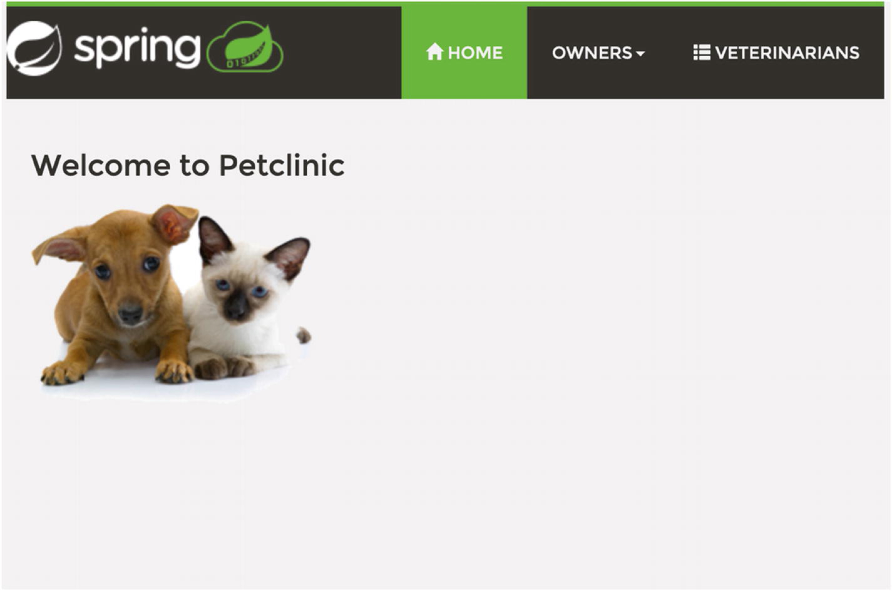

In this exercise, you'll configure a Sample Application to be ready for monitoring.

## Access the sample application

In this exercise, you'll clone a GitHub repository that contains all the code for Monitoring.

1. On GitHub, clone the below repository:

   ```html
   https://github.com/roryp/azure-spring-cloud-reference-architecture.git
   ```

## Setup and run the Setup script

Edit the deployPetClinicApp.sh and customize the below parameters for your environment

| Variable | Description |
|-|-|
| project_directory| local directory that will be used to clone the repository and build/deploy the application |
| subscription | Your Azure Subscription ID. To find your Subscription ID, Sign in to the Microsoft Azure portal. In the left-hand menu, select "All Services". In the General section, select "Subscriptions". Copy the Subscription ID for the applicable subscription |
| resource_group | Provide a new or existing resource group name |
| region | The Azure region you'll use. You can use `westeurope` by default, but we recommend that you use a region close to where you live. To see the full list of available regions, enter `az account list-locations` |
| spring_cloud_service | Name of your Azure Spring Cloud instance |
| mysql_server_name | The name of your MySQL server. It should be unique across Azure |
| mysql_server_admin_name | Username for the MySQL Administrator. The admin name can't be "azure_superuser", "admin", "administrator", "root", "guest, or "public" |
| mysql_server_admin_password | A new password for the server admin user. The password must be 8 to 128 characters long and contain a combination of uppercase or lowercase letters, numbers, and non-alphanumeric characters (!, $, #, %, and so on).|

## Run the setup script

```bash
cd petclinic
az login
sh deployPetClinicApp.sh
```

## Test the application

Navigate to the URL provided by the previous command to open the Pet Clinic microservice application.



## Next steps

In the next exercise, you'll explore logging for your sample application.
