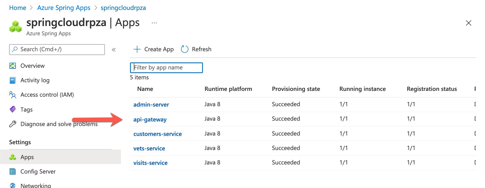
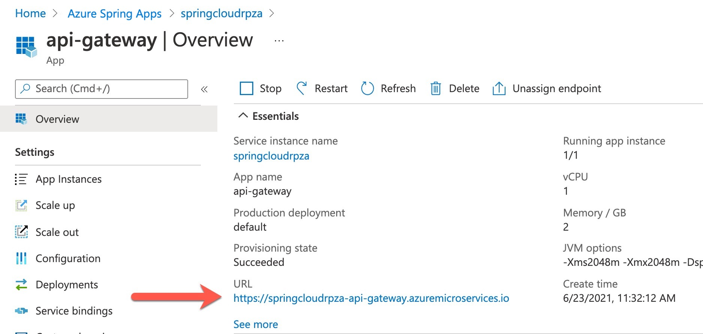

In this exercise, you'll configure a sample Application to be ready for monitoring. Later, you'll access the collected monitoring data and view it in the Azure portal.

## Introduction

In this exercise, you'll clone a GIT repository and run a script that sets-up an Azure Spring Cloud application and Azure Database for MySQL.
The script deploys a well-known PetClinic application and is built around small independent services, communicating over HTTP via a REST API.

## The sample application

The PetClinic application is decomposed into four core microservices. All of them are independently deployable applications organized by business domains.

- Customers service: Contains general user input logic and validation including pets and owners information (Name, Address, City, Telephone).
- Visits service: Stores and shows visits information for each pets' comments.
- Vets service: Stores and shows Veterinarians' information, including names and specialties.
- API Gateway: A single entry point into the system, used to handle requests and route them to an appropriate service, and aggregate the results.

## Set up the  sample application

In a web browser, open https://shell.azure.com and select "Bash" mode in the top right hand side.
Next, run the following command to clone the sample repository and open the build in the Azure editor:

   ```bash
   git clone https://github.com/roryp/azure-spring-cloud-reference-architecture.git
   cd azure-spring-cloud-reference-architecture
   cd petclinic
   code deployPetClinicApp.sh
   ```

## Setup and run the Setup script

When you run the above command, a window will pop up with the file 'deployPetClinicApp.sh' ready to be edited in the build in Azure editor.

1. Edit the variables in the `deployPetClinicApp.sh` and customize the following parameters for your environment:

| Variable | Description |
|-|-|
| resource_group | Provide a new or existing resource group name |
| region | The Azure region you'll use. You can use `westeurope` by default, but we recommend that you use a region close to where you live and that also support Azure Spring Cloud. To see the full list of available regions, see the Summary unit at the end of this module |
| spring_cloud_service | Name of your Azure Spring Cloud instance |
| mysql_server_name | The name of your MySQL server. It should be unique across Azure |
| mysql_server_admin_name | Username for the MySQL Administrator. The admin name can't be "azure_superuser", "admin", "administrator", "root", "guest, or "public" |
| mysql_server_admin_password | A new password for the server admin user. The password must be 8 to 128 characters long and contain a combination of uppercase or lowercase letters, numbers, and non-alphanumeric characters (!, $, #, %, and so on).|

2. Save the file by selecting the ... action panel in the top right of the editor and select "Save".

3. Close the editor - open the ... action panel in the top right of the editor and select "Close".

4. Don't close the Azure Cloud Shell as next, we'll run the setup script.

## Run the setup script

The script takes 15-30 minutes to run and includes the creation of an Azure spring Cloud and a MySQL instance. This sample script also populates some sample data for the monitoring logs, traces, and metrics.

In the already open Azure Cloud Shell, run the below shell script. Leave the browser window and Azure Cloud Shell open while running. Store the URL it when the script finishes as the public endpoint for your environment:

```bash
sh deployPetClinicApp.sh
```

## Test the application

Next, we'll verify your apps are installed and registered via the Azure portal.

- Open the Azure portal
- Select "Azure Spring Cloud" from the list of Azure services
- Select your Azure Spring Cloud instance
- On the right-hand side, select "Apps" under settings
- Verify all the apps are running and registered



- On the left-hand side, select the "api-gateway" app
- The URL for your app is listed on the left-hand side properties as "URL"



In a web browser, navigate to the URL of your api-gateway to open the Pet Clinic microservice application.

> [!TIP]
> Access the Public Url in the format of "https://> <your-app>-api-gateway.azuremicroservices.io".

Next, navigate to the "Owners" tab and select "Find all owners".
Confirm your sample app is up and running, populated with data and now ready for you to explore.


## Next steps

In the next exercise, you'll explore logging for your sample application.
