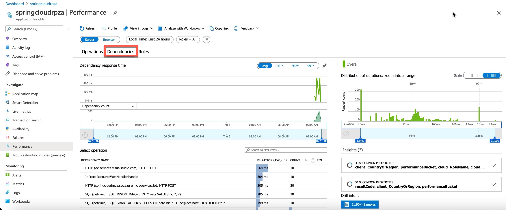
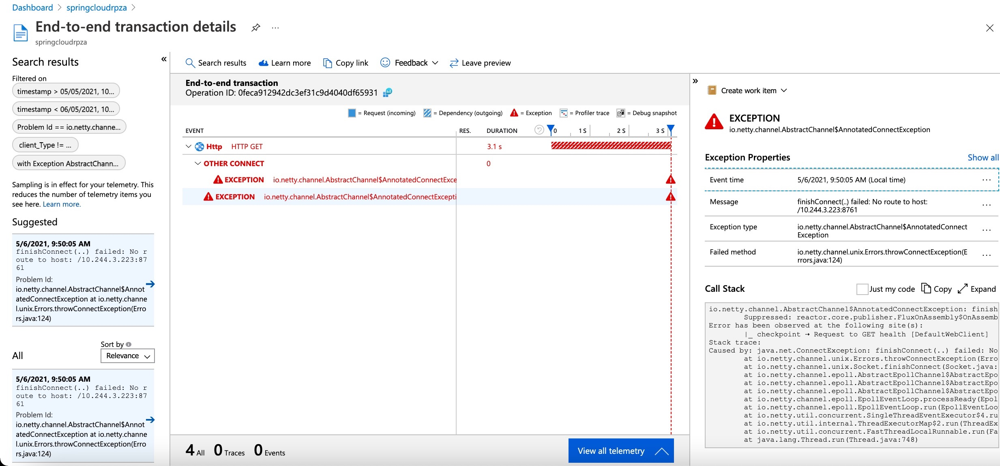
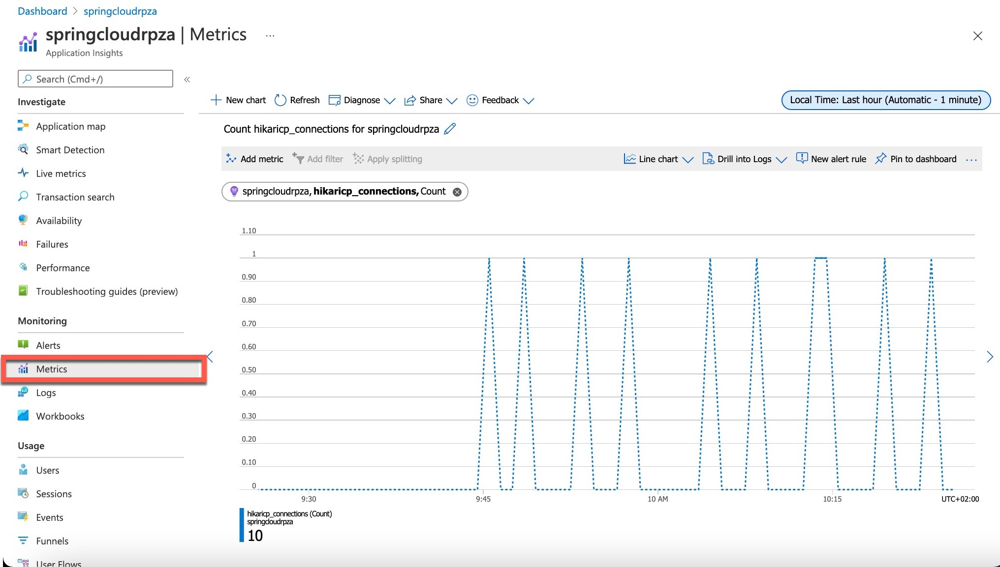
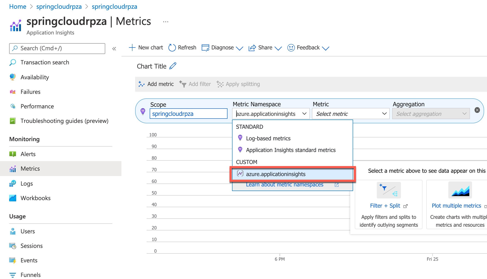
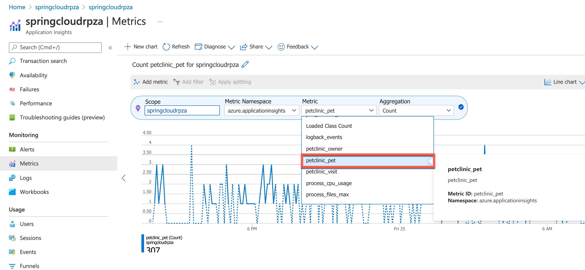
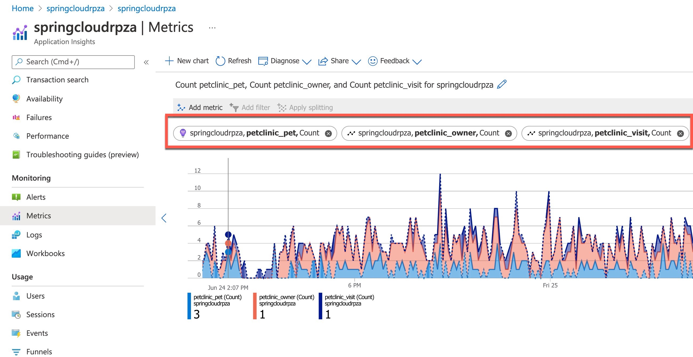
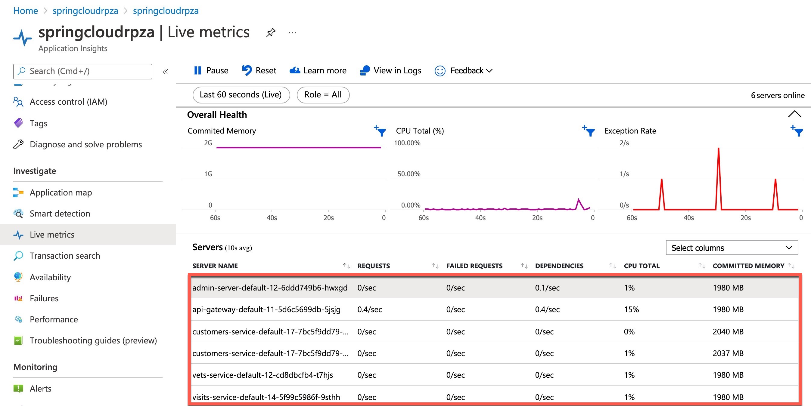

In this exercise, with zero configuration, you'll effortlessly monitor data flows for your sample application.

## Monitor the Application with Application insights

Select you Azure Spring instance and in the left navigation pane, select Application Insights to jump to the Overview page of Application Insights.

### Application Map

Application Map helps you spot performance bottlenecks or failure hotspots across all components of your distributed application. On the left, navigate to **Application Map** where you can see a view of your Azure Spring Cloud microservices:

:::image type="content" source="../media/4-distributed-tracking-new-ai-agent.jpg" alt-text="Application map":::

Applications that are operating correctly (green) and those applications with bottlenecks (red).
In the Application Map above, each of the names in green boxes are different services of your Azure Spring Cloud.
You can easily identify issues in their applications and quickly troubleshoot and fix them. Each node on the map represents a MicroService or its dependencies with health KPI and alerts status. You can select from any component to more detailed diagnostics, such as Application Insights events.

### Performance

On the left, navigate to **Performance** where you can see response times and request counts for operations exposed by your applications.

:::image type="content" source="../media/4-petclinic-microservices-performance.jpg" alt-text="Performance":::

Next, on the right, navigate to **Dependencies** where you can see all your dependencies and their response times and request counts.
You can see the performance number for dependencies, particularly SQL calls:

You can select a SQL call or a dependency to see the transaction in context:

### Failures/Exceptions

Next, select **Failures** in the Application Insights resource menu located in the Investigate section. In this view, you'll see top three failure response codes, top three exception types, and top three failing dependency types.

Select an exception and drill in for meaningful insights and actionable stack trace:

### Metrics

Spring Boot registers many core metrics: JVM, CPU, Tomcat, Logback...
You can see metrics contributed by Spring Boot apps, Spring Cloud modules, and dependencies.
The chart below shows `gateway-requests` (Spring Cloud Gateway), `hikaricp_connections` (JDBC Connections), and `http_client_requests`.

### Custom Metrics

To create a metric chart, open the Metrics tab and follow these steps:

1. Ensure your Azure Spring Cloud is selected in the resource scope picker. It will already be populated if you opened metrics explorer from the resource's menu.

2. Next, under **namespaces**, select the **azure.applicationinsights** namespace. The namespace is just a way to organize metrics so that you can easily find them.

3. Next, under metrics, add the following custom metrics and aggregation:

* Metric `petclinic_pet`, Aggregation: `count`

4. Add the metrics for the `owner` and `visit` services:

* Metric `petclinic_owner`, Aggregation: `count`
* Metric `petclinic_visit`, Aggregation: `count`

5. Next, on the top right-hand side, change the graph type to **Area Chart**

6. Your final graph will show the counts in the last 24 hours for each of the pet, vet, and owner microservices:

### Availability

You can use the Availability Test feature in Application Insights to monitor the availability of applications in Azure Spring Cloud. This feature is a recurring test to monitor the availability and responsiveness of applications at regular intervals. It can proactively alert you if your applications aren't responding or if they respond too slowly.

### Live Metrics

When you deploy a new version of your web app, you want to know immediately its effect on performance. Have response times improved or worsened, or is it showing failures? Watch Live Metrics Stream in Application Insights while your deployment is happening, and you’ll see the effect immediately. If there are problems, you could back out the deployment before too many users are affected.
Live Metrics Stream enables you to probe the beating heart of your live, in-production web application. You can select and filter metrics and performance counters to watch in real time, without any disturbance to your service. You can also inspect stack traces from sample failed requests and exceptions.

On the left, navigate to **Live Metrics** where you can see live metrics practically in real time, within only one second:

Scroll down the metrics to see the metrics for each microservice:

## Next steps

In the next unit, we'll discuss monitoring your entire solution.
