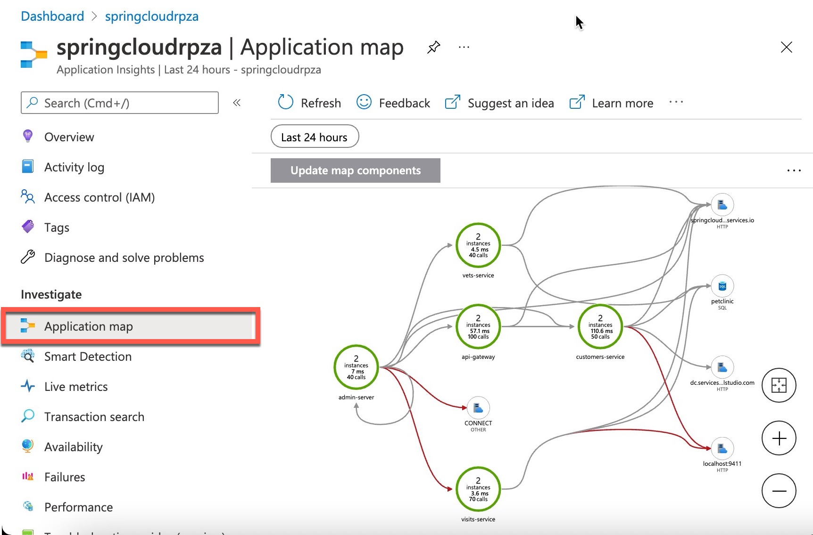
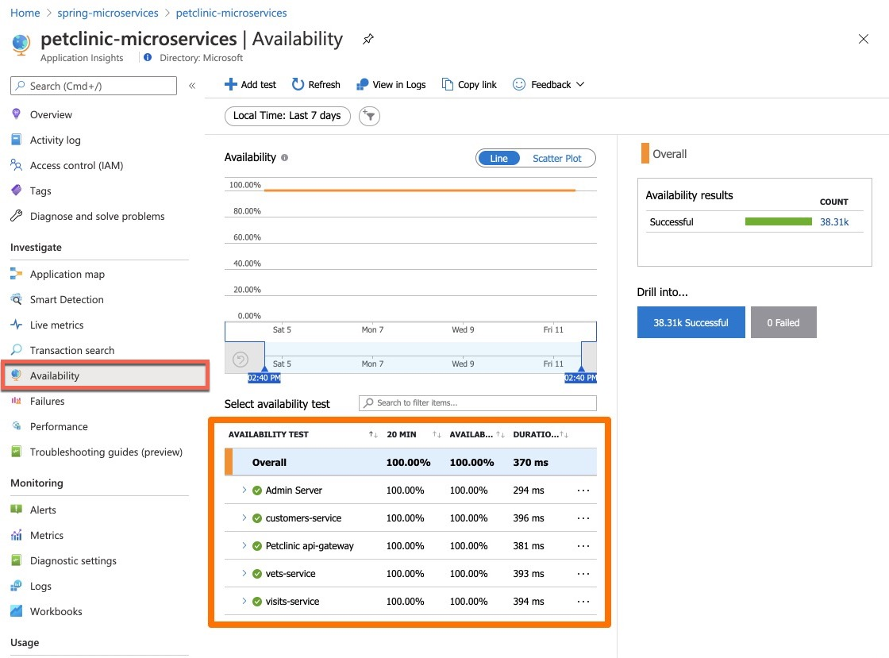

In this exercise, you'll configure an the sample Application for Monitoring.

## Monitor the Application

Open the Application Insights created by Azure Spring Cloud and start monitoring microservice applications.

Navigate to the `Application Map` blade:

Navigate to the `Performance` blade:

Navigate to the `Performance/Dependenices` blade - you can see the performance number for dependencies,
particularly SQL calls:

Click on a SQL call to see the end-to-end transaction in context:

Navigate to the `Failures/Exceptions` blade - you can see a collection of exceptions:

Click on an exception to see the end-to-end transaction and stacktrace in context:

Navigate to the `Metrics` blade - you can see metrics contributed by Spring Boot apps, Spring Cloud modules, and dependencies.
The chart below shows `gateway-requests` (Spring Cloud Gateway), `hikaricp_connections` (JDBC Connections) and `http_client_requests`.

Spring Boot registers a lot number of core metrics: JVM, CPU, Tomcat, Logback...
The Spring Boot auto-configuration enables the instrumentation of requests handled by Spring MVC.
All those three REST controllers `OwnerResource`, `PetResource` and `VisitResource` have been instrumented by the `@Timed` Micrometer annotation at class level.

* `customers-service` application has the following custom metrics enabled:
  * @Timed: `petclinic.owner`
  * @Timed: `petclinic.pet`
* `visits-service` application has the following custom metrics enabled:
  * @Timed: `petclinic.visit`

You can see these custom metrics in the `Metrics` blade:

You can use the Availability Test feature in Application Insights and monitor
the availability of applications:

Navigate to the `Live Metrics` blade - you can see live metrics on screen with low latencies < 1 second:

## Next steps

In the next unit, we'll discuss monitoring your entire solution.
