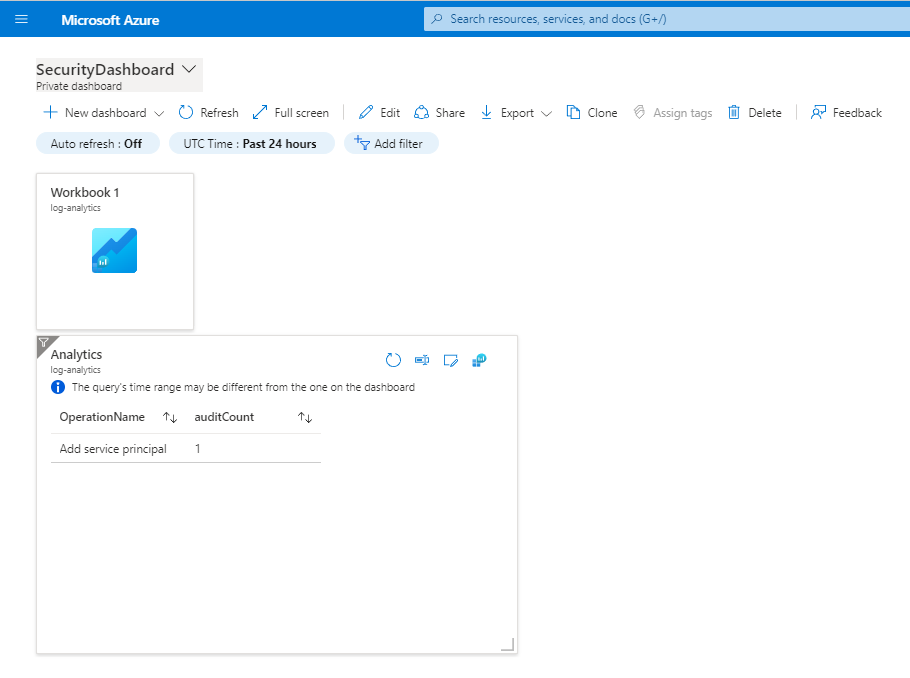

So far, you've learned about the various user-based logging methods provided by Azure. You've learned how to route the audit and sign-in data to an Azure Log Analytics workspace. Also, you've seen how to use this data to create various views and reports for your security team.

In this exercise, you implement a dashboard for the security team, so they can see the potential of Azure Monitor logs and alerting to help them better understand user behavior.

## Create a security dashboard

1. In the Azure portal, search for **Dashboard**.

1. Select **New dashboard** > **Blank dashboard**.

    :::image type="content" source="../media/dashboard-blank.png" alt-text="Screenshot that shows how to create a new dashboard.":::

1. At the prompt, name the dashboard **SecurityDashboard**, and then select **Done**. For now, leave the dashboard blank. In the next few steps, you'll be adding a report query to the dashboard.

    :::image type="content" source="../media/dashboard-save.png" alt-text="Screenshot that shows how to save a dashboard.":::

1. Select **Share**.

    :::image type="content" source="../media/dashboard-share.png" alt-text="Screenshot of the Share button.":::

1. In the **Sharing + access control** pane, confirm that the information is correct:  

   - The dashboard name is **SecurityDashboard**.
   - For the subscription name, keep the default value.
   - The **Publish to the 'dashboards' resource group** check box is cleared.
  
1. Select **Publish** to make the empty dashboard available.

    :::image type="content" source="../media/dashboard-share-access.png" alt-text="Screenshot of the Sharing + access control pane.":::

## Pin a workbook to a dashboard

You can pin a workbook to a dashboard so that it's easy to find or to share it with other users.

1. To pin a workbook to a dashboard, in the left menu under **General**, select **Workbooks**. Open the workbook you want to pin.

1. In the menu bar, select the **Pin** icon.

1. In the **Pin to dashboard** pane, select the options you want to use. For this exercise, select **SecurityDashboard**, the dashboard you created.

    :::image type="content" source="../media/workbook-pin.png" alt-text="Screenshot of pinning workbook.":::

1. Select **Pin**.

1. Go to the dashboard to view your analytics results.

   

To change the title of the report in the dashboard, do the following:

1. Select **Edit** (pencil icon) in the report tile.

1. Select the title, and change it to **Top User Events past seven days**.

1. Remove the subtitle, which you don't need for this report.

    :::image type="content" source="../media/query-rename.png" alt-text="Screenshot of renaming query.":::

You can use them to display common views of your audit and sign-in data.

In the next section, you set up a dashboard that your security team can begin to use.

## Build a query for the dashboard

1. In the Azure portal, select **All resources**.

1. Select the Log Analytics workspace you created earlier.

1. Under **General**, select **Logs**.

1. For this exercise, you want to know the most common user event for last week. In your query editor, paste the following query.

    ```kusto
    AuditLogs
    | where TimeGenerated >= ago(7d)
    | summarize auditCount = count() by OperationName
    | sort by auditCount desc
    ```

1. In the menu bar, select **Run** to ensure that the query returns data.

    :::image type="content" source="../media/logs-search.png" alt-text="Screenshot of searching logs.":::

1. When you're satisfied that you have the data you want, select **Done editing**, and then select the **Save** icon in the menu bar.

1. Enter a descriptive name, like *Common User Events Last 7 days*.  

1. Select or enter the subscription, resource group, and location you want to use.

1. Select **Save**.

## Pin query results to a dashboard

You can pin query results to a dashboard so that they're easy to find or to share them with other users.

1. In your Log Analytics workspace, under **General**, select **Logs**.

1. In the **Queries** dialog, search for the query you created, and then select **Run**.

1. To pin query results to a dashboard, in the menu bar, select the **Pin** icon.

1. In the **Pin to dashboard** pane, select the options you want to use. For example, select **SecurityDashboard**, which you created earlier.

1. Select **Pin**.

    :::image type="content" source="../media/query-pin.png" alt-text="Screenshot of pinning a query.":::

1. Go to the dashboard to view your analytics results.

## Edit or customize an item in a dashboard

To change the title of an item in a dashboard or change the dashboard view:

1. Select **Configure tile settings** (gear icon) in the item tile.

1. In the **Configure tile settings** pane, change the title to **Top User Events past week**.

1. Select **Apply**.

    :::image type="content" source="../media/5-pin-query.png" alt-text="Screenshot of editing a report on the dashboard.":::

1. To change how an item appears in the dashboard, select **Customize** (pencil icon), and then select from the options.

1. Select **Save**.

    :::image type="content" source="../media/5-customize-dashboard.png" alt-text="Screenshot of customizing a report on the dashboard.":::

You've now created a dashboard with a query report embedded in it.

## Export a report to Excel

When you're satisfied with the report, export it to Excel:

1. In the log query view, select the **Export** dropdown, and then select **Open in Excel**.

   :::image type="content" source="../media/export-excel.png" alt-text="Screenshot of the options in the Export dropdown.":::

You can save the CSV file to your local computer.

