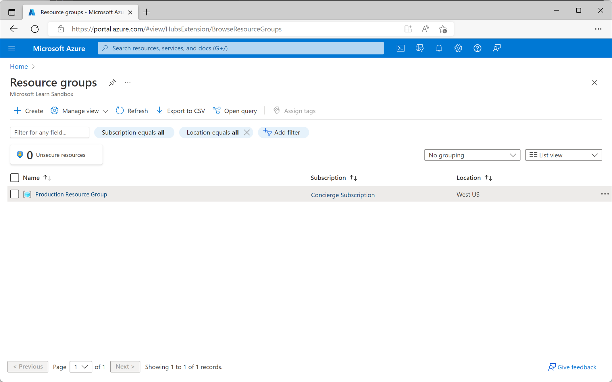

Your organization has a resource group that contains both production resources and development resources. You're going to move the development resources out of that group into their own resource group, which is dedicated to development.

In this unit, you'll learn how to go to your production resource group and identify the development resources that don't belong there.

## Organize Azure resource into resource groups

You use resource groups to logically group resources together. Each resource must be part of a single resource group. A resource group can hold many different types of resources in different regions.

Generally, resource groups hold resources that have some relation. For example, you can have a resource group for testing and development, and a separate one for production.  A production resource group could hold resources that support a live website. These resources can be several virtual machines, storage accounts, virtual networks, SQL Database instances, and more.

Ensure that all the resources in your resource group have a single life cycle. You count on having to update, delete, or deploy these resources together. If you believe a resource doesn't fit into the life cycle of other resources, move it to another resource group.

You can control which resources are available to different types of users. In this way, these groups help you protect your resources and control costs.

## Navigate resource groups

Before starting to move resources, you must understand how to navigate to the appropriate resource group. You'll find resource groups in the Azure portal by selecting **Resource Groups**. This action lists all your resource groups. It is recommended that you use a consistent naming convention that is useful for your resource groups. For example, an organization could have a resource group named "project-infrastructure-resource-group" to denote that it is a resource group for a certain project's infrastructure. It is ultimately up to your organization to decide how resource groups should be named.

You'll find all the contents of a resource group by selecting it. These resources are all shown in a table and, at this stage, you can add new resources. You can search for specific resources, or filter them based on their resource types. You could also move resources to another resource group.

## Use tags to find resources

Tags are name and value pairs that you apply to resources. For example, you can set the name "environment" and its value as "development" for all resources that aren't meant for production. In this way, you ensure that you can easily find related resources and keep them organized. 

Many resource types have a **Tags** page in the portal that you can use to add tags:

Both users and custom code can use tags to find resources. In the portal, to see a list of all the tags that have been assigned, click **All services**, and then click **Tags**. 

If you click on a tag in the list, you can see a list of all the resources with that tag. Alternatively, on the **All resources** page, you can filter the resources by their tags.

Tags have limitations:

- Always check whether your Azure resource supports tags. For example, you can't set tags on generalized VMs. 
- You can apply tags on resource groups but tags are not automatically inherited by resources from their resource group. If you want all the resources in a resource group to have a tag, you must manually assign it. 
- A maximum of 50 tags can be applied to a single resource or resource group in Azure. 

Tags should help you locate and identify resources. Carefully consider how your tags should be allocated so that they help administrators find the resources they are interested in.
