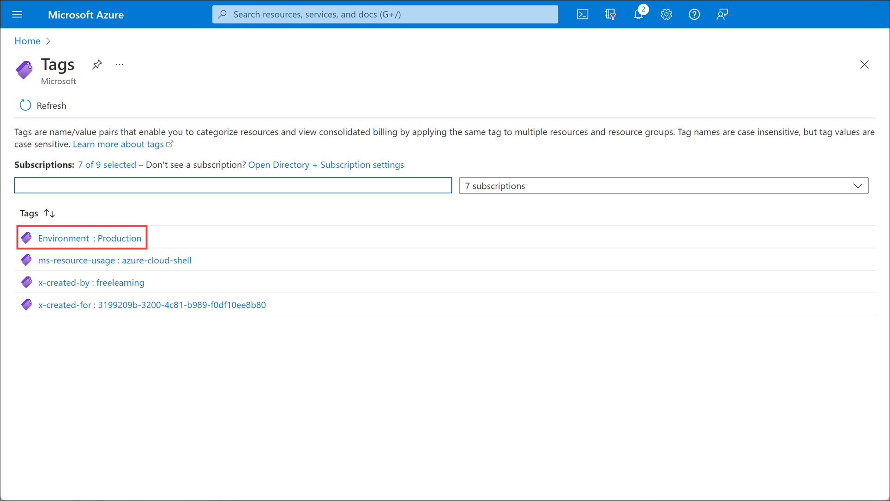

Your organization has a resource group that contains both production resources and development resources. You're going to move the development resources out of that group into their own resource group, which is dedicated to development.

In this unit, you'll learn how to go to your production resource group and identify the development resources that don't belong there.

## Organize Azure resources into resource groups

You use resource groups to logically group resources together. Each resource must be part of a single resource group. A resource group can hold many different types of resources in different regions.

Generally, resource groups hold resources that are related. For example, you can have a resource group for testing and development, and a separate one for production. A production resource group might hold resources that support a live website. These resources can include several virtual machines, storage accounts, virtual networks, and Azure SQL Database instances.

Make sure that all the resources in your resource group have a single lifecycle. You want to update, delete, or deploy these resources together. If you believe a resource doesn't fit into the lifecycle of other resources, move it to another resource group.

You can control which resources are available to different types of users. In this way, resource groups help you protect your resources and control costs.

You might need to change who's billed for resources in resource groups. You can move resources from one resource group to another resource group in a different subscription. In this case, you'd need to put any dependent resources into one resource group. Then move the resources from that resource group into a new resource group in the other subscription.

## Use a consistent naming convention

To help identify and organize your resource groups, use a consistent naming convention. For example, you might have a resource group named "project-infrastructure-resource-group" to denote that it's a resource group for a certain project's infrastructure.

## Find resource groups

Find resource groups in the Azure portal by selecting **Resource Groups** from the left-hand side. You'll see a list of all your resource groups.

When you select a resource group, you see all the resources in it. Within the resource group, you can:

- Search for specific resources.
- Filter resource based on type.
- Create a resource. 
- Move resources to another resource group.

## Use tags to find resources

Tags are name and value pairs that you apply to resources. For example, you can set the name "environment" and its value as "development" for all resources that aren't meant for production. In this way, you ensure that you can easily find related resources and keep them organized. 

Many resource types have a **Tags** page in the portal that you can use to add tags.

Both users and custom code can use tags to find resources. In the portal, to see a list of all the tags that have been assigned, search on "Tags".

If you select a tag in the list, you see a list of all the resources with that tag. Or, on the **All resources** page, you can filter the resources by tags.

Tags have limitations:

- Always check whether your Azure resource supports tags. For example, you can't set tags on generalized VMs. 
- You can apply tags on resource groups, but tags aren't automatically inherited by resources from their resource group. If you want all the resources in a resource group to have a tag, you must do this manually.
- You can apply a maximum of 50 tags to a single resource or resource group in Azure.

Carefully consider how you assign your tags so that they help your organization locate and identify resources.
