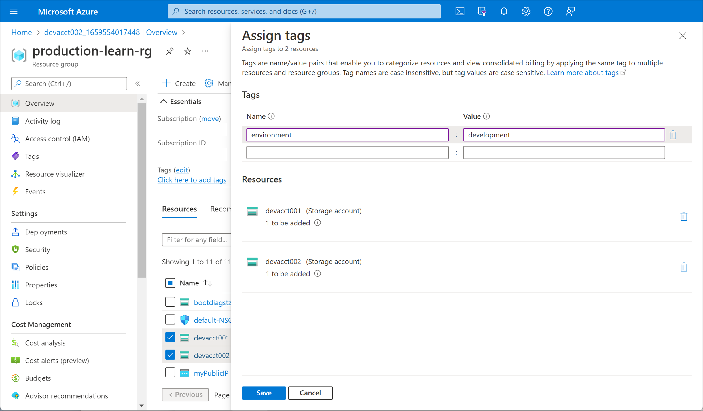

Your organization uses different resources for production and development environments. Some resources that were created for development work were put into the same resource group as production resources. You need to be able to identify which resources belong to a development resource group.

In this unit, you'll create both development and production resources, and put them in a production resource group. You'll tag your resources appropriately. You'll then filter the resources to identify all your development resources from a single location.

[!include]

## Create resources

Create a resource group to act as the production resource group.

1. Sign in to the Azure portal.

1. On the home page, under **Azure services**, select **Resource groups**. The **Resource groups** pane appears.

1. In the top menu bar, select **Create**. The **Create a resource group** pane appears.

1. On the **Basics** tab, enter the following values for each setting.

    | Setting | Value |
    |---|---|
    | **Project details** |
    | Subscription | From the dropdown list, select your account's subscription  |
    | Resource group | Enter *production-learn-rg* |
    | **Resource details** |
    | Region | From the dropdown list, select a location close to you |

1. Select **Review + create**. After validation passes, select **Create**.

1. Use the following quickstart template to create a virtual machine (VM) in your production resource group: [Deploy a simple Windows VM](https://azure.microsoft.com/resources/templates/vm-simple-windows/).  
1. Select **Deploy to Azure** on the template page. The **Deploy a simple Windows VM** pane appears.

1. On the **Basics** tab, enter the following values for each setting.

    | Setting | Value |
    |---|---|
    | **Project details** |
    | Subscription | From the dropdown list, select your account's subscription |
    | Resource group | From the dropdown list, select *production-learn-rg* |
    | **Instance details** |
    | Admin Username | Enter a unique username |
    | Admin Password | Enter a unique password |

1. Accept the remaining default values.

1. Select **Review + create**. After validation passes, select **Create**. Wait for deployment to complete.

## Create additional resources

Now, you need to create some additional resources that you'll eventually move to a development resource group.

1. Return to the Azure portal home page, and under **Azure services**, select **Create a resource**. The **Create a resource** pane appears.

1. In the search box, search for and select **Storage account**, and select **Create**. The **Create a storage account** pane appears.

1. On the **Basics** tab, enter the following values for each setting.

    | Setting | Value |
    |---|---|
    | **Project details** |
    | Subscription | From the dropdown list, select your account's subscription  |
    | Resource group | From the dropdown list, select *production-learn-rg* |
    | **Instance details** |
    | Storage account name | Enter a unique storage account name that starts with the prefix *dev* |

1. Accept the remaining default values.

1. Select **Review + create**. After validation passes, select **Create**. Wait for deployment to complete.

1. Create another storage account with a unique name by repeating the storage account creation steps again. Wait for deployment to complete.

You now have a production resource group with two additional storage accounts that you'll move to a development resource group.

## Apply tags to your resources

Now, use the Azure portal to apply tags to resources so you can identify and locate them later.

1. In the Azure portal, on the **Home** page, under **Azure services**, select **Resource groups**. The **Resource groups** pane appears.

1. Select the **production-learn-rg** resource group. The *production-learn-rg* resource group pane appears.

1. Select the check box next to the **Name** field for both storage accounts you created.

    

1. In the top menu bar, select **Assign tags**. The **Assign tags** pane appears.

1. Enter the following values for each setting.

    

    | Setting | Value  |
    |---------|---------|
    | Name    |   environment     |
    | Value     |  development    |

1. Select **Save**. Your resources have now been tagged with *development*.

1. Repeat these steps to assign the following tag to the remaining resources.

    | Setting | Value  |
    |---------|---------|
    | Name    |  environment     |
    | Value   |  production      |

## Filter and identify your development resources

Now you'll filter your resources and find your development tagged resources.  

1. At the top of the Azure portal, search for and select *Tags*.

    

    The **Tags** pane appears.

1. Select the **environment:development** tag.

    All your tagged development resources are listed in one place.

Keep your portal instance open to use later.
