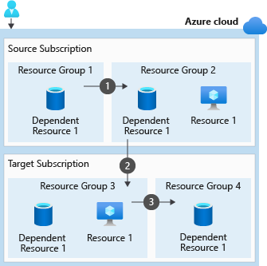

In this unit, you'll learn what steps you might need to take and what tools you can use to move resources between resource groups.

## Understand resource moves

When you start a move operation, the resource group holding your resources and the new destination resource group are locked. You can't do write or delete operations on the resource groups until the move operation ends. Your resources aren't affected but you can't add, delete, or update any resources in these resource groups.

Your moved resources don't change location. For example, if you have a storage account in the East US region, and you move it to another resource group, it keeps its East US region location.

## Move resources between subscriptions

Depending on the resource type, you can move your resources between subscriptions or between resource groups within the same subscription.

For our scenario, we just need to move a pair of storage accounts to a different resource group within the same subscription. If, for billing reasons, we needed to move something like an Azure Web App, and all its dependant resources under a different subscription, that might include more steps. As mentioned in unit 2, you'd need to move all dependant resources into one resource group. Then, you can move those resources into a new resource group under a different subscription. The following diagram shows the steps you might need to take. This example includes a resource with one dependent resource in a separate resource group.




- Step 1: Move the dependent resources into one resource group with the resource.
- Step 2: Move the resource and dependent resources together from the source subscription to the target subscription.
- Step 3: Optionally, redistribute the dependent resources to different resource groups within the target subscription.

## How to move resources

After you've identified the resources you want to move and verified they can be moved, you create a resource group and move the resources into that resource group.

You can use the Azure portal, Azure CLI, PowerShell, or Azure REST API to move your resources. In the next unit, you'll use the Azure portal to move storage accounts to a new resource group. So, in this unit, let's see what commands you'd use to move resources with Azure CLI or PowerShell.

### Move resources by using Azure CLI

The following commands show you how to move a resource by using Azure CLI.

1. Create a resource group.

   ```azurecli
   az group create --name <destination resource group name> --location <location name>
   ```
1. Get the resource.

   ```azurecli
    yourResource=$(az resource show --resource-group <resource group name> --name <resource name> --query id --output tsv)
   ```

1. Move resource to another resource group by using the resource ID.

    ```azurecli
    az resource move --destination-group <destination resource group name> --ids $yourResource
   ```

1. Return all the resources in your resource group to verify your resource moved.

    ```azurecli
    az group show --name <destination resource group name> 
   ```

1. Update the resource IDs in any tools and scripts that reference your resources.

### Move resources by using Azure PowerShell

The following commands show you how to move a resource by using Azure PowerShell.

1. Create a resource group.

   ```powershell
   New-AzResourceGroup -Name <destination resource group name> -Location <location name>
   ```

1. Get the resource.

   ```powershell
   $yourResource = Get-AzResource -ResourceGroupName <resource group name> -ResourceName <resource name>
   ```
1. Move resource to another resource group by using the resource ID.

    ```powershell
    Move-AzResource -DestinationResourceGroupName <destination resource group name> -ResourceId $yourResource.ResourceId
   ```
1. Return all the resources in your resource group to verify your resource moved.

   ```powerShell
   Get-AzureRmResource -ResourceGroupName <destination resource group name> | ft
   ```

1. Update the resource IDs in any tools and scripts that reference your resources.

