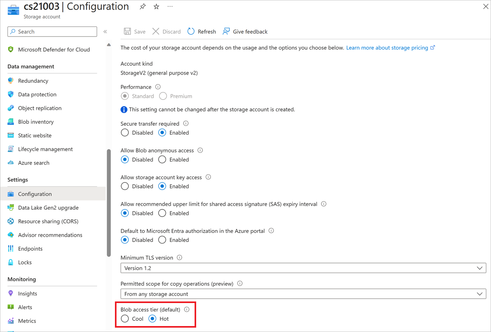
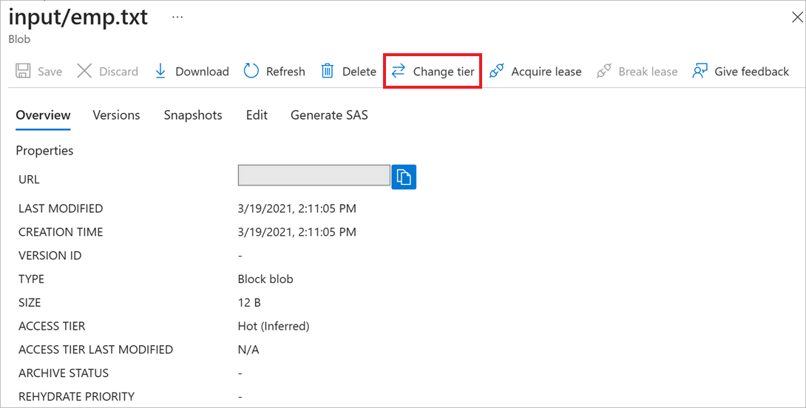
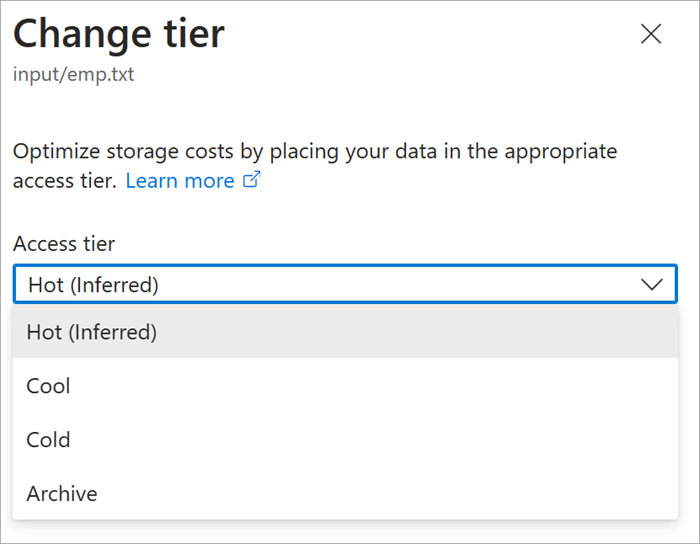
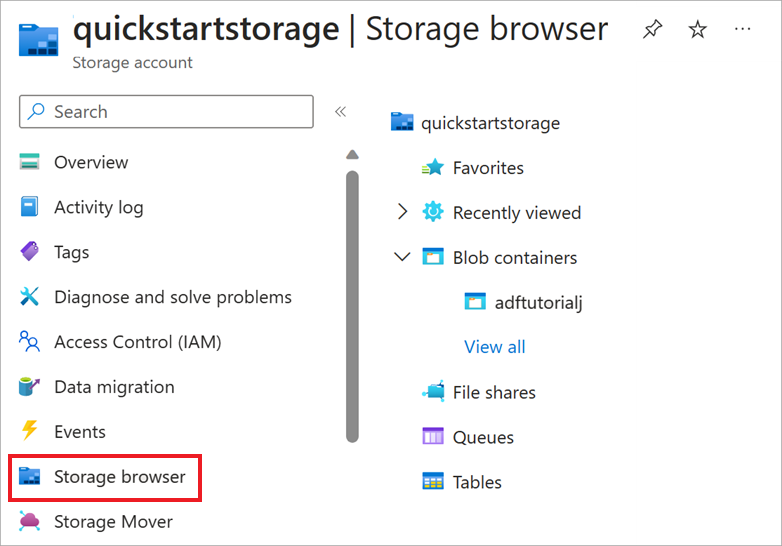
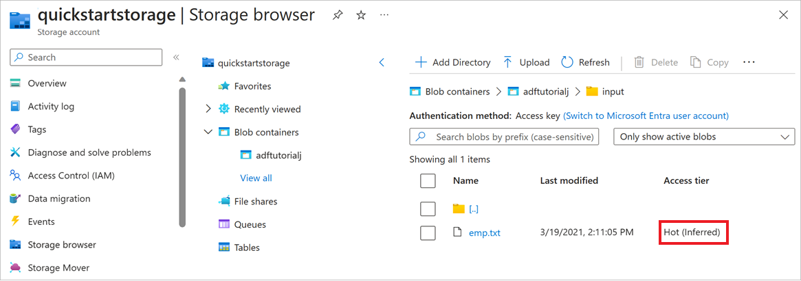

Azure Storage can be configured and managed using various Azure GUI and command-line tools.

Using the manufacturing company example, as project lead, your next step in planning your company's storage tier strategy is to review the Azure tool options and decide which are most appropriate for particular scenarios.

In this unit, you'll compare the methods for configuring and managing storage tiers using Azure tools.

## Azure Tools

There are several tools available that you can use to manage Azure Storage:

- Azure portal
- Azure Storage Explorer
- Azure CLI
- Azure Powershell

## Azure portal

Using the Azure portal, you can amend the Access Tier for the Storage Account, from Hot to Cool, or change the Replication options.

1. To manage storage tiers in the Azure portal, click **Storage Accounts**.
1. Click one of your storage accounts in the displayed list.
1. Click **Configuration**.
   
1. In the Storage Account, click **Blobs** and select a container.
1. Click your blob and scroll down to **Access Tier**.
   
1. Click the drop-down list and select the Access Tier you want to use.
   

## Azure Storage Explorer

Azure Storage Explorer can be used to upload and download Blobs from Azure Storage. There are two versions of Storage Explorer, Portal Storage Explorer and standalone Storage Explorer.

1. To use the Azure portal tool, under Storage account, click **Storage Explorer**:
   
1. Click **BLOB CONTAINERS** to view a list of your containers.
1. Select a container, and then select the Blob where you want to change the Access Tier.
   
1. Right-click the Blob and click **Change Access Tier.**
1. From the Access Tier drop-down list, select the tier you want to assign to the Blob.

## Azure Powershell

You can use Powershell to manage the Access Tiers on a Storage Account and Blobs. Some of the cmdlets you can use to manage storage include:

| Cmdlet | Description |
|-----|-----|
| `Add-AzureRMAccount` | Adds an authenticated account to use for Azure Resource Manager cmdlet requests. |
| `Get-AzureStorageAccount` | Gets the storage accounts for the current Azure subscription. |
| `Set-AzureRmStorageAccount -AccessTier` | Sets the Access Tier for a Storage account. |


Here's an example command for changing Access Tier on a Storage Account:

```powershell
Set-AzureRmStorageAccount -ResourceGroupName "TestGroup" -AccountName "StorageAccountName" -AccesTier Cool
```

Here's another example, this time for changing Access Tier for multiple blobs in a container:

```powershell
$Storage = "StorageAccountName"

$Key = "StorageAccountKey"

$Container = "BlobContainer"

$blobs = Get-AzureStorageBlob -Container $Container

$blob.icloudblob.setstandardblobtier("Cool")
```

## Azure CLI

You can also use Azure CLI to manage Access Tiers on Storage Accounts. Below are some of the cmdlets you can use:

```azurecli
az storage blob upload

az storage blob list

az storage blob download

az storage blob set-tier
```

Example code to change Access Tier to Cool for a Blob:

```azurecli
az storage blob set-tier --name BlobName --container-name BlobContainer --account-name StorageAccountName --tier Cool
```
