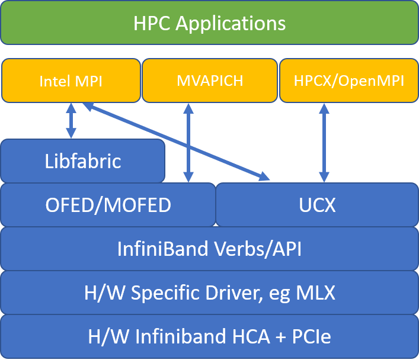

HB120_v2, HB60 and HC44 SKUs support InfiniBand network interconnects, and because the PCI express is virtualized via Single-Root Input/Output (SR-IOV) virtualization, all popular MPI libraries (HPCX, OpenMPI, Intel MPI, MVAPICH and MPICH) are available on these HPC VMs. 

The current limitation for an HPC Cluster that can communicate over InfiniBand is 300 VMs, and the following table lists the maximum number of parallel processes that are supported in tightly coupled MPI applications that are communicating over InfiniBand.

| SKU | Max parallel processes |
|---|---|
| HB120_v2 | 36,000 processes |
| HC44 | 13,200 processes |
| HB60 | 18,000 processes |

> [!NOTE]
> These limits may change in the future. If you have a tightly coupled MPI job that requires a higher limit, please submit a support request (It may be possible to raise the limits for your situation).

If an HPC application recommends a particular MPI library, then it's probably a good idea to initially use that version first before you implement other MPI optimizations. If you have flexibility in which MPI you can choose and you want the best performance, the recommended MPI is HPCX. Overall, the HPCX MPI performs the best using the **UCX framework (UCX)** for the InfiniBand interface, and takes advantages of all the Mellanox InfiniBand hardware and software capabilities.

The following illustration compares the popular MPI library architectures.



HPCX and OpenMPI are ABI compatible, so you can dynamically run an HPC application with HPCX that was built with OpenMPI. Similarly, Intel MPI, MVAPICH and MPICH are ABI compatible.

The Queue Pair 0 is not accessible to the guest VM in order to prevent any security vulnerability via low-level hardware access. This should not have any impact on end-user HPC applications, but may prevent some low-level tools like Open Fabrics Enterprise Distribution (OFED) like ibdiagnet from functioning correctly.

## HPCX and OpenMPI mpirun arguments

The following command illustrates some recommended mpirun arguments for HPCX and OpenMPI.

```bash
mpirun -n $NPROCS --hostfile $HOSTFILE --map-by ppr:$NUMBER_PROCESSES_PER_NUMA:numa:pe=$NUMBER_THREADS_PER_PROCESS -report-bindings $MPI_EXECUTABLE
```

Where:

| Parameter | Description |
|---|---|
| `$NPROCS` | Specifies the number of MPI processes; for example: `-n 16`. |
| `$HOSTFILE` | Specifies a file containing the hostname or IP address, to indicate the location of where the MPI processes will run; for example: `--hostfile hosts`. |
| `$NUMBER_PROCESSES_PER_NUMA` | Specifies the number of MPI processes that will run in each NUMA domain; for example: to specify four mpi processes per NUMA, you would use `--map-by ppr:4:numa:pe=1`. |
| `$NUMBER_THREADS_PER_PROCESS` | Specifies the number of threads per MPI process; for example: to specify one MPI process and four threads per NUMA, you would use `--map-by ppr:1:numa:pe=4`. |
| `-report-bindings` | Prints MPI processes mapping to cores, which is useful to verify that your MPI process pinning is correct. |
| `$MPI_EXECUTABLE` | Specifies the MPI executable built linking in MPI libraries. MPI compiler wrappers do this automatically, for example: `mpicc`, `mpif90`, etc. |

If you suspect your tightly coupled MPI application is doing an excessive amount of collective communication, you could try enabling Hierarchical Collectives (HCOLL). To enable those features, use the following parameters.

```bash
-mca coll_hcoll_enable 1 -x HCOLL_MAIN_IB=<MLX device>:<Port>
```

## Intel MPI mpirun arguments

The Intel MPI 2019 release switched from the Open Fabrics Alliance (OFA) framework to the Open Fabrics Interfaces (OFI) framework, and currently supports libfabric. There are two providers for InfiniBand support, mlx and verbs. The provider mlx would be the preferred provider on HB and HC VMs.

Here are some suggested mpirun arguments for Intel MPI 2019 update 5+.

```bash
export FI_PROVIDER=mlx
export I_MPI_DEBUG=5
export I_MPI_PIN_DOMAIN=numa

mpirun -n $NPROCS -f $HOSTFILE $MPI_EXECUTABLE
```

Where:

| Parameters | Description |
|---|---|
| `FI_PROVIDER` | Specifies which libfabric provider to use, which will impact the API, protocol and network used; `verbs` is another option, but generally `mlx` will give better performance. |
| `I_MPI_DEBUG` | Specifies the level of extra debug output, which can provide details about where processes are pinned, and which protocol and network are used. |
| `I_MPI_PIN_DOMAIN` | Specifies how you want to pin your processes; for example: to cores, sockets, or NUMA domains. In this example, we set this environmental variable to `numa`, which means processes will be pinned to NUMA node domains. |

There are some other options that you can try, especially if collective operations are consuming a significant amount of time. Intel MPI 2019 update 5+, supports the provide mlx and uses the UCX framework to communicate with InfiniBand, and also supports HCOLL.

```bash
export FI_PROVIDER=mlx
export I_MPI_COLL_EXTERNAL=1
```

## MVAPICH mpirun arguments

The following list contains several recommended mpirun arguments.

```bash
export MV2_CPU_BINDING_POLICY=scatter
export MV2_CPU_BINDING_LEVEL=numanode
export MV2_SHOW_CPU_BINDING=1
export MV2_SHOW_HCA_BINDING=1

mpirun -n $NPROCS -f $HOSTFILE $MPI_EXECUTABLE
```

Where:

| Parameters | Description |
|---|---|
| `MV2_CPU_BINDING_POLICY` | Specifies which binding policy to use, which will affect how processes are pinned to core IDs. In this case, we specify `scatter`, so processes will be evenly scattered among the NUMA domains. |
| `MV2_CPU_BINDING_LEVEL` | Specified where to pin processes. In this case, we set it to `numanode`, which means processes are pinned to units of NUMA domains. |
| `MV2_SHOW_CPU_BINDING` | Specified is we want to get debug information about where the processes are pinned. |
| `MV2_SHOW_HCA_BINDING` | Specified is we want to get debug information about which Host Channel Adapter (HCA) each process is using. |
