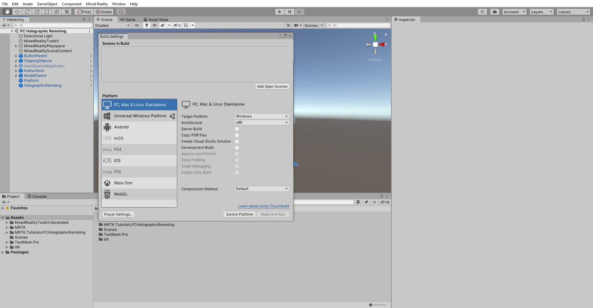

## [Unity 2020 + OpenXR](#tab/openxr)

## 1. Switching Build Platform

In the menu bar, select **File** > **Build Settings**.

1. In the Build Settings window, select PC, Mac & Linux Standalone Platform and click the Switch Platform button to change the Build Platform:

    

## 2. Set The Project Settings

1. In the menu bar, select **Edit > Project Settings > XR Plug-in Management**. Ensure that you're in the Windows Standalone tab and then select **OpenXR** and **Windows Mixed Reality feature**.

    

2. In the Project Settings window, select **OpenXR**. Ensure that you're in the Windows Standalone tab, and then change the **Depth submission mode** from None to **Depth 16** Bit.

3. Add **Eye Gaze Interaction Profile**and **Microsoft Hand Interaction Profile** by clicking on the plus sign ("+") button in the Interaction Profiles tab.

    

4. Under **Open XR feature groups > All features**, select **Holographic App Remoting**.

    

5. Select **Windows Mixed Reality** and then under the **Windows Mixed Reality** group, select **Holographic App Remoting**.

    

## 3. Build The Unity Project

In the menu bar, select **File** > **Build Settings**.

1. Click **Add Open Scenes** to add your current scene to the Scenes list in the Build Settings window. Then, in the Build list, click the **Build** button:

    

2. Choose a suitable location to store your build--for example, Documents\MixedRealityLearning. Create a new folder and give it a proper name--for example, PCHolographicRemoting--and then click the **Select Folder** button to start the build process:

    

3. Wait for Unity to finish the build process.

    

    Double-click the Executable file to open the PC Holographic Remoting Application on your PC.

> [!Note]
> Due to some known issues in building the Holographic Remoting app for UWP, we're building as Windows Standalone for OpenXR.

## [Legacy WSA](#tab/wsa)

## 1. Set The Player Settings

1. In the **XR Settings** section, select  **WSA Holographic Remoting Supported** to enable Holographic Remoting.

    

## 2. Build The Unity Project

1. In the menu bar, select **File** > **Build Settings**, In the Build Settings window, click the **Add Open Scenes**button to add your current scene to the Scenes. In the Build list, then click the **Build** button to open the Build Universal Windows Platform window:

    

2. In the Build Universal Windows Platform window, choose a suitable location to store your build--for example, Documents\MixedRealityLearning. Next, create a new folder and give it a proper name--for example, PCHolographicRemoting--and then click the **Select Folder** button to start the build process:

    

3. Wait for Unity to finish the build process.

    

## 3. Build And Deploy The Application

1. After the build process has finished, Unity will prompt Windows File Explorer to open where you stored the build. Navigate to the folder and then double-click the .sln file to open it in Visual Studio:

    

    > [!Note]
    > If Visual Studio asks you to install new components, take a moment to ensure that all prerequisite components are installed as specified in the Install the Tools documentation.

2. Configure Visual Studio for PC by selecting the Release configuration, the x64 architecture, and Local Machine as target:

    

    Click the button that says **Local Machine**. This begins the process of building the application and deploy it to your PC. The application is installed on your PC by default.
