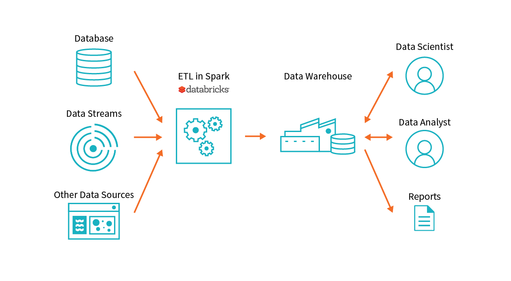

The extract, transform, load (ETL) process takes data from one or more sources, transforms it, normally by adding structure, and then loads it into a target database.

A common ETL job takes log files from a web server, parses out pertinent fields so it can be readily queried, and then loads it into a database.

ETL may seem simple: applying structure to data so it’s in a desired form. However, the complexity of ETL is in the details. Data Engineers building ETL pipelines must understand and apply the following concepts:

- Optimizing data formats and connections
- Determining the ideal schema
- Handling corrupt records
- Automating workloads 

## The Spark approach

Spark offers a compute engine and connectors to virtually any data source. By leveraging easily scaled infrastructure and accessing data where it lives, Spark addresses the core needs of a big data application.

These principles comprise the Spark approach to ETL, providing a unified and scalable approach to big data pipelines:

- Databricks and Spark offer a unified platform
  - Spark on Databricks combines ETL, stream processing, machine learning, and collaborative notebooks.
  - Data scientists, analysts, and engineers can write Spark code in Python, Scala, SQL, and R.
- Spark's unified platform is scalable to petabytes of data and clusters of thousands of nodes.
  - The same code written on smaller data sets scales to large workloads, often with only small changes.
- Spark on Databricks decouples data storage from the compute and query engine.
  - Spark's query engine connects to any number of data sources such as S3, Azure Blob Storage, Redshift, and Kafka.
  - This minimizes costs; a dedicated cluster does not need to be maintained and the compute cluster is easily updated to the latest version of Spark.

## ETL process

A typical ETL process in Databricks includes the following steps:

1. **Extraction**. You can virtually connect to any data store including Azure Blob Storage, using Java Database Connectivity (JDBC). Databricks support connection to multiple database types, inlcuding:

   - Traditional databases like Postgres, SQL Server, and MySQL
   - Message brokers like Kafka and Kinesis
   - Distributed databases like Cassandra and Redshift
   - Data warehouses like Hive and Cosmos DB
   - File types like CSV, Parquet, and Avro

1. **Data validation**. One aspect of ETL jobs is to validate that the data is what you expect. This includes:

   - Approximately the expected number of records
   - The expected fields are present
   - No unexpected missing values

1. **Transformation**. This step generally includes applying structure and schema to your data to transform it into the desired format. Schemas can be applied to tabular data, such as that found in CSV files or relational databases, or to semi-structured data such as JSON data.

1. **Corrupt record handling**. Handling the bad data is also an important part of the entire ETL process. The built-in functions of Databricks allow you to handle corrupt data such as missing and incomplete information,schema mismatch, differing formats or data types, and user errors when writing data producers.

1. **Loading data** - A common and highly effective design pattern in the Databricks and Spark ecosytem involves loading structured data back to DBFS as a parquet file. Databricks also allows you to productionalize code by scheduling notebooks for regular execution.

In this module we will explore some basic ETL techniques using Azure Databricks.