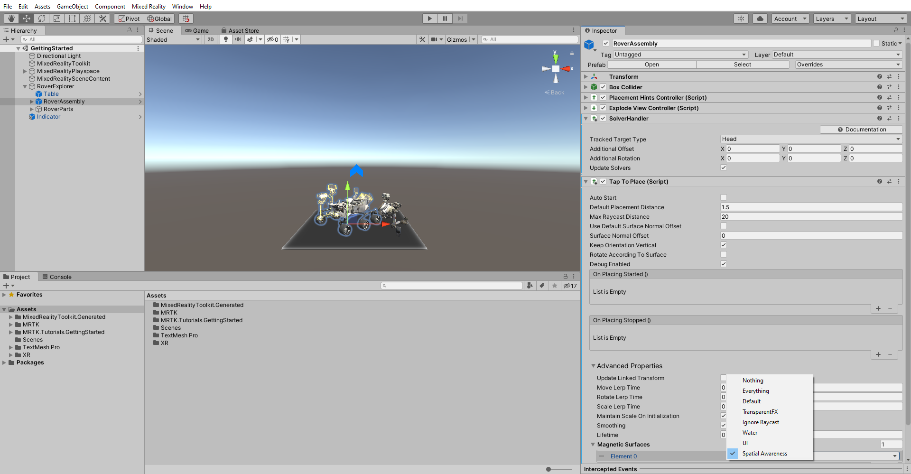
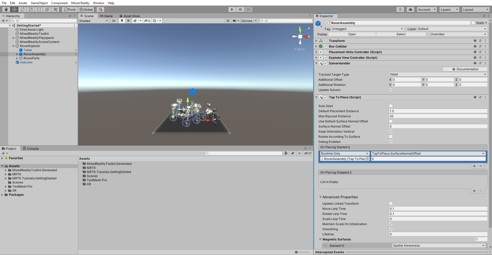
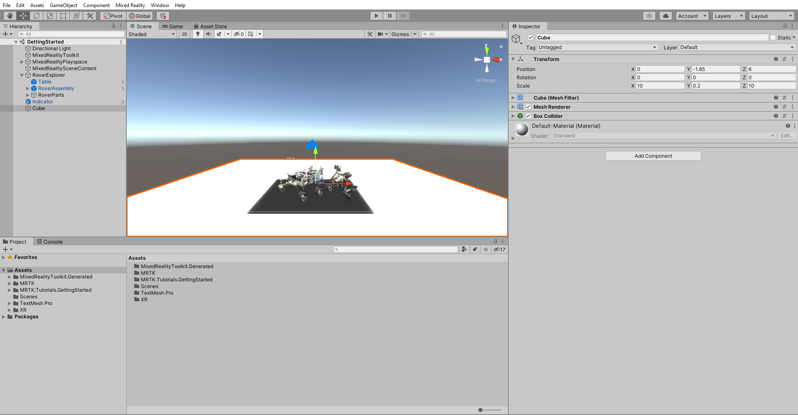
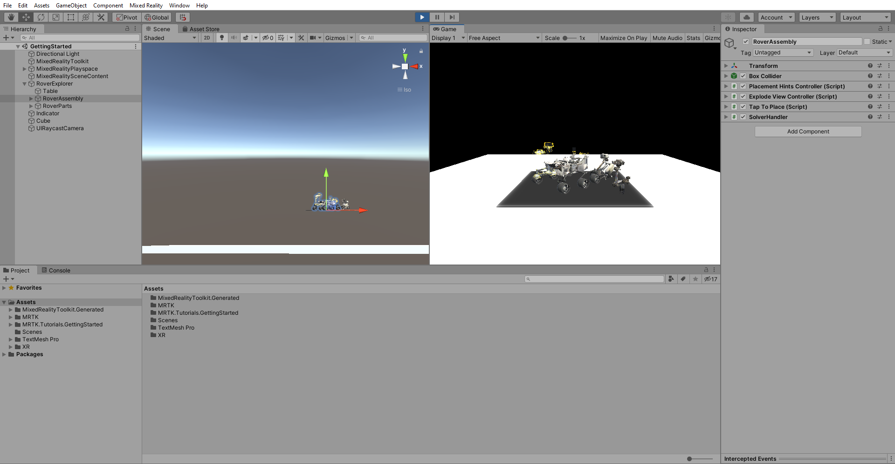

Solvers are one of the components of the Mixed Reality Toolkit, which provides some handy functions for your application. Here you'll learn to use two types of solvers and look at their functionalities.

## Location of solvers in the MRTK

* The MRTK's solvers are located in the MRTK SDK folder. To see the available solvers in your project, in the Project window, navigate to **Packages** > **Mixed Reality Toolkit Foundation** > **SDK** > **Features** > **Utilities** > **Solvers**:

    

## Use the Directional Indicator Solver to direct the user to objects

1. In the Project window, navigate to the **Assets** > **MRTK.Tutorials.GettingStarted** > **Prefabs** folder, click-and-drag the **Chevron** prefab into the Hierarchy window, and set it's Transform **Position** to X = 0, Y = 0, Z = 2 to position it near the RoverExplorer object:

    

2. Rename the newly added Chevron object to **Indicator**, then in the Inspector window, use the **Add Component** button to add the **DirectionalIndicator**:

    

3. Configure the DirectionalIndicator and SolverHandler components as follows:

    * Verify that the **SolverHandler** component's **Tracked Target Type** is set to **Head**
    * Assign the **RoverExplorer** to the **DirectionalIndicator** component's **Directional Target** by dragging it from the Hierarchy window into the **None (Transform)** field
    * Change the **View Offset** to 0.2

    

4. Press the Play button to enter Game mode, press-and-hold the right mouse button while moving your mouse to the left or right to rotate your gaze direction, and notice the following:

    * When you look away from the RoverExplorer object, the Indicator object will appear and point towards the RoverExplorer object

    

## Use the Tap to Place Solver to reposition objects

1. In the Hierarchy window, select the RoverExplorer > **RoverAssembly** object, then in the Inspector window, use the **Add Component** button to add the **Tap To Place (Script)** component, and configure it as follows:

    * Verify that the **SolverHandler** component's **Tracked Target Type** is set to **Head**
    * Uncheck the **Use Default Surface Normal Offset** and ensure **Surface Normal Offset** is set to 0
    * Check the **Keep Orientation Vertical** checkbox
    * From the **Magnetic Surfaces** > **Element 0** dropdown, uncheck all options expect **Spatial Awareness**

    

2. With the RoverAssembly object still selected in the Hierarchy window, in the Inspector window, locate the **On Placing Started ()** event and click the **+** icon to add a new event:

    

3. Configure the event as follows:

    * Assign the **RoverAssembly** object as a listener for the On Placing Started () event by dragging it from the Hierarchy window into the **None (Object)** field
    * From the **No Function** dropdown, select **TapToPlace** > **float SurfaceNormalOffset** to update the SurfaceNormalOffset property value when the event is triggered
    * Verify that the argument is set to **0**

    

4. In the Hierarchy window, right-click on an empty spot and select **3D Object** > **Cube**, to create a temporary object representing the ground, and configure the **Transform** component as follows:

    * **Position**: X = 0, Y = -1.65, Z = 6
    * **Rotation**: X = 0, Y = 0, Z = 0
    * **Scale**: X = 10, Y = 0.2, Z = 10

    

5. With the temporary Cube still selected in the Hierarchy window, in the Inspector window, use the **Layers** dropdown to change the Cube's Layer setting only to include the **Spatial Awareness** layer:

    

6. Press the Play button to enter Game mode, then press-and-hold the right mouse button while moving down your mouse until the gaze hit's the RoverAssembly object:

    

7. Click the left mouse button to start the tap-to-place process:

    

8. Press-and-hold the right mouse button while moving your mouse to the left or right to rotate your gaze direction, when you're happy with the placement, click the left mouse button:

    

9. Once you're done testing the feature in the Game mode, right-click on the Cube object and select **Delete** to remove it from the scene:

    
