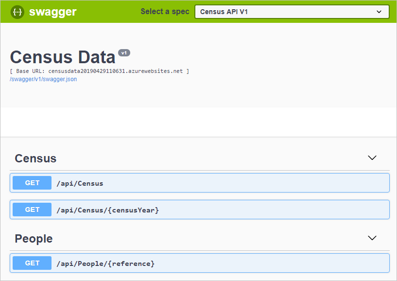
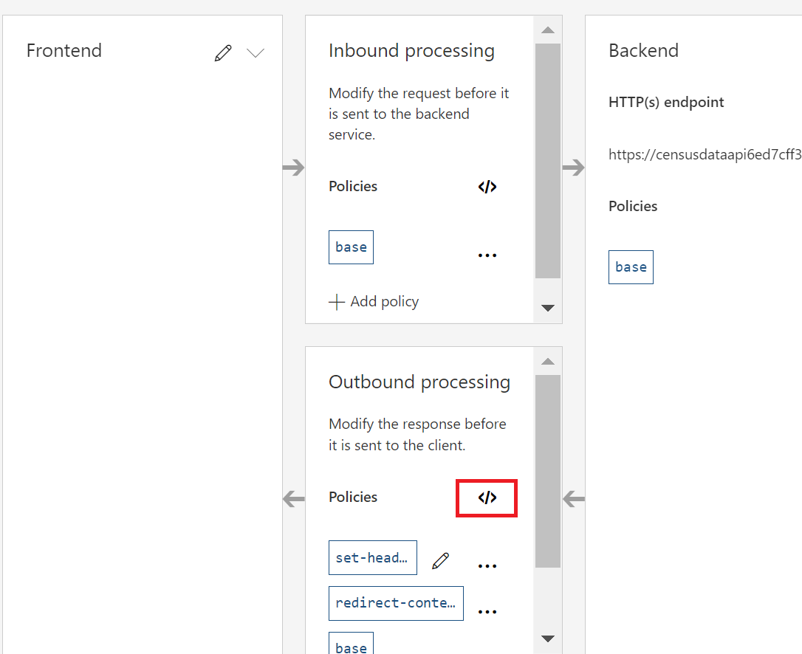
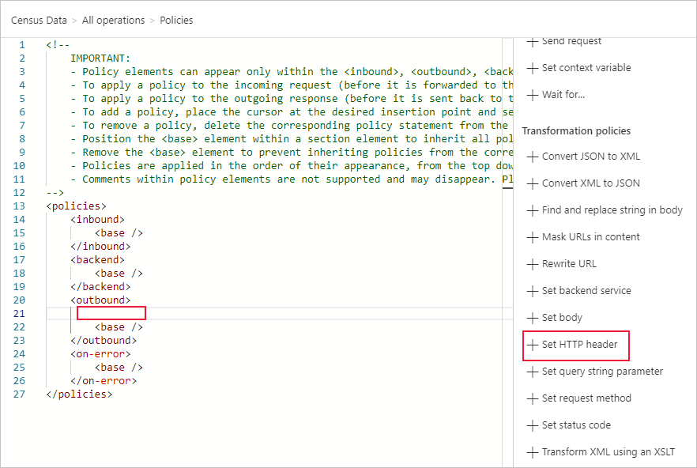
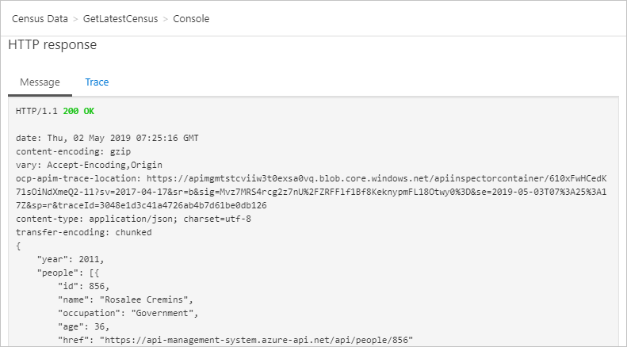

Companies that publish web APIs often need to carefully control the HTTP headers that their APIs return, preferably without rewriting the API source code.

The Government has decided to share census data with its agencies through RESTful APIs. The critical requirements are that this is done securely and can be easily amended to facilitate quick integration. As lead developer, you need to create an API gateway. You'll use the gateway to publish a RESTful Census API that exposes an OpenAPI endpoint using modern security standards.

Here, you will:
- Publish a RESTful Census API.
- Deploy an API Management gateway.
- Expose the Census API through the gateway endpoint.
- Remove headers from the response.

[!include[](../../../includes/azure-sandbox-activate.md)]

[!include[](../../../includes/azure-sandbox-regions-first-mention-note-friendly.md)]

## Deploy the Census Web API

You have developed a .NET Core app that returns sensitive census information. The app includes Swashbuckle to generate OpenAPI documentation.

To save time, let's start by running a script to host our RESTful API in Azure. The script performs the following steps:

- It creates an Azure App Service plan in the free tier.
- It create a Web API within an Azure App Service, which is configured for Git deployment from a local repo.
- It sets account-level deployment credentials for our app.
- It configure Git locally.
- It deploys our Web API to our App Service instance.

1. To clone the repo that contains the source for our app, run the following `git clone` command in the Cloud Shell:

    <!-- TODO: the URL in the following command must be replaced when the location of the GitHub repo is known -->

    ```bash
    git clone https://github.com/GeekEffect/CensusData.git
    ```

1. To navigate into the repo folder locally, run the following command:

    ```bash
    cd CensusData
    ```

1. As its name suggests, setup.sh is the script you will run to create our test API. This script generates a public web app that exposes an OpenAPI interface:

    ```bash
    bash setup.sh
    ```

    The script takes about a minute to run. When the script finishes, it displays two URLs that you can use to test the app deployment. Observe that during deployment, all dependencies needed for our app to run are automatically installed on the remote App Service.

1. To test that our app deployed correctly, copy and paste the first URL from the Cloud Shell output into your browser. The browser should display the Swagger UI for our app and declare the following RESTful endpoints:

    - **api/census**, which returns a census and associated people
    - **api/census/{censusYear}**, which returns a census and associated people for the specified year
    - **api/people/{reference}**, which returns returns detailed information about a specific person

    

1. Finally, copy the last URL from the Cloud Shell output. This URL is the swagger JSON URL, which you will need later in this exercise.

## Deploy an API gateway

The next step in this exercise is to create an API gateway in the Azure portal. In the next section, you'll use this gateway to publish your API:

1. Sign into the [Azure portal](https://portal.azure.com/learn.docs.microsoft.com?azure-portal=true) using the same account you activated the sandbox with.
1. In the left menu, click **+ Create a resource**.
1. Click **Integration**, and then click **API management**.
1. In the **API Management service** page, enter the following details:

    | Field | Details |
    | --- | --- |
    |**Name** | Type `apim-CensusData<random number>`; the random number is to ensure that the name is globally unique. |
    | **Subscription** | Concierge Subscription |
    | **Resource group** | Select the existing resource group **<rgn>[sandbox resource group name]</rgn>** |
    | **Location** | Select a location near you from the above list. | 
    | **Organization Name** | Type `Government-Census`. |
    | **Administrator Email** | Type your own email address. |
    | **Pricing Tier** | Select `Consumption (preview)`. |

    > [!NOTE]
    > You're using the consumption plan because it is much faster to create while testing. The overall experience is very similar to the other pricing tiers.

1. Click **Create**.
1. Deployment may take several minutes. You'll get a message to your specified email address when the deployment has completed. You'll also see the gateway listed in Azure resources.

## Import the API

Now import the Census API into the API Management gateway:

1. Sign into the [Azure portal](https://portal.azure.com/learn.docs.microsoft.com?azure-portal=true) using the same account you activated the sandbox with.
1. In the left menu, click **All Resources**, and then select your API gateway.
1. Under **API management**, click **APIs**.
1. On the **Add a new API** page, click **OpenAPI**.
1. On the **Create from OpenAPI specification** page, enter the following details:

    **OpenAPI specification**: paste the swagger JSON URL that you saved earlier in the exercise.

    > [!NOTE]
    > You will notice that, when you tab out of the box, some of the other fields will be populated for you, this is because you have used OpenAPI which specifies all of the required connection details.

1. Leave the other settings at their defaults, and then click **Create**.
1. On the API details page, click **Settings**, and then click **Save**.

## Remove Headers

The final step is to remove the two headers **X-Powered-By** and **Server**:



1. Select **Census Data** and then, at the top of the screen, select the **Design** tab.
1. Select **All operations**, and then in the **Outbound processing** section, click the **</>** icon.
1. Position the cursor inside the <outbound> element.
1. In the right window, under Transformation policies, click **+ Set HTTP header**.

    

1. Modify your outbound configuration to look like this:

    ```XML
    <outbound>
       <set-header name="X-Powered-By" exists-action="delete" />
       <set-header name="Server" exists-action="delete" />
       <base />
    </outbound>
    ```

1. Click the Save button

## Test the Removal of Headers

You should now be able to run a test to demonstrate that the headers are removed:

1. Select **Census Data**.
1. On the top of the screen, select **test** tab.
1. Next, select **GetLatestCensus** operation.
1. Click **Send**.

    

1. **X-Powered-By** and **Server** headers should not be in the response.
