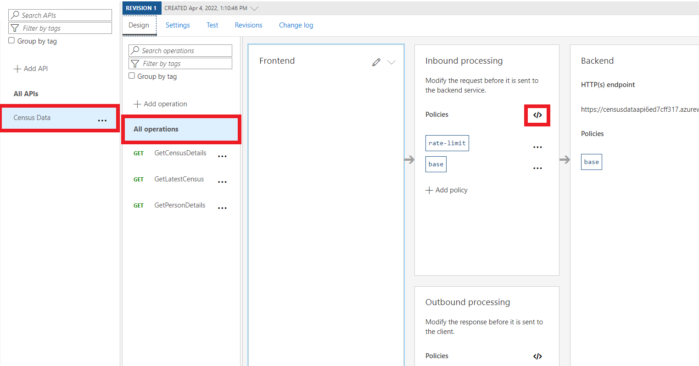
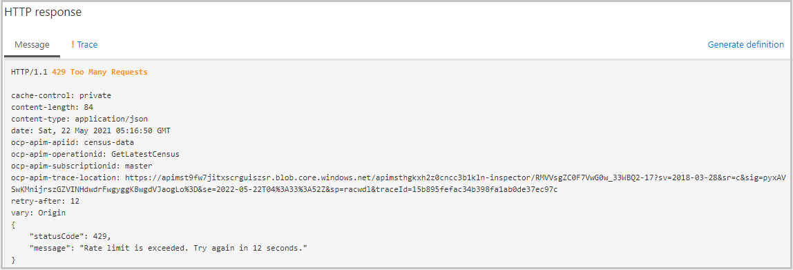

In API Management, you use policies to implement throttling.

Recall that your government agency would like to prevent the abuse of their APIs, such as large volumes of requests.

In this unit, you will learn how to set limits on the frequency your census API can be called. You will learn how these limits can be applied globally to all of your census endpoints or granularly to each client.

## Apply a rate limit policy

To apply a **throttling** policy within API Management, follow these steps:

1. Sign into the [Azure portal](https://portal.azure.com/learn.docs.microsoft.com?azure-portal=true) using the same account you activated the sandbox with.
1. In the left menu, click **All Resources**, and then select your API gateway.
1. Under **API management**, click **APIs**, and then select **Census Data**.
1. On the top of the screen, select the **Design** tab, and then select **All operations**.
1. In the **Inbound processing** section, click the **</>** icon.

    

1. Replace the entire `<inbound>` with the following code:

    ```XML
    <inbound>
        <rate-limit calls="3" renewal-period="15" />
        <base />
    </inbound>
    ```

Your policy file should contain all three policies, similar to this code:

```XML
<policies>
    <inbound>
        <rate-limit calls="3" renewal-period="15" />
        <base />
    </inbound>
    <backend>
        <base />
    </backend>
    <outbound>
        <set-header name="X-Powered-By" exists-action="delete" />
        <redirect-content-urls />
        <base />
    </outbound>
    <on-error>
        <base />
    </on-error>
</policies>
```

> [!NOTE]
> The order of the policies within each section is not important for this example.

## Test the policy 

Now let's see if the throttling policy is working:

1. Select **Census Data**, and then at the top of the screen, select the **Test** tab.
1. Next, select the **GetLatestCensus** operation, and then click **Send** three times in a row.
1. Send the request for the fourth time. You should get a **429 error (too many requests)** response:

    