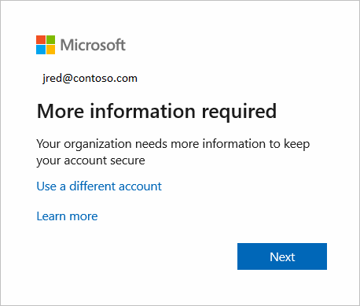

Risk policies make it possible for your organization to respond more appropriately to identity risk.

Previously, your retail company's IT team didn't have security skills in-house and had to hire external contractors to protect identities. Your manager wants to avoid the same situation going forward. Your company needs to be able to respond to threats in a controlled and more cost effective manner, without weakening security.

You've been asked to investigate how identity risks are detected in Azure Active Directory Identity Protection. You've been asked to look into risk policies, and how to use them.

In this unit, you'll investigate what risk policies are. You'll also learn what each type of risk policy is used for, and how to configure and enable them. Then you'll see what the end-user experience is like for each risk policy type.

## What is a risk policy?

You configure a risk policy to decide how you want Identity Protection to respond to a particular type of risk. Do you want to block or allow access? Do you want to make users go through additional authentication before allowing access? Risk policies help you respond to risks rapidly. Your company can leverage risk policies and avoid hiring external contractors to handle identity-based risks.

Different risk policies are available, depending on the type of identity risk. You can use a sign-in risk policy or a user risk policy.

## Sign-in risk policy

A sign-in risk policy scrutinizes every sign-in, and gives it a risk score. This score indicates that probability that the sign-in was attempted by the person whose credentials are used. You decide which level of risk is acceptable by choosing a threshold of low, medium, or high. Based on the risk level, you choose whether to allow access, automatically block, or allow access only after additional requirements are met. For example, users might be asked to go through multi-factor authentication to remediate detected risks that are considered to be at the medium level. Users could be blocked entirely if the risk is considered high.

You use a form to configure a sign-in risk policy in the Azure portal. You specify settings such as:

- The users this policy should target
- The conditions that must be met, such as how high a score triggers the policy
- How you want to respond

Make sure users have already been registered for Azure Multi-Factor Authentication before applying this policy.

When a sign-in risk has been identified, the user can be asked to take action to remediate the risk. They're told what triggered the risk, and what's needed from them for the issue to be resolved. For example, the user may see the following notification:

## User risk policy

Here, Identity Protection learns the user's normal behavioral patterns. Identity Protection then uses this knowledge to calculate the likely risk that the user's identity has been compromised. Based on this risk, the administrator can decide whether to allow access, block it, or allow access only after additional requirements are met. The user could, for example, be asked to change their password using self-service password reset before being allowed access.

You use a form to configure a user risk policy in the Azure portal. You specify settings such as the users this policy should target, the conditions that must be met, and how you'll respond. Make sure users have already been registered for self-service password reset before applying this policy.

When a user risk has been identified, the user can be asked to take action to remediate that risk. They're told what triggered the risk, and what's needed from them for the issue to be resolved. For example, the user may see the following notification:

## Multi-factor authentication (MFA) registration policy

Multi-factor authentication adds a second layer of protection to your users' identities. With multi-factor authentication, the user has to go through an additional verification step after they successfully provide their username and password.

You can use an MFA registration policy to make sure all users are registered for multi-factor authentication from the first time they use their account. You also configure this policy so you can enforce sign-in risk policies. This way, you let users self-remediate when a sign-in risk has been detected.

You fill in a form to configure an MFA registration policy using the Azure portal. You'll need to provide details about which users the policy targets, and whether it should be enabled or disabled.

When you configure an MFA registration policy, users will be asked to register when they sign in. The user will see the notification below.

Users must complete the registration within 14 days, but can choose to skip it to sign in during that period. After 14 days, they'll have to complete registration before they're allowed to sign in again.
