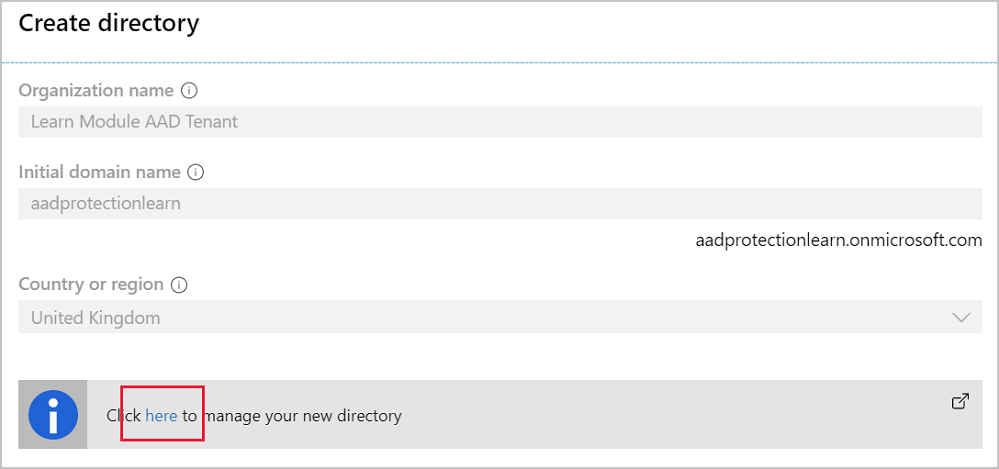
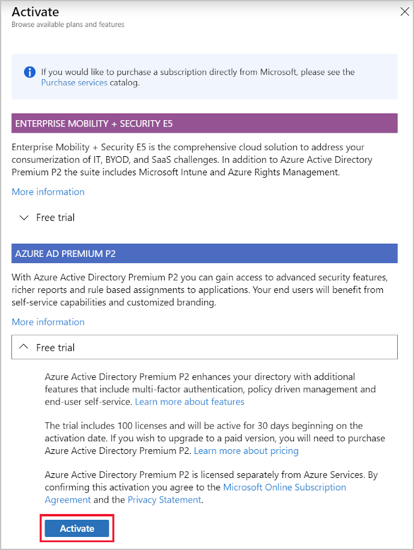
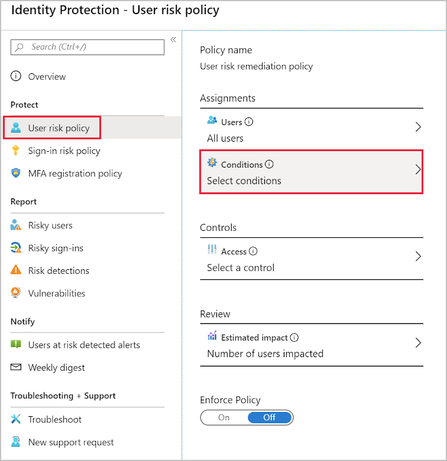
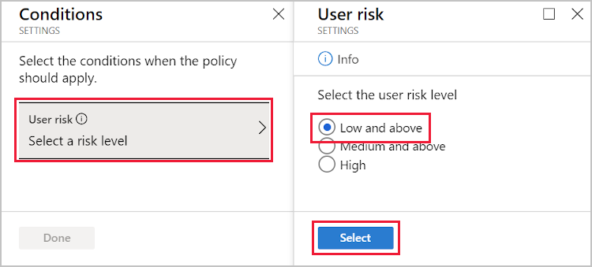

Azure Active Directory Identity Protection (AADIP) is a feature of Azure AD Premium P2. Administrators can test AADIP's automated tools that keep users' credentials safe, through an Azure AD Premium P2 trial.

Your manager wants you to test the user risk policies that are included with Azure Active Directory Identity Protection.

You'll create a new directory in this exercise and sign up for Azure AD Premium. You'll then enable a user risk policy that forces a password reset for users who are identified as "risky". In the final step, you'll use a TOR browser to trigger the risk policy.

## Configure a sign-in risk policy

1. Sign in to the [Azure portal](https://portal.azure.com/?azure-portal=true) using the same account with which you activated your sandbox.

1. Select **Create a resource**, select the **Identity** category, and then select **Azure Active Directory**.
1. Fill in the **Create directory** page with these values, and then select **Create**:

    | Box | Value |
    | --- | --- |
    | **Organization name** | A friendly name for your tenant. For this exercise, use **Learn Module AAD Tenant**. |
    | **Initial domain name** | Enter a unique name for your tenant. |
    | **Country or region** | Select your preferred region. |

    

1. When directory creation is complete, select **Click here to manage your new directory**.
1. Under the **Manager** section, select **Security**.
1. Under the **Protect** section, select **Identity Protection**.

    > [!NOTE]
    > Identity Protection is a feature of Azure AD Premium P2. For this exercise, you can sign up for a free trial.

1. At the top of the page, select **Get a Premium trail to use this feature**. In the popout menu, expand the free trial under **AZURE AD PREMIUM P2**, then select **Activate**.

    

1. Under the **Protect** section, select **User risk policy**.

    

    > [!NOTE]
    > If you can't select the **User risk policy**, you may need to switch Azure directories.

1. Under the **Assignments** section, select **Select conditions**.

    

1. Select the **Select a risk level**, then select **Low and above**.
1. At the bottom of the pane, select the **Select** button, then select **Done**.
1. Select **On** under the **Enforce Policy**, then select **Save**.

## Test the user risk-based policy

The AI-based approach to identifying risks makes it difficult to consistently trigger the policy. One way to simulate an attacker trying to sign in is to use an IP address based in a different country.

You'll create a VM and install the TOR browser to generate this kind of traffic.

1. Using the Cloud Shell on the right, create a VM in a region the furthest from your current location.

    ```bash
    PASSWORD=$(openssl rand -base64 32)

    az vm create \
        --resource-group <rgn>[sandbox resource group name]</rgn> \
        --name remoteAttack \
        --location northeurope \
        --image Win2019Datacenter \
        --admin-username azureuser \
        --admin-password $PASSWORD

    echo $PASSWORD
    ```

1. While the VM is being created, sign in to the [Azure portal](https://portal.azure.com/?azure-portal=true) with the credentials you used to create the sandbox.

1. On the Azure portal, in the portal menu, select **Virtual Machines**.

1. Select the **remoteAttack** machine, then select **Connect**.

1. In the popout, select **Download RDP File**.

1. Open the RDP connection after it has downloaded. Accept the warning about the unknown publisher by selecting **Connect**.

1. In the Windows Security window, select **More choices**, then select **Use a different account**.

1. In the **Username** field, type **azureuser**. In the **Password** field, paste the copied random string password from the Cloud Shell. Then select **OK**.

1. In the Remote Desktop Connection window, select **Yes**.

1. When the VM has signed in, using the Server Manager, select **Local Server**.

1. In Properties, on the right, change **IE Enhanced Security Configuration** to **Off** for all users.

1. From the taskbar, select **Internet Explorer**, then browse to [Download the TOR browser](https://www.torproject.org/download/). Download the Windows version of the browser and install it.

1. Use the TOR browser to sign in with your credentials.

1. Return to your local machine, sign out and sign in again. You should be prompted to change your password.
