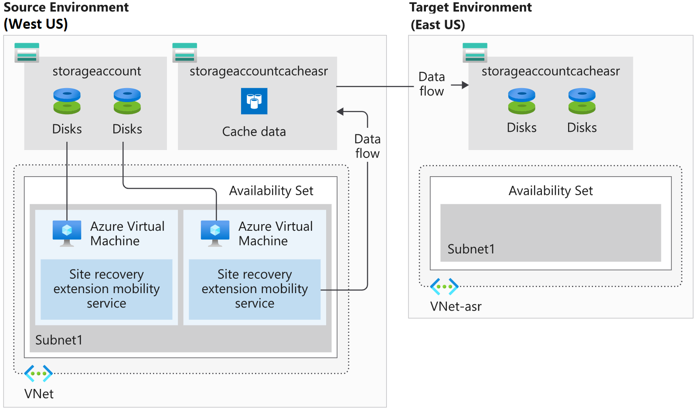

Now you know about the capabilities of Azure Site Recovery, you can begin to think about preparation for disaster recovery in your Azure environment.

Using your organizations BCDR plan, you now need to run through the Azure Site Recovery configurations and set a preparation plan in motion that fits with your organizations BCDR goals.

In this unit, you'll explore what you need to prepare for a disaster recovery scenario to take advantage of Azure Site Recovery's automated features.



## Environment setup

> [!NOTE]
> If you want to complete the following exercises, but you don't have an Azure subscription, or prefer not to use your own account, you will need to create a [free account](https://azure.microsoft.com/free/?azure-portal=true) before you begin.

Run the following commands in the Cloud Shell. This will create your companies infrastructure in Azure to use in the next exercise. This includes a virtual network, two VMs, and a storage account for the vault.


1. Sign into the [Azure portal](https://portal.azure.com) with your own credentials, and start a Cloud Shell session.

1. Copy the Azure Resource Manager json templates to create your company's infrastructure.

    ```bash
    curl https://raw.githubusercontent.com/MicrosoftDocs/mslearn-protect-infrastructure-with-azure-site-recovery/master/deploy.json > deploy.json
    ```

1. Run the following command to create resource groups and the company's infrastructure.

    ```azurecli
    az group create --name west-coast-rg --location westus2
    az group create --name east-coast-rg --location eastus2

    az group deployment create \
        --name asrDeployment \
        --template-file deploy.json \
        --parameters storageAccounts_asrcache_name=asrcache$RANDOM \
        --resource-group west-coast-rg
    ```

    > [!NOTE]
    > This can take up to five minutes to complete. While it is running continue with this module.

## Disaster recovery preparation with Azure Site Recovery

Azure Site Recovery will manage and orchestrate your DR process for Azure VMs or on-premises machines. However, to enable this there are several components you need to configure:

- Add a Recovery Services Vault
- Organize target resources
- Configure outbound network connectivity
- Set up replication on existing VMs

## Recovery Services Vault

To enable Azure Site Recovery to complete disaster recovery replication it requires a recovery services vault. These vaults use storage accounts to store data backups, VM configuration settings, and workloads. To meet Azure Site Recovery requirements simply provision a recovery services vault using the portal or the Azure CLI.

## Target resources

The target resources for Azure Site Recovery replication has to be in a different Azure region. The storage account that stores the backed up data must also be in a different region to the resources being protected. Check the target region allows you to create virtual machines, and that the region has enough resources to be able to match the size of the existing VMs.

## Outbound network connectivity & URLs

If you're using Virtual Machines originally created in Azure, the required network connectivity will have been set up for you automatically. If you've migrated on-premises VMs to Azure, you may need to update your network connectivity.

Azure Site Recovery requires outbound connectivity on the virtual machines that you wish to replicate. Azure Site Recovery does not support controlling network connectivity via an authentication proxy.

If your organization is using a URL-based firewall proxy in order to restrict outbound connectivity, you will need to add access to several URLs:

- *.blob.core.windows.net - To write VM data to the source storage account cache
- login.microsoftonline.com - For the Azure Site Recovery URLs to authenticate
- *.hypervrecoverymanager.windowsazure.com - For Azure Site Recovery to communicate with the VM
- *.servicebus.windows.net - For Azure Site Recovery monitoring and diagnostic data from the VM

If you would prefer to control the connectivity using IP addresses instead, then you need to add the following IP ranges:

- The IP ranges for Azure Datacenters
- The IP ranges for the Azure Site Recovery endpoints

## Updating Azure VM certs

Every Azure VM you wish to replicate requires the latest root certificates, without them you will not be able to register it with Azure Site Recovery. This is done to ensure security is kept watertight. A windows VM will need to have all the latest windows updates installed so that the machine has up-to-date trusted root certificates. A linux VM requires the same but you will need to contact your distributor.

## Account permissions

Azure Site Recovery by default uses Role-Based Access Control (RBAC) in Azure. This enables fine grained access, Azure Site Recovery comes with several built-in roles:

- **Site Recovery Contributor:** Full permissions for Azure Site Recovery operations in a recovery services vault, suitable for disaster recovery admins.
- **Site Recovery Operator:** Permissions to run and administer Azure Site Recovery failover and failback operations, suitable for disaster recovery operators.
- **Site Recovery Reader:** Permissions to view Azure Site Recovery operations, suitable for IT monitoring executives.

To enable replication on a VM, a user must have permissions to create a VM in both the virtual network and resource group.

## Mobility Service

Every VM that is to be replicated needs the Azure Mobility Service to be installed. This client is available for Windows and Linux VMs and will be installed and configured automatically by Site Recovery. If the automatic installation fails, you can install the service manually.

The mobility service works in partnership with Azure Site Recovery to keep an up-to-date cache of the VMs' data. The cache is  replicated to the target environments storage account. The replicated data will be used if Azure Site Recovery fails over the environment.
