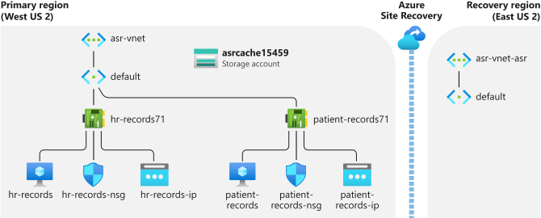
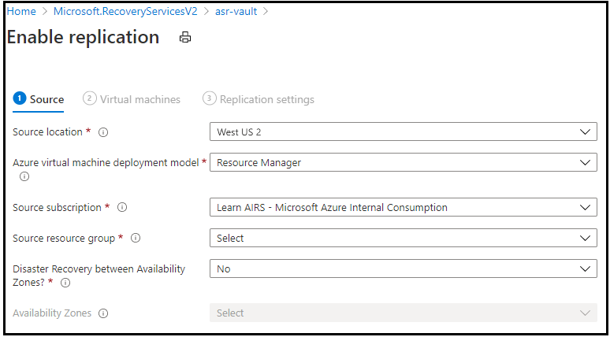
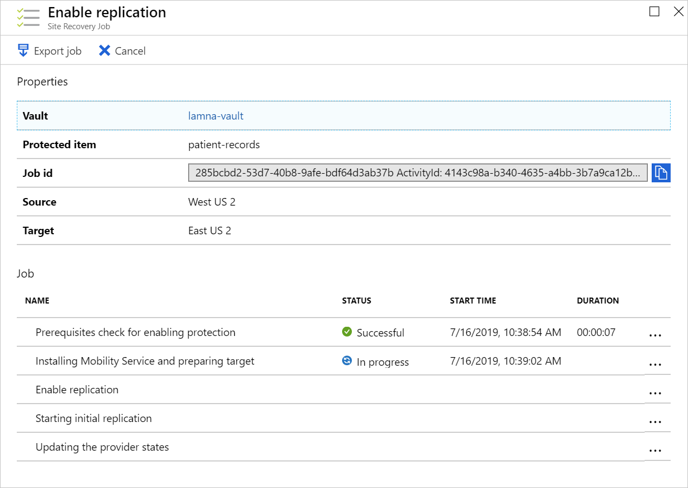

Azure Site Recovery automates the setup of recovery from one region to another. The setup process will install the Mobility Service onto the VMs, create the required infrastructure in the recovery region, and give you a way to monitor the progress.

Currently, two VMs are running the company's patient and employee systems. These systems are running in the West US region. You've been asked to protect the infrastructure by enabling it to be recovered to the East US region. Using Azure Site Recovery, you'll enable a Recovery Services vault to replicate the current workloads.

In this exercise, you'll complete the setup of Azure Site Recovery using the Azure portal.

> [!NOTE]
> This exercise is optional. If you don't have an Azure account, you can read through the instructions to understand how to use backup virtual machines with Azure Backup.
> If you want to complete this exercise, but you don't have an Azure subscription, or prefer not to use your account, you will need to create a [free account](https://azure.microsoft.com/free/?azure-portal=true) before you begin.

## Create a recovery services vault

1. Sign in to the [Azure portal](https://portal.azure.com?azure-portal=true) with your own credentials.

1. On the Azure portal **Home** page, under **Azure services**, select **Create a resource**. The **Create a resource** pane appears.

1. In the left menu pane, select **IT & Management Tools**, and then select **Backup and Site Recovery** under *Popular services*. The **Create Recovery Services vault** pane appears.

1. On the **Basics** tab, enter the following values for each setting.

    | Setting | Value |
    |---------|---------|
    | **Project Details** |
    | Subscription | *your subscription* |
    | Resource group | From the dropdown list, select **east-coast-rg**. |
    | **Instance Details** |
    | Vault name | **asr-vault** |
    | Region | **East US 2** |

1. Select. **Review + create**, and then select **Create**. After deployment completes, select **Go to resource** to view the recovery services vault.

## Enable replication

1. In the Recovery Services vault pane named *asr-vault*, in the left menu bar, under **Protected items**, select **Replicated items**. The **Replicated items** pane appears.

1. In the top menu bar, select **Replicate**, and from the dropdown list, select **Azure virtual machines**. The **Enable replication** pane appears.

1. Enter the following values for each setting.

    | Setting | Value |
    |---------|---------|
    | **Source** tab |
    | Source location | **West US 2** |
    | Source resource group | **west-coast-rg**. Select **Next.** |
    | **Virtual machines** tab |
    | Select both VMs | **hr-records** and **patient-records**. Select **Next**. |
    | **Replication settings** tab |
    | Target location | **East US 2**. |
    | Target subscription | Select the **Customize** link. The **Customize target subscription** pane appears. In the **Target subscription** field, select your Azure subscription, and select **OK**. The **Enable replication** pane reappears. |

    

1. Select **Enable replication**. When deployment succeeds, select **Go to resource group**. The **Recovery Services vault** pane named *asr-vault* appears.

## Monitor replication progress

1. Select **Home** on the top menu to return to the portal's home page.

1. Select **All resources**.

1. In the list of resources, select the **Recovery Services vault** named **asr-vault**.

1. In the left menu pane, under **Monitoring**, select **Site Recovery jobs**.

1. In the jobs list, select the **In progress** link to view how the replication setup is progressing.

    

1. You can select any of the listed jobs to view more details.

    

Two of these jobs will take the most time to complete. If you select either of the **Enable replication** jobs, you'll see that the **Installing Mobility Service and preparing target** step can take between five to 10 minutes to finish.
