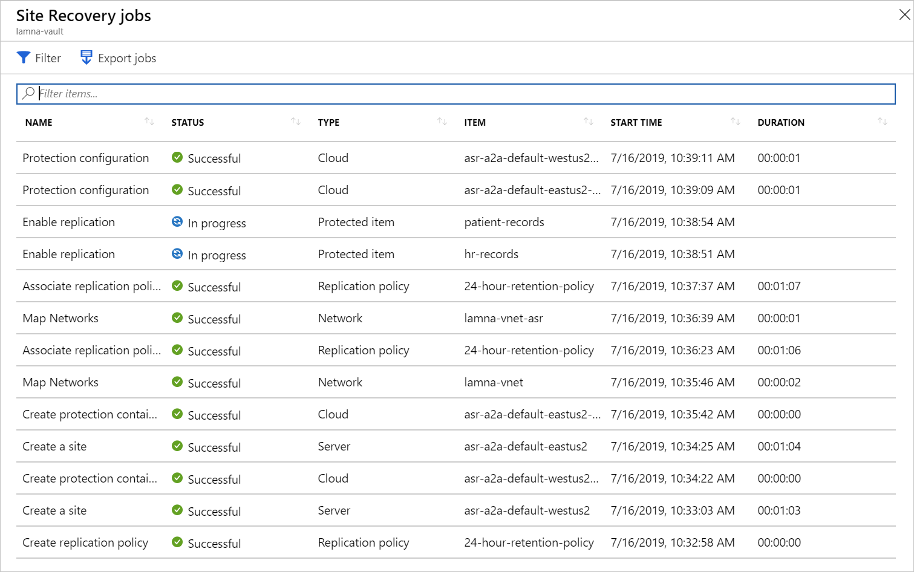

Azure Site Recovery automates the setup of recovery from one region to another. The setup process will install the Mobility Service on to the VMs, create the required infrastructure in the recovery region, and give you a way to monitor the progress.

Currently, two virtual machines are running the company's patient and employee systems. These systems are running in the West US region. You've been asked to protect the infrastructure by enabling it to be recovered to the East US region. Using Azure Site Recovery, you'll enable a Recovery Services vault to replicate the current workloads.

In this exercise, you'll complete the setup of Azure Site Recovery using the Azure portal.

> [!NOTE]
> This exercise is optional. If you don't have an Azure account, you can read through the instructions to understand how to use backup virtual machines with Azure Backup.
> If you want to complete this exercise, but you don't have an Azure subscription, or prefer not to use your account, you will need to create a [free account](https://azure.microsoft.com/free/?azure-portal=true) before you begin.

## Create a recovery services vault

1. Sign into the [Azure portal](https://portal.azure.com?azure-portal=true) with your own credentials.

1. Select **+ Create a resource** option on the top-left hand side of the portal.

1. Under **Azure Marketplace**, select **IT & Management Tools**, and then select **Backup and Site Recovery**.

1. On the **Backup and Site Recovery** pane, select **Create**.

    | Setting | Value |
    |---------|---------|
    | On the **Basics** tab, under **Project Details** section: |
    | Subscription | *your subscription* |
    | Resource group | Select **east-coast-rg**, and then select **OK**. |
    | Under **Instance Details** section: |
    | Vault name | **asr-vault** |
    | Region | **East US 2** |

1. Select. **Review + create**, and then on the *Summary* page, select **Create**. Once deployed, select **Go to resource** to view the resource.

## Enable replication

1. In the Recovery Services vault pane, under **Protected items** category n left nav bar, select **Replicated items**.

1. Select **+ Replicate**, and from the dropdown, select **Azure virtual machines**. Complete the following fields.

    

    | Setting | Value |
    |---------|---------|
    | On the **Source** tab: |
    | Source location | **West US 2** |
    | Source resource group | **west-coast-rg**. Select **Next.** |
    | On the **Virtual machines** tab: |
    | Select both VMs | **hr-records** and **patient-records**. Select **Next**. |
    | On the **Replication settings** tab: |
    | Target location | **East US 2**. |
    | **Customize**. Select it. The **Customize target settings** page appears. |
    | Target resource group | **east-coast-rg** |
    | For each VM | From the dropdown, change the **Cache storage** to **asrcacheXXXX**, where **XXXX** is a random number. Select **OK**. |
    | Select **Enable replication**. |

Continue to the next steps to monitor the progress.

## Monitor replication progress

1. Select **Home** on the top menu to return to the portal's home page.

1. Select **All resources**.

1. In the list of resources, select the **Recovery Services vault** named **asr-vault**.

1. On the left under **Monitoring**, select **Site Recovery jobs**.

1. In the jobs list, select the **In progress** link to view how the replication setup is progressing.

    

1. You can select any of the listed jobs to view more details.

    

Two of these jobs will take the most time to complete. If you select either of the **Enable replication** jobs, you'll see that the **Installing Mobility Service and preparing target** step can take between five to 10 minutes to finish.
