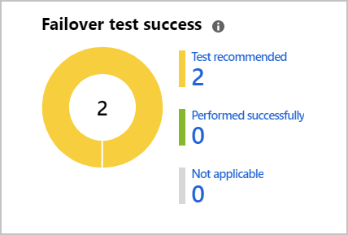
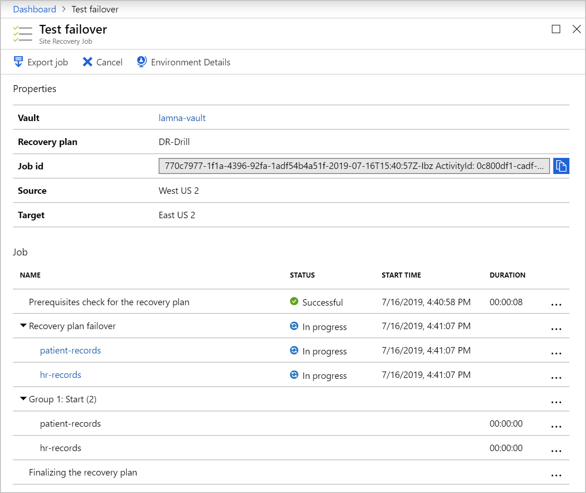
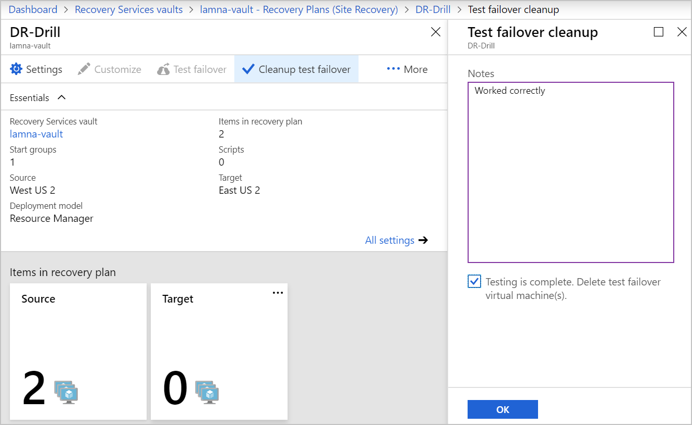

Disaster recovery (DR) drills test your organization's ability to recover from an outage, without impacting any production service.

With Azure Site Recovery setup, and your infrastructure protected, you should run a disaster recovery drill. Azure Site Recovery supports doing this in a safe manner that won't impact your production environment. You'll run some quality assurance on the configuration to ensure your DR solution is working correctly.

In this unit, you'll learn about Azure Site Recovery disaster drills, what you need to consider, and how to run test process to check your environment has been correctly configured.

## What is a disaster recovery drill

A DR drill is a sanity check to ensure you have configured you solution properly, it shoulg give you and your company confidence in the event of a disaster, your infrastructure will keep working. Typically your organization will set a recovery time objective (RTO) which is a timeframe for recovering infrastructure in a disaster or outage scenario. In tandem with this usually comes a recovery point objective (RPO), defining at which point in time the infrastructure is recovered from i.e. hours, minutes or seconds. Both of these will be defined in a good BCDR plan.

Azure Site Recovery not only supports running automated test failovers, it actively prompts you to run them on the Site Recovery dashboard.

## Why should you run a DR drill

A DR drill is important to ensure the solution setup meets the BCDR requirements, not only this but also to ensure the replication works properly. This combined with RTO and RPO need to be tested thoroughly to ensure replication and failover happen in the desired timeframe. For example, if your RTO is set to 1 hour and your RPO set to 30 minutes, as in business operations can continue for 1 hour without major impact and systems backup every 30 minutes, thats 30 minutes of lost time with a recovery of 1 hour. Imagine now your actual recovery time is 2 hours but your backup only completes every hour, that's an extra 30 minutes of data loss and and additional hour of serious business harm which could potentially have large financial consequences for your organization.

## Test failover of individual machines

A test failover allows you to simulate a disaster, and see its effects. This method enables you to choose a recovery point typically either the last processed, the latest app-consistent point or a custom recovery point (any available). This process can be started  from the Site Recovery dashboard, or from the disaster recovery menu for a specific VM.

The steps proceeding that are as follows:

1. Create an isolated virtual network, so that your production infrastructure isn't affected.
1. On the target VMs overview, select Disaster recovery.

    

1. This will open a new **Replicated items** pane.
1. Select **Test Failover** at the top of the pane.
1. This will then run a test failover on the replicated VM you chose and allow you to track its progress through Site Recovery jobs.
1. Once complete, the VM failed over will appear in the portal under Virtual Machines, in the recovery region. You can then check the VM is running, is sized and connected as expected, and is mirroring the source VM but in a different Azure region.
1. Following this check the VMs replicated can be deleted by selecting **Cleanup test failover**. You can also store notes about the testing at this point.

## Flexible failover of multiple machines

Azure Site Recovery gives you the felxibitly to run a full DR test scenario for all your virtual machines. You can create Recovery Plans that can include one or more of your VMs. Failovers can be run as many times as you like, and allow for a flexible policy to determine what will trigger an automatic failover.

## Difference between a drill and production failover

Running a production failover in ASR is pretty much the same procedure as it is for a drill. There are some exceptions the first being that **Failover** is selected. You can choose to shut down the source VM before starting the failover, this does not stop the failover in the event the shutdown fails. ASR will not clean up the source environment once the failover is complete.

When the failover is completed, monitor through the **jobs** page, validate the VM is working as expected. ASR gives you the ability to change the recovery point at this stage. When you are happy the failover has completed successfully you simply **Commit** the failover, ASR will then delete all source VM recovery points and completes the failover. The new VM in the secondary region will then need to be re-protected.
