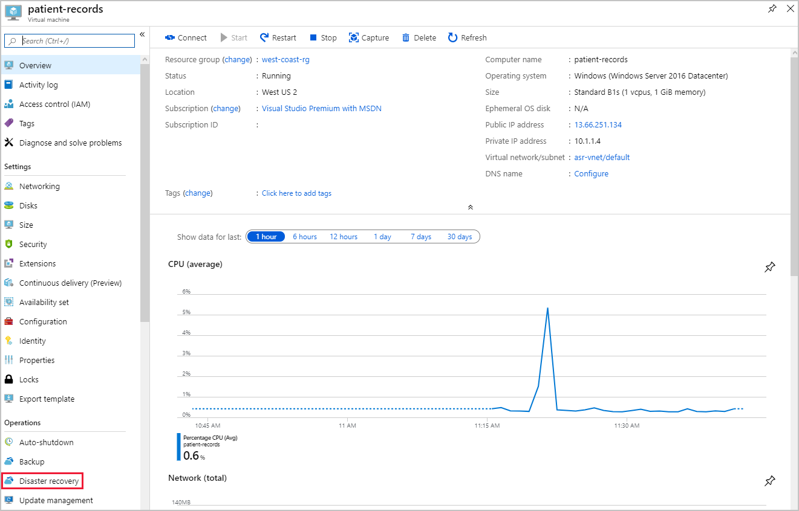

Disaster recovery (DR) drills test your organization's ability to recover from an outage, without impacting any production service.

When you have finished setting up Azure Site Recovery, and your infrastructure is protected, you should run a disaster recovery drill. Azure Site Recovery supports doing these drills in a safe manner that won't impact your production environment. You'll run some quality assurance on the configuration to ensure your DR solution is working.

In this unit, you'll learn about Azure Site Recovery disaster drills. What you need to consider, and how to run a test to check the configuration is correct.

## What is a disaster recovery drill?

A DR drill is a way to check you've configured your solution properly. The drill should give you, and your company, confidence if a disaster hits. Typically your organization sets a recovery time objective (RTO) which is a how long it takes to recover infrastructure. Alongside the RTO, your company should define a recovery point objective (RPO). The RPO defines the amount of data loss that is acceptable as a function of time. So if your companies RPO is a day, you'll need to create at least a backup of all your data each day. It must also take less than a day to recover from this backup.

Azure Site Recovery not only supports running a disaster recovery drill via automated test failovers. It actively prompts you to run them on the Site Recovery dashboard.

## Why should you run a DR drill?

A DR drill is vital to ensure the solution implemented meets the BCDR requirements, and to check the replication works appropriately. This, combined with RTO and RPO, needs to be tested thoroughly to ensure replication, failover, and recovery happen in the required timeframe.

For example, imagine your RTO is an hour, and your RPO is six hours. Your systems backed up every hour, that's an hour of lost data plus the additional hour to recover your systems and get them back online.

Imagine your actual recovery time is five hours. Your systems are now close to being over six hours out of date, which means you'll be in breach of the BCDR RPO objective. Testing the actual time it takes to recover from failures can give you confidence that your systems comply with your BCDR plans.

## Test failover of individual machines

A test failover allows you to simulate a disaster, and see its effects. When you start the test, you first choose a recovery point. The choice is either the last processed, the latest app-consistent point, or a custom recovery point. The failover tests can be started from the Site Recovery dashboard, or directly from the disaster recovery menu on a specific VM.

The steps are as follows:

1. Create an isolated virtual network so that your production infrastructure isn't affected.

    

1. On the target VMs' overview, select **Disaster recovery**.

1. This will open a new **Replicated items** pane.

    

1. Select **Test Failover** at the top of the pane.
1. This will run a test failover of the VM, and allow you to track its progress through the Site Recovery jobs page.
1. Once complete, the failed over VM appears in the portal under Virtual Machines, in the recovery region. You can then check the VM is running, is sized and connected correctly, and is mirroring the source VM but in a different Azure region.
1. After you've validated everything has worked as expected, the replicated VM is deleted by selecting **Cleanup test failover**. You can add notes about your testing at this point.

## Flexible failover of multiple machines

Azure Site Recovery gives you the flexibility to run a full DR test scenario for all your virtual machines. You can create recovery plans that include one or more of your VMs. Failovers are runnable as many times as you like, and allow for a flexible policy to test different combinations of infrastructure. Just like testing the single VMs, the same test cleanup is available for everything included in the recovery plan.

## Difference between a drill and production failover

Running a real production failover in Azure Site Recovery is similar as it is for a test drill. There are some exceptions the first being that **Failover** is selected, instead of Test failover. You can choose to shut down the source VM before starting the failover so that no data is lost during the switch. Azure Site Recovery doesn't clean up the source environment once the failover is complete.

When the failover is completed, validate the VM is working as expected. Azure Site Recovery gives you the ability to change the recovery point at this stage. If you're happy the failover works, you'll **Commit** the failover. Azure Site Recovery deletes all the source VM recovery points and finishes the failover. The new VM in the secondary region then needs to be reprotected.