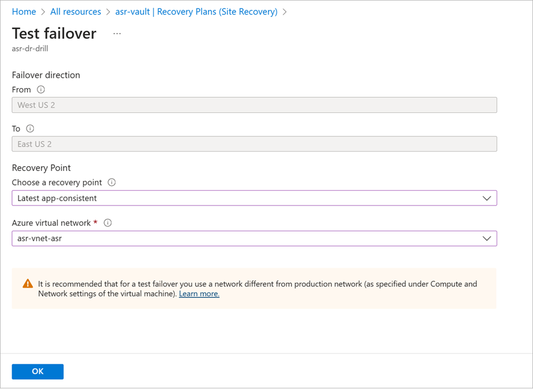
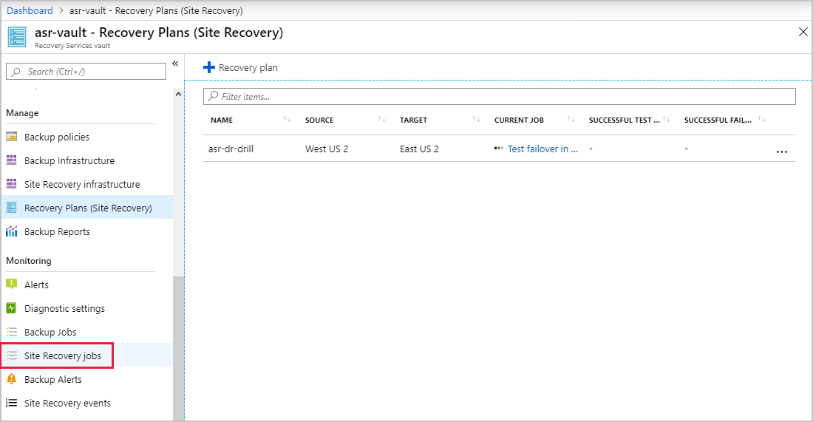
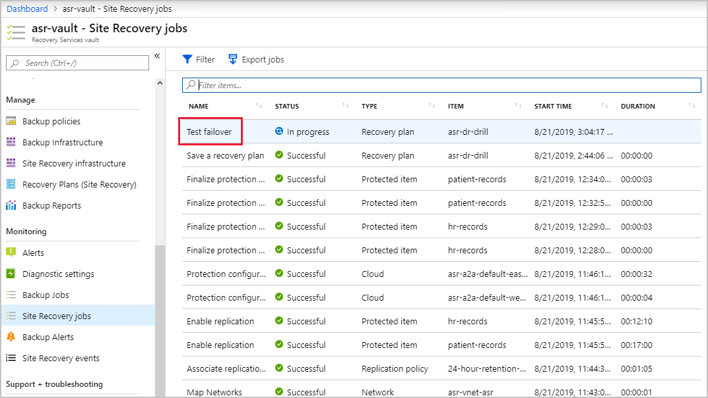

Azure Site Recovery is flexible enough to support many different recovery scenarios. You can choose to failover individual machines or our entire infrastructure with recovery plans. The flexibility enables you to simulate various disasters, like losing only part of your infrastructure. Multiple recovery plans can be defined to allow for all the different kinds of disaster drills you want to run.

With Site Recovery in place, the head of Ops has asked you to test how long it takes to fail over all your infrastructure. You've investigated the different options, and decided to create a recovery plan so that you can fail over all the VMs. With the plan in place, you'll run a test failover, and monitor its progress.

In this exercise, you'll complete the steps needed to run a DR drill using a recovery plan on the portal.

> [!NOTE]
> For Azure Site Recovery to efficiently function, a minimum memory of 1 GB is required on each VM.

## Create a recovery plan

1. Sign in to the [Azure portal](https://portal.azure.com) with your credentials.

1. On the home page, select **All resources**.

1. From the list of resources, select the Recovery Services vault, **asr-vault**.

1. In the middle menu pane, under **Manage**, select **Recovery Plans (Site Recovery)**.

1. In the top menu bar, select **Recovery plan**. The **Create recovery plan** pane appears.

1. Enter the following values for each setting.

    | Setting | Value |
    |---|---|
    | Name | asr-dr-drill |
    | Source | West US 2 |
    | Target | East US 2 |
    | Allow items with deployment model | From the dropdown list, se;ect **Resource Manager**. |

1. Select the **Select items** link. The **Select items** pane appears.

1. Select your company's two VMs, and then select **OK**. The **Create recovery plan** reappears.

    

1. Select **Create**. The **recovery Plans (Site Recovery) pane reappears.

    > [!NOTE]
    > It can happen that the configuration fails. If the configuration fails, delete the plan and create a new plan.

## Run a test failover using a recovery plan

1. View the details of the recovery plan you previously created by selecting **asr-dr-drill**.

    

    The **asr-vault** pane named *asr-dr-drill** pane appears.

1. In the top menu bar, select **Test failover**.

    

    The **Test failover** pane appears.

1. Enter the following values for each setting.

    > [!IMPORTANT]
    > The network configuration failover support for each VM can take several minutes to auto-configure as each VM also needs to complete an initial synchronization. Running a failover test may not be available immediately.

    | Setting | Value |
    |---|---|
    | **Failover direction** |
    | From | West US 2 |
    | To*| East US 2 |
    | **Recovery Point** |
    | Choose a recovery point | From the dropdown list, select **Latest app-consistent** |
    | Azure virtual network | From the dropdown list, select **asr-vnet-asr**. |

1. To begin the failover, select **OK**.

    

    The **Recovery Plans (Site Recovery)** pane for the **Recovery Services vault** named *asr-vault* reappears.

## Monitor failover progress

1. In the left menu pane, under **Monitoring**, select **Site Recovery jobs**.

    

1. From the list, select **Test failover**.

    

1. The **Test failover** pane appears where you can view the status of the jobs.

    

    You'll use the information on this pane to report back to the Ops manager that an Azure failover for your company's current infrastructure will take less than three minutes to complete. These jobs are running in parallel, (rather than a simple sum of all of jobs), to work out the total of time taken.

1. After all the jobs have completed successfully, on the far left, select **Virtual machines**.

    

1. Select one of the new test VMs.

1. In the left menu pane, under **Settings**, select **Networking**, and then select **Topology**.

    

    > [!NOTE]
    > Both the patient-records and hr-records VMs have been failed over by Site Recovery. The VMs are running in their own disaster recovery virtual network.

1. After you're satisfied with the test results, make sure to capture any notes about the test outcome. You'll now switch back to your **asr-dr-drill** site recovery plan, and in the top menu bar, select **Cleanup test failover** to delete the replicated VMs.

    

1. To complete the cleanup process, select the **Testing is complete** checkbox, and then select **OK**. This step can take up to three minutes to complete.
