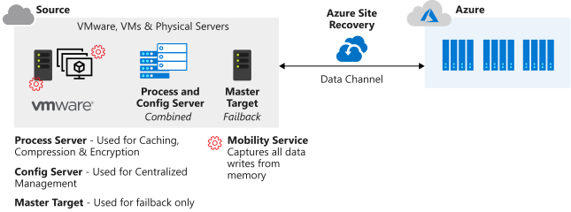
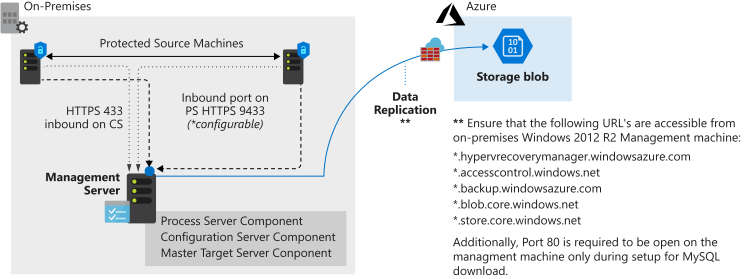

Azure Site Recovery is more than just a tool to help you recover from system outages. Azure Site Recovery will replicate workloads between a primary and secondary site, and can also be used to migrate VMs from on-premises infrastructure to Azure.

Your first task to protect your workloads from earthquakes is to review the company's current business continuity and disaster recovery (BCDR) plan. You need to identify the different recovery objectives and scope for the systems that need protection.

In this unit, you'll investigate how Azure Site Recovery can help achieve these goals and make failover and recovery of resources possible in the event of a disaster.

## Business continuity and disaster recovery

Loss of service can cause disruption to your staff and users. Every second that systems are unavailable can cause the company lost revenue, or financial penalities for breaking agreements written for the availability of services you provide.

BCDR plans are formal documents that companies draw up that cover the scope and actions that should be taken when a disaster or large-scale outage happens. Each outage is assessed on its own merit. For example, a DR plan will come into action when a whole data center loses power, or relevant in this scenario, an earthquake hits and has damaged communications lines that render a data center useless until fixed. A disaster of that size could bring services down for days, not hours, so a full BCDR plan would need to be invoked to get the service back online.

As part of your BCDR plan, identify the recovery time objectives (RTO) and recovery point objectives (RPO) for your applications. Both help to realize the maximum tolerable hours your business can be without specified services, and what the data recovery process should be. Let's look closer at each.

### Recovery Time Objective (RTO)

RTO is a measure of the maximum amount of time your business can survive for after a disaster, before things are restored to normal service. Let's assume your RTO is 12 hours, meaning operations can continue for 12 hours without the businesses core services functioning. If the downtime is 24 hours, this delay would cause your business serious harm.

### Recovery Point Objective (RPO)

RPO is a measure of the maximum amount of data loss that's acceptable during a disaster. A business can typically decide to do a backup every 24 hours, 12 hours, or even in real time, but if there's a disaster there will always be some data loss. If your backup occurred every 24 hours, at midnight, and a disaster happened at 9am the following day, then nine hours of data would be lost. If the companies RPO was 12 hours, it would be ok as only nine hours have passed. However, if the RPO was four hours then there would be a problem and damage would occur to the business.

## What is Azure Site Recovery?

Azure Site Recovery is designed to contribute to your disaster recovery plan and can replicate workloads from a primary site to a secondary site. If an issue occurs at the primary site, the Site Recovery service can be automatically invoked and protected virtual machines will be replicated to another location. The failover could be an on-premises to Azure failover, or one Azure region to another.

Some notable features of Azure Site Recovery are:

- **Central management** -  Replication is set up, managed, failover, and failback can be invoked all from within the Azure portal.
- **On-premises virtual machine replication** -  On-premise virtual machines can be replicated to Azure, or to secondary on-premise data center if necessary.
- **Azure virtual machine replication** -  Azure virtual machines can be replicated from one region to another.
- **App consistency during failover** -  Using recovery points and application-consistent snapshots, during replication virtual machines are kept in a consistent state at all times.
- **Flexible failover** - Failovers can be run on demand as a test, or triggered during an actual disaster. Tests can be run to simulate a DR scenario without interruption to your live service.
- **Network integration** - Site Recovery can manage network management during a replication/DR scenario, including reserved IP addresses and load balancers so that when the virtual machine is working in its new location.

## Setting up Azure Site Recovery

There are several components that need to be set up to enable Azure Site Recovery:

- **Networking** - A valid Azure virtual network is required for the replicated virtual machines to use.
- **Recovery Service vault** - A vault in your Azure subscription that stores the migrated VMs when a failover is run. The vault also contains the replication policy, and the source and target locations for replication/failover.
- **Credentials** - The credentials you use for Azure need to have the **Virtual Machine Contributor** and **Site Recovery Contributor** roles to allow permission to modify both the VM and the storage Site Recovery is connected to.
- **Configuration Server** - An on-premises VMware server fulfills several roles during the failover/replication process. It's obtained from the Azure portal as an OVA for easy deployment. The configuration server includes a:
  - **Process Server** - This server acts as a gateway for the replication traffic and optimizes it before sending it over the WAN to Azure, it caches, compresses, and encrypts the traffic. The process server also installs the Mobility service onto the all the physical and virtual machines targeted for failover/replication.
  - **Master Target Server** - This machine handles the replication process during a failback from Azure.

> [!IMPORTANT]
> If you want to be able to fail back from Azure to on-premises environment, VMware vCenter with a Configuration server needs to be available even if you are only replicating physical machines to Azure. You cannot fail back to physical servers.

## The replication process

Once the pre-requisite tasks have been set up, replication of the machines can begin. They are replicated in accordance with the created replication policy and during the initial stages the first copy, the server data is replicated to Azure storage. Once the initial replication completes, a second replication, this time for the delta changes to the virtual machine, are replicated to Azure with those changes.

## Testing and monitoring a failover

Once your environment is set up for disaster recovery, you should test it to make sure it's configured correctly and that everything works as you expect. Test the configuration by doing a disaster recovery drill on an isolated VM, it's best practice to use an isolated network for the test so as not to disrupt any live services.

The first task when attempting a recovery drill is to verify your test virtual machine properties in the **Protected Items** section of the Azure portal. The latest recovery points are viewed from the **Replicated Item** pane. In the **Compute & Network** section the virtual machine name, resource group, target size, availability set, and disk settings are adjusted if needed.

Recovery drills can be started from the **Settings > Replicated Items** section of the Azure portal. The target virtual machine should be selected and then the **Test Failover** menu item should be selected for the latest processed recovery point. Select the Azure network in the same menu. Finally, start the recover job by selecting **OK** on the network selection screen.

The status of the recovery job and the replicated virtual machine is accessed via the **Overview** section of the Recovery Services vault. Replicated items will have a status of:

- **Healthy** - replication is operating normally.
- **Warning** - Indication there's an issue that could impact replication.
- **Critical** - Indication a critical replication error has been detected.

The replicated VM will be set to a status of **Performed successfully** if all went well, or **Test recommended** if a test hasn't yet been done. The VM will also be set to **Test recommended** if it's been more than six months since the last test.
