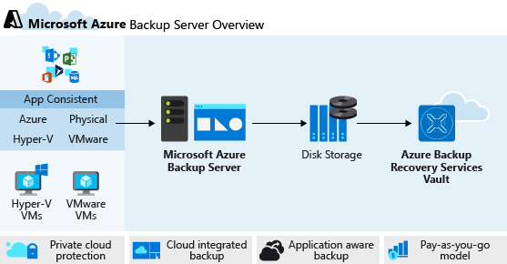
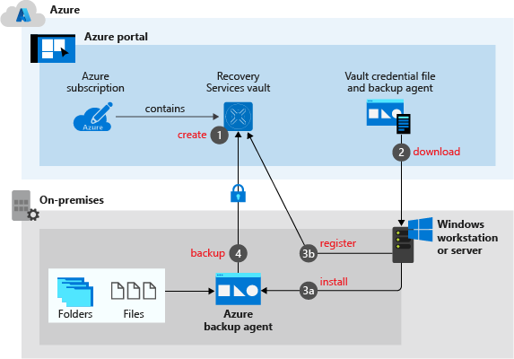

You want to ensure that the backup and restore jobs you put in place offer a way to recover your company's servers. With this requirement in mind, you want to investigate the best way to implement backup for your virtual machines. 

Virtual machines that are hosted on Azure can take advantage of Azure Backup. You can easily back up and restore machines without installing additional software.

In this unit, you'll explore all the methods of backing up Azure virtual machines provided by Azure Backup and make a decision on which to implement.

## Snapshots

A snapshot is a point-in-time backup of all disks on the virtual machine. For Azure virtual machines, Azure Backup uses different extensions for each supporting operating system:

| Extension | OS | Description |
|---|---|---|
| VMSnapshot | Windows | The extension works with Volume Shadow Copy Service (VSS) to take a copy of the data on disk and in memory. |
| VMSnapshotLinux | Linux | The snapshot is a copy of the disk. |

Depending on how the snapshot is taken and what it includes, you can achieve different levels of consistency:

- **Application consistent**
  - The snapshot captures the virtual machine as a whole. It uses VSS writers to capture the content of the machine memory and any pending I/O operations.
  - For Linux machines, you'll need to write custom pre or post scripts per app to capture the application state.
  - You can get complete consistency for the virtual machine and all running applications.
- **File system consistent**
  - If VSS fails on Windows, or the pre and post scripts fail on Linux, Azure Backup will still create a file-system-consistent snapshot.
  - During a recovery, no corruption occurs within the machine. But installed applications need to do their own cleanup during startup to become consistent.
- **Crash consistent**
  - This level of consistency typically occurs if the virtual machine is shut down at the time of the backup.
  - No I/O operations or memory contents are captured during this type of backup. This method doesn't guarantee data consistency for the OS or app.

## Recovery Services vault

You use a Recovery Services vault to manage and store the backup data in Azure. Typically a vault consists of data copies, configuration information for virtual machines, a server, and workstation workloads. You can also use Recovery Services vaults to hold backup data for infrastructure-as-a-service (IaaS) virtual machines. 

The vault provides a single place to manage your backups. It's accessible in context to the resource that it helps protect. For example, with the vault, you can:

- Monitor Azure virtual machine backups. Hybrid scenarios are also supported, so on-premises machines protected with Azure Backup can also be monitored.
- Manage backup jobs and their properties.
- Take advantage of access management control, which allows fine-tuned permissions for administrators.
- Quickly restore files or folders within virtual machines instead of recovering the whole machine.
- Be assured that all data located in a Recovery Services vault is secured while at rest.

## Cost considerations

There's a cost for every virtual machine backed up, and it starts as soon as the first backup is completed. The pricing is based on the size of the backed-up data, because the cost is based on the size of the allocated disk space. For SQL Server backups, cost is based on the size of the database backup file.

## Backup agents

Azure Backup uses agents to support a variety of backup scenarios. The agents can be installed directly on physical or virtual machines, or be part of a dedicated backup server. The agent that you choose will differ slightly depending on whether you need to backup an entire virtual machine, files and folders, or running apps.

### Azure Backup virtual machine extension

The Azure Backup extension is the default backup choice, because it's the most simple and straightforward method to quickly back up an Azure virtual machine. The administrator doesn't need to take any action other than to configure the backup job. 

During the first backup, a *VMSnapshot* (for Windows) or *VMSnapshotLinux* (for Linux) extension is installed. These extensions take snapshots of the virtual machine's entire disk, which means they don't enable file-level or folder-level restores. The snapshots are created and stored in a Recovery Services vault.

If your company's virtual machines are in Azure, and you don't require file-level restores, your company should use the Azure Backup extension.

### Microsoft Azure Backup Server protection agent

The Microsoft Azure Backup Server (MABS) agent installed on an Azure or on-premises virtual machine allows that machine to back up to an Azure Backup server. The MABS agent can back up and restore SQL and other application services. You can also support workloads like Exchange and SharePoint by using the *AzureBackupWindowsWorkload* extension. 

Machines and workloads are backed up to an Azure Backup server, although this doesn't move these backups to a Recovery Services vault. If you need to move your backups to a Recovery Services vault, install the MARS agent.

### Microsoft Azure Recovery Services agent

Azure Backup uses the Microsoft Azure Recovery Services (MARS) agent to back up Windows files, folders, and system state data to a Recovery Services vault. The agent is installed manually on the machines that you're backing up. 

The MARS agent enhances the levels of backup if it's installed alongside the Azure Backup extension on an Azure virtual machine. MARS enables on-premises Windows machines to be backed up directly to a Recovery Services vault.

When the MARS agent is used in conjunction with an Azure Backup server, it will copy the snapshots from the server into a vault.

## Backup process for an Azure virtual machine

1. The first stage of the backup job is installing the extension automatically. The *VMSnapshot* extension is for Windows machines, and the *VMSnapshotLinux* extension is for Linux virtual machines.
   
   In a Windows environment, Azure Backup uses the Volume Shadow Copy Service to take app-consistent snapshots of the virtual machine that's used for the backup procedure.
   
   In a Linux environment, Azure Backup takes file-consistent snapshots that are used for the backup procedure.

1. The snapshot is transferred to your Recovery Services vault in Azure.
    
   Each disk for the selected virtual machine is backed up in parallel for optimization purposes.
    
   After the first full backup, Azure Backup will identify the blocks of data that have changed. It will back up only that information, rather than the whole virtual machine a second time.

1. Snapshots can take up to 24 hours to transfer to the Recovery Services vault in Azure. When the transfer finishes, the service will remove the snapshot and create a recovery point for the machine.

## Security

Azure Backup offers the ability to back up virtual machines encrypted with Azure Disk Encryption. Azure Storage also encrypts your backed-up data at rest by using Storage Service Encryption. Your data is automatically decrypted when it's retrieved. 

Here are more details about the encryption types:

- Azure Disk Encryption encrypts your operating system and data disks. It works with BitLocker encryption keys (BEKs), which are safeguarded in a key vault as secrets. It also works with Azure Key Vault encryption keys (KEKs).
  
  During the backup procedure, both BEKs and KEKs are backed up and encrypted. Users who have appropriate permissions can then restore the keys and secrets if needed, and also recover an encrypted virtual machine.
- Storage Service Encryption encrypts your backups when at rest after it has been copied to the vault. When a restore operation is called for the backed-up data, it's automatically decrypted and ready for use.
