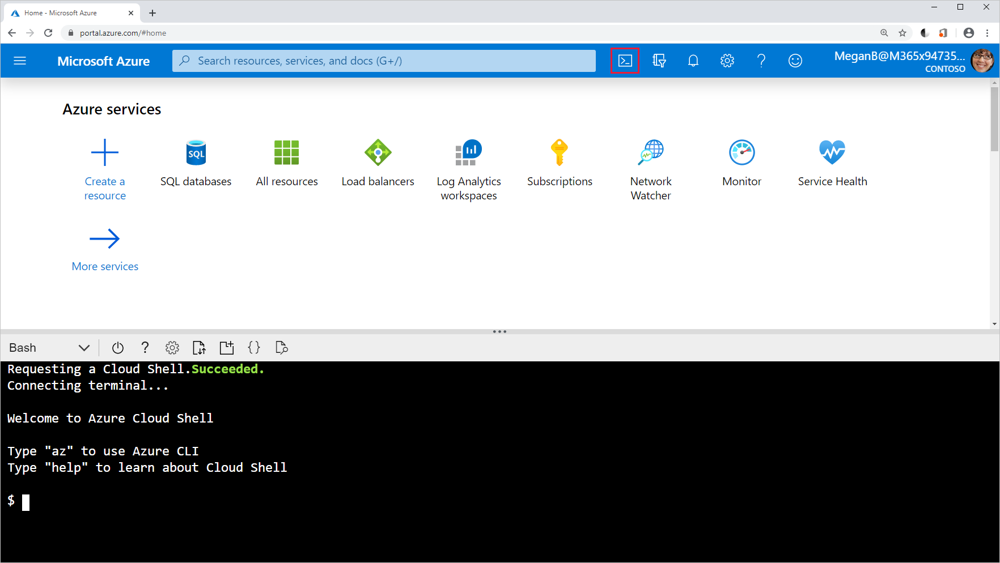
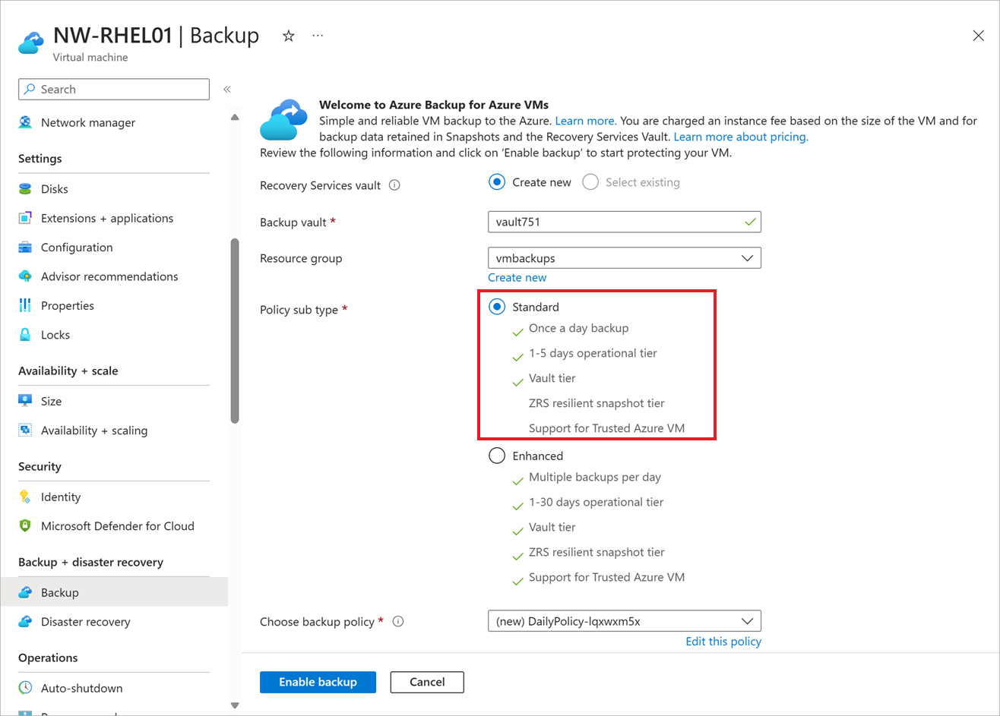
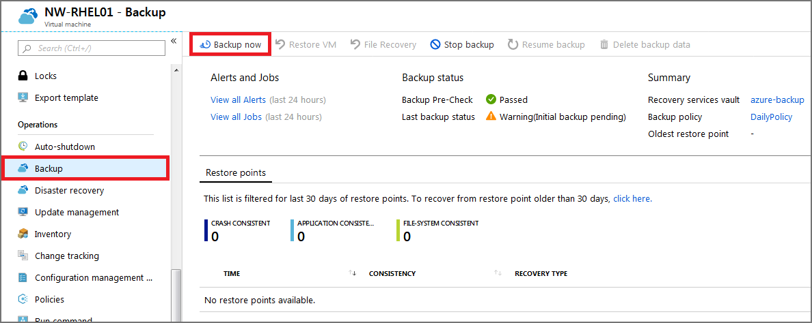
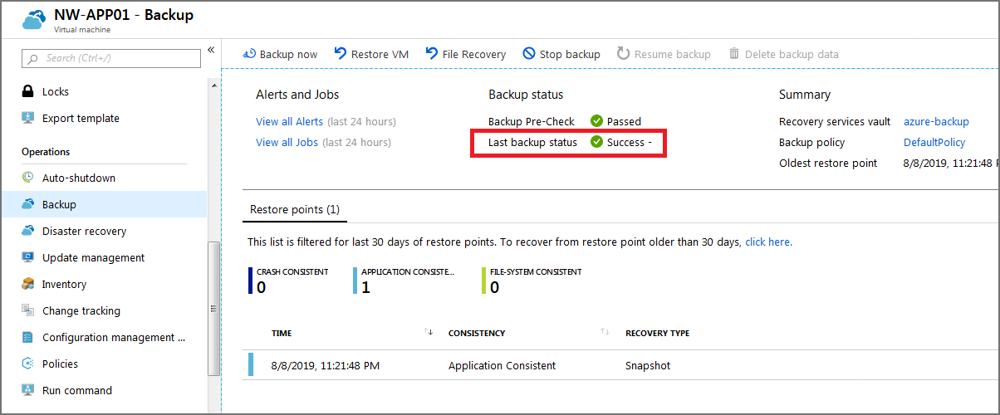

Your company is running a combination of Windows and Linux workloads, and you've been asked to prove Azure Backup is a good fit for both kinds of VMs. Using a combination of Azure CLI and the Azure portal, you're going protect both kinds of VMs with Azure Backup.

Azure Backup can be quickly enabled for VMs in Azure. You can enable Azure Backup from the portal, the azure CLI, or with powershell commands.

In this exercise, you'll create a VM, setup, and then start an Azure Backup.

> [!NOTE]
> This exercise is optional. If you don't have an Azure account, you can read through the instructions so you understand how to back up virtual machines with Azure Backup.
> If you want to complete this exercise, but you don't have an Azure subscription, or prefer not to use your own account, you'll need to create a [free account](https://azure.microsoft.com/free/?azure-portal=true) before you begin.

## Create a backup for Azure VMs

### Set up the environment

1. Sign into the [Azure portal](https://portal.azure.com/), and select the Cloud Shell.

    

1. Create a resource group to contain all the resources for this exercise.

    ```azurecli
    RGROUP=$(az group create --name vmbackups --location westus2 --output tsv --query name)
    ```

1. Use the Cloud Shell to create the **NorthwindLive** VNet and **NorthwindInternal1** subnet.

    ```azurecli
    az network vnet create \
        --resource-group $RGROUP \
        --name NorthwindInternal \
        --address-prefix 10.0.0.0/16 \
        --subnet-name NorthwindInternal1 \
        --subnet-prefix 10.0.0.0/24
    ```

### Create a Windows Virtual Machine using Azure CLI

Create the **NW-APP01** virtual machine by using the following command.

```azurecli
az vm create \
    --resource-group $RGROUP \
    --name NW-APP01 \
    --size Standard_DS1_v2 \
    --vnet-name NorthwindInternal \
    --subnet NorthwindInternal1 \
    --image Win2016Datacenter \
    --admin-username admin123 \
    --admin-password Password123456 \
    --no-wait
```

### Create a Linux VM using Azure CLI

Create the **NW-RHEL01** virtual machine by using the following command.

```azurecli
az vm create \
    --resource-group $RGROUP \
    --name NW-RHEL01 \
    --size Standard_DS1_v2 \
    --image Canonical:UbuntuServer:18.04-LTS:latest \
    --authentication-type ssh \
    --generate-ssh-keys \
    --vnet-name NorthwindInternal \
    --subnet NorthwindInternal1
```

The above can take a few minutes to complete, wait for this command to finish before moving on to the next step.

### Enable backup for a VM using the Azure portal

1. Select **All Services** and then search for **Virtual Machines**. From the list, select **Virtual Machines**.

    

1. From the list, select the **NW-RHEL01** VM you created.

    

1. In the sidebar, scroll down to **Operations**, select **Backup**, and then use the following information to create a backup:

    - **Recovery Services vault** - select **Create new**, and type **azure-backup** for the name.

    - **Resource group** - select the **vmbackups** resource group that you created earlier.

    - **Choose a backup policy** - select **(new) DailyPolicy**, which is a daily backup at 12:00 PM UTC, and a retention range of 180 days.

    - Select **Enable Backup**.

    

1. After the deployments completes, select **NW-RHEL01** from the list of VMs.

1. The backup settings for the virtual machine can be accessed from the virtual machine menu by scrolling down to **Operations** and selecting **Backup**.

1. To perform the first backup for this server, select **Backup now**.

    

1. On the **Backup Now** page, select **OK**.

### Enable a backup with Azure CLI

1. Using the Cloud Shell, enable a backup for **NW-APP01** VM.

    ```azurecli
    az backup protection enable-for-vm \
        --resource-group vmbackups \
        --vault-name azure-backup \
        --vm NW-APP01 \
        --policy-name DefaultPolicy
    ```

1. Monitor the progress of the setup using Azure CLI.

    ```azurecli
    az backup job list \
        --resource-group vmbackups \
        --vault-name azure-backup \
        --output table
    ```

    Keep running the above command until you see that `ConfigureBackup` has completed:

    ```output
    Name                                  Operation        Status      Item Name    Start Time UTC                    Duration
    ------------------------------------  ---------------  ----------  -----------  --------------------------------  --------------
    a3df79b4-be4f-4cc9-8b2c-a5ead44a6a12  ConfigureBackup  Completed   NW-APP01     2019-08-01T06:19:12.101048+00:00  0:00:31.305975
    5e1531a9-8b3d-4983-a642-86ee982f7036  Backup           InProgress  NW-RHEL01    2019-08-01T06:18:35.955118+00:00  0:01:22.734182
    860d4dca-9603-4a4e-9f3b-93f242a0a64d  ConfigureBackup  Completed   NW-RHEL01    2019-08-01T06:13:33.860598+00:00  0:00:31.256773    
    ```

1. Do an initial backup of the VM, instead of waiting for the schedule to run it.

    ```azurecli
    az backup protection backup-now \
        --resource-group vmbackups \
        --vault-name azure-backup \
        --container-name NW-APP01 \
        --item-name NW-APP01 \
        --retain-until 18-10-2030
    ```

    There's no need to wait for the backup to complete as you'll be seeing how to monitor the progress on the portal next.

## Monitoring backups in the portal

### View the status of a backup for a single VM

1. Sign into the [Azure portal](https://portal.azure.com/), and select **All resources** on the left of the portal.

1. Select the **NW-APP01** VM.

1. Under **Operations**, select **Backup**.

    

    The **Last backup status** will display the current status of the backup.

### View the status of backups in the Recovery Service vault

1. Sign into the [Azure portal](https://portal.azure.com/), and select **All resources** on the left of the portal.

1. Select the **azure-backup** Recovery Services vault.

1. Select the **Backup** tab on the **Overview** page to see a summary of all the backup items, storage being used, and the current status of any backup jobs.

    

