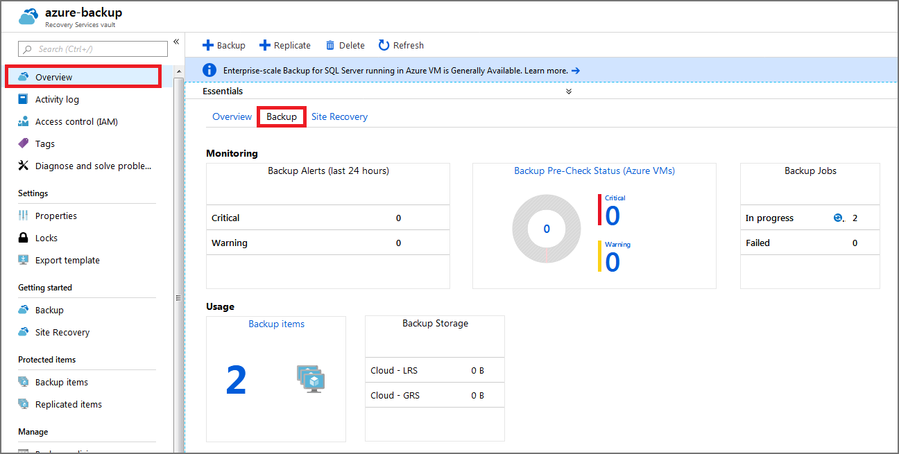

Your company runs a combination of Windows and Linux workloads. You've been asked to prove that Azure Backup is a good fit for both kinds of virtual machines (VMs). By using a combination of the Azure CLI and the Azure portal, you'll help protect both kinds of VMs with Azure Backup.

Azure Backup can be quickly enabled for VMs in Azure. You can enable Azure Backup from the portal, from the Azure CLI, or by using PowerShell commands.

In this exercise, you'll create a VM, set up a backup, and start a backup.

> [!NOTE]
> This exercise is optional. If you don't have an Azure account, you can read through the instructions so you understand how to back up virtual machines by using Azure Backup.
> If you want to complete this exercise, but you don't have an Azure subscription or you prefer not to use your own account, create a [free account](https://azure.microsoft.com/free/?azure-portal=true) before you begin.

## Create a backup for Azure virtual machines

### Set up the environment

1. Sign in to the [Azure portal](https://portal.azure.com/?azure-portal=true), and select the **>_** icon to open Azure Cloud Shell.

    

1. Create a resource group to contain all the resources for this exercise.

    ```azurecli
    RGROUP=$(az group create --name vmbackups --location westus2 --output tsv --query name)
    ```

1. Use Cloud Shell to create the **NorthwindInternal** virtual network and the **NorthwindInternal1** subnet.

    ```azurecli
    az network vnet create \
        --resource-group $RGROUP \
        --name NorthwindInternal \
        --address-prefixes 10.0.0.0/16 \
        --subnet-name NorthwindInternal1 \
        --subnet-prefixes 10.0.0.0/24
    ```

### Create a Windows virtual machine by using the Azure CLI

Create the **NW-APP01** virtual machine by running the following command. Replace `<password>` with a password of your choice, enclosed in double quotes. For example, `--admin-password "PassWord123!"`.

```azurecli
az vm create \
    --resource-group $RGROUP \
    --name NW-APP01 \
    --size Standard_DS1_v2 \
    --public-ip-sku Standard \
    --vnet-name NorthwindInternal \
    --subnet NorthwindInternal1 \
    --image Win2016Datacenter \
    --admin-username admin123 \
    --no-wait \
    --admin-password <password>
```

### Create a Linux virtual machine by using the Azure CLI

Create the **NW-RHEL01** virtual machine by running the following command.

```azurecli
az vm create \
    --resource-group $RGROUP \
    --name NW-RHEL01 \
    --size Standard_DS1_v2 \
    --image RedHat:RHEL:7-RAW:latest \
    --authentication-type ssh \
    --generate-ssh-keys \
    --vnet-name NorthwindInternal \
    --subnet NorthwindInternal1
```

The command can take a few minutes to complete. Wait for it to finish before moving on to the next step.

### Enable backup for a virtual machine by using the Azure portal

1. In the Azure portal, search for and select **Virtual machines**.

    

    The **Virtual machines** pane appears.

1. From the list, select the **NW-RHEL01** virtual machine that you created.

    

    The **NW-RHEL01** virtual machine pane appears.

1. In the middle menu pane, scroll down to **Operations**, and select **Backup**. The **Backup** pane for the NW-RHEL01 virtual machine appears.

1. Under the **Summary** section, ensure the following information exists for creating a backup.

    - **Recovery services vault**: **azure-backup** for the name.
    - **Backup policy**: **DailyPolicy-xxxxxxxx**, which creates a daily backup at 12:00 PM UTC with a retention range of 180 days.

    

1. To perform the first backup for this server, in the top menu bar, select **Backup now**.

    

    The **Backup Now** pane for NW-RHEL01 appears.

1. Select **OK**.

### Enable a backup by using the Azure CLI

1. Using Cloud Shell, enable a backup for the **NW-APP01** virtual machine.

    ```azurecli
    az backup protection enable-for-vm \
        --resource-group vmbackups \
        --vault-name azure-backup \
        --vm NW-APP01 \
        --policy-name DefaultPolicy
    ```

1. Monitor the progress of the setup using the Azure CLI.

    ```azurecli
    az backup job list \
        --resource-group vmbackups \
        --vault-name azure-backup \
        --output table
    ```

    Keep running the preceding command until you see that `ConfigureBackup` has finished.

    ```output
    Name                                  Operation        Status      Item Name    Start Time UTC                    Duration
    ------------------------------------  ---------------  ----------  -----------  --------------------------------  --------------
    a3df79b4-be4f-4cc9-8b2c-a5ead44a6a12  ConfigureBackup  Completed   NW-APP01     2019-08-01T06:19:12.101048+00:00  0:00:31.305975
    5e1531a9-8b3d-4983-a642-86ee982f7036  Backup           InProgress  NW-RHEL01    2019-08-01T06:18:35.955118+00:00  0:01:22.734182
    860d4dca-9603-4a4e-9f3b-93f242a0a64d  ConfigureBackup  Completed   NW-RHEL01    2019-08-01T06:13:33.860598+00:00  0:00:31.256773    
    ```

1. Do an initial backup of the virtual machine, instead of waiting for the schedule to run it.

    ```azurecli
    az backup protection backup-now \
        --resource-group vmbackups \
        --vault-name azure-backup \
        --container-name NW-APP01 \
        --item-name NW-APP01 \
        --retain-until 18-10-2030 \
        --backup-management-type AzureIaasVM
    ```

    There's no need to wait for the backup to finish, because you'll see how to monitor the progress in the portal next.

## Monitor backups in the portal

### View the status of a backup for a single virtual machine

1. On the Azure portal menu or from the **Home** page, select **All resources**.

1. Enter *Virtual machines* in the search field at the top of the page and select **Virtual machines** from the results.

1. Select the **NW-APP01** virtual machine. The **NW-APP01** virtual machine pane appears.

1. In the middle menu pane, scroll to **Operations**, and select **Backup**. The **Backup** pane for the NW-APP01 virtual machine appears.

    Under the **Backup status** section, the **Last backup status** field displays the current status of the backup.

    

### View the status of backups in the Recovery Services vault

1. On the Azure portal menu or from the **Home** page, select **All resources**.

1. Sort the list by *Type*, and then select the **azure-backup** Recovery Services vault. The **Azure-backup** recovery services vault pane appears.

1. On the **Overview** pane, select the interior **Backup** tab to display a summary of all the backup items, the storage being used, and the current status of any backup jobs.

    
