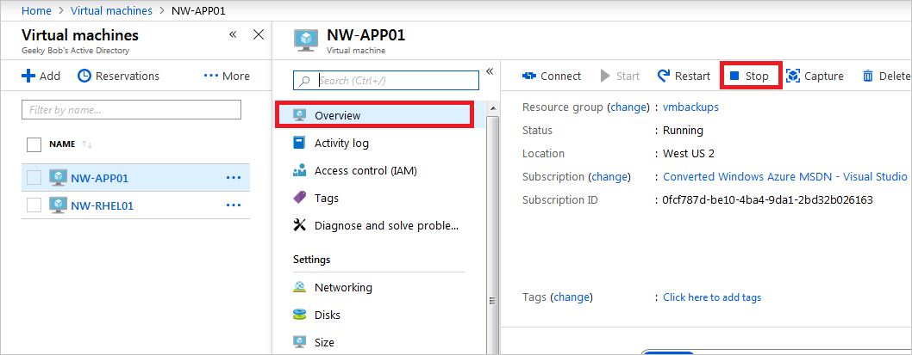
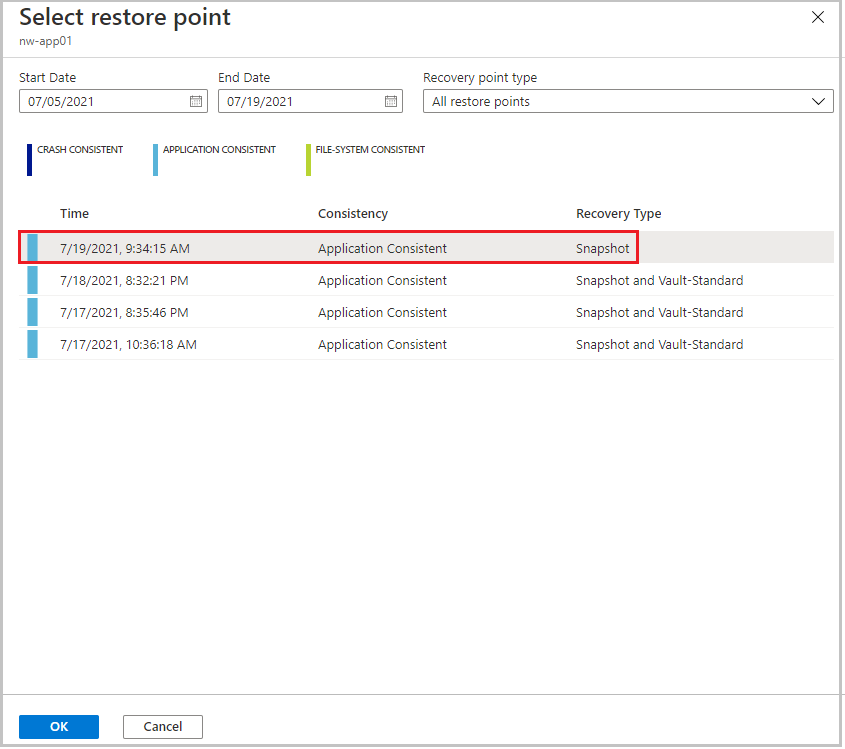
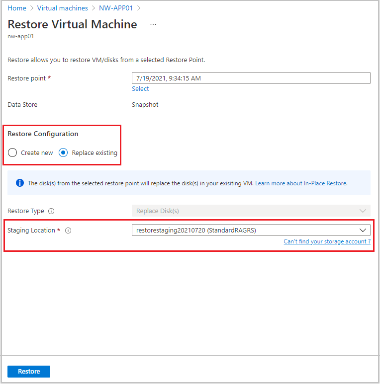
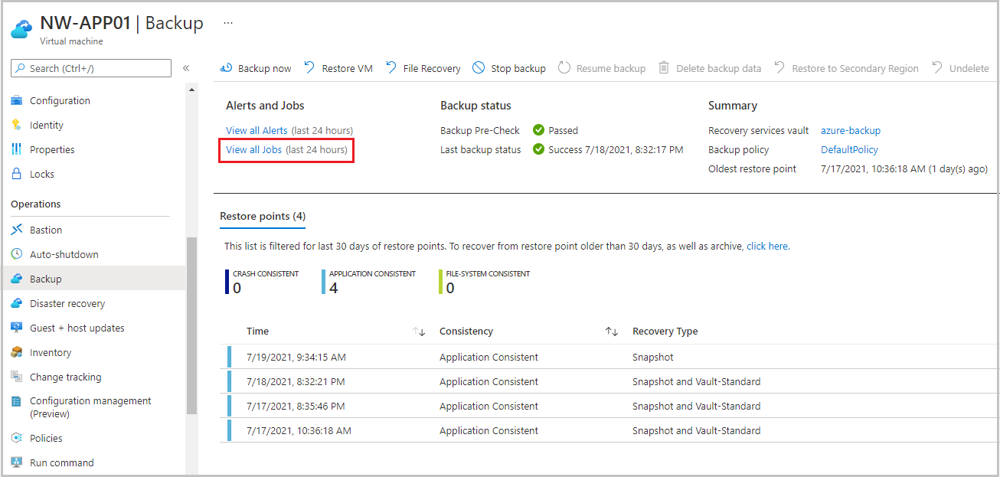
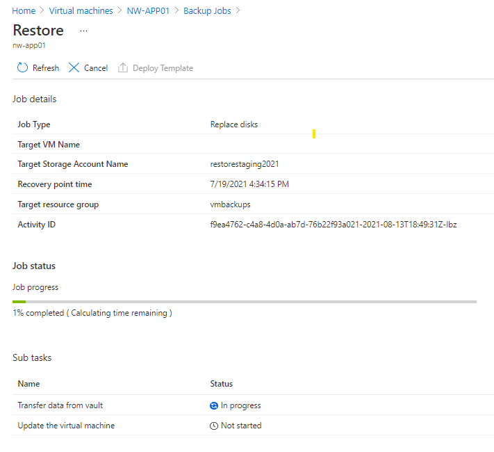

A few days after you backed up your first Azure virtual machine (VM), the server had issues. The VM needs to be restored from a backup. You want to restore the virtual machine's disk and attach it to the problematic live server, and then track the restore to ensure that it has finished successfully.

In this exercise, you'll see how to restore a successful backup to replace a VM that has become corrupted, and monitor its progress.

## Restore a virtual machine in the Azure portal

### Create a storage account to use as a staging location

1. If you closed Azure, sign in to the [Azure portal](https://portal.azure.com/?azure-portal=true) by using the same account that you used in the previous exercise.

1. In the Azure portal, enter **Storage accounts** in the top search bar, and then select it.

    

    The **Storage accounts** pane appears.

1. In the menu bar, select **Create**. The **Create a storage account** pane appears.

1. On the **Basics** tab, enter the following values for each setting to create a storage account.

    | Setting | Value |
    |-|-|
    | Resource group | From the dropdown list, select **vmbackups**. |
    | **Instance details** |
    | Storage account name | Enter a unique name like **restorestagingYYYYMMDD**, where YYYYMMDD is replaced with today's date. |
    | **Region** | From the dropdown list, select **(US) West US 2**. |

    

1. Select **Review + create**.

1. After validation passes, select **Create**.

    Wait for the storage account to be deployed.

### Stop the virtual machine to allow for the restore

A backup can't be restored if the VM is allocated and running. If you forget to stop the VM and attempt to restore it, you'll see an error that's similar to the following example.

To prevent this error, follow these steps:

1. In the top left of the Azure portal, select **Home**, select **Virtual Machines**, and then select **NW-APP01**.

    

    The **NW-APP01** virtual machine pane appears.

1. In the menu bar, select **Stop**.

    

1. In the **Stop this virtual machine** dialog box, select **OK**.

    

### Restore the virtual machine

The Recovery Services vaults are accessible at the subscription level. When you're viewing the VM, Azure provides a quick link to the specific vault under **Operations**.

1. In the menu pane, scroll to **Operations**, and select **Backup**.

    

1. To restore the virtual machine, in the menu bar, select **Restore VM**. The **Restore Virtual Machine** pane for *nw-app01* appears.

1. Under the **Restore point** text box, select **Select**. The **Select restore point** pane appears.

1. By default the start and end date are set for a two week range. Set the **Start date** to an appropriate date for our restore points (07/05/2021), select the restore point to use for the recovery, and then select **OK**.

    

    The **Restore Virtual Machine** pane for *nw-app01* appears.

1. Configure the restore point using the following values for each setting.

    | Setting | Value |
    |-|-|
    | **Restore Configuration** |
    | Replace existing | Select this option. |
    | Staging Location | From the dropdown list, select the storage account that you previously created. |

    

1. Select **Restore**. The **Backup** pane for the NW-APP01 virtual machine appears. Notice the notifications in the top right of the toolbar. The latest notification shows   **Triggering restore for NW-APP01**

## Track a restore

1. In the **Alerts and Jobs** section, select **View all Jobs**. The **Backup Jobs** pane appears.

    
    
1. In the **Details** column, select **View details** for the **Restore** job.

    :::image type="content" source="../media/6-restore-progress.png" alt-text="Screenshot of the restore progress." lightbox="../media/6-restore-progress.png":::

    The **Restore** pane appears for nw-app01.

1. You can monitor the progress of the VM restore job:
    - **Job details**: Details about the restore job you launched for this VM.
    - **Job status**: Real-time progress of the restore job.
    - **Sub tasks**: Name and status of the tasks within the job.

    
