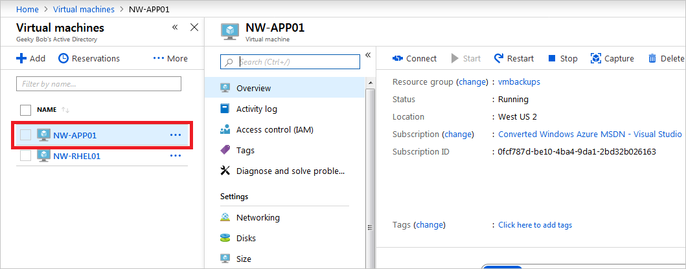
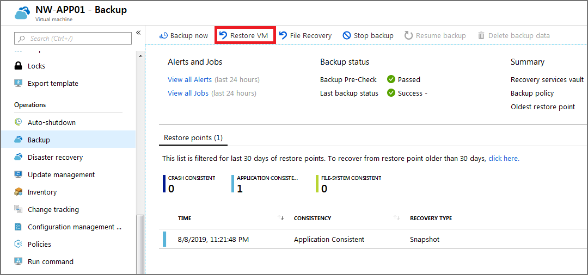
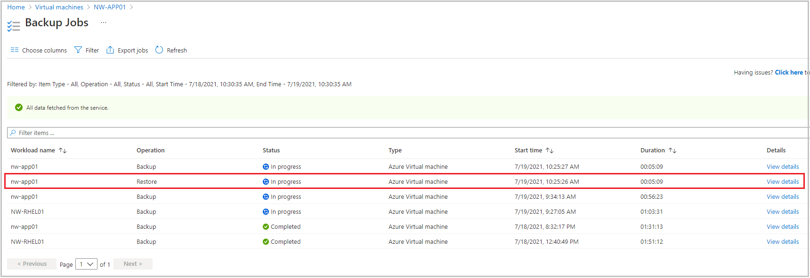

A few days after your first Azure virtual machine backup was completed, the server has had issues and it needs to be restored from a backup. You want to restore the virtual machine's disk and attach it to the problematic live server, and then track the restore to ensure that it has completed successfully.

In this exercise, you'll see how to restore a successful backup to replace a VM that has become corrupted, and monitor its progress.

## Restore a virtual machine in the Azure portal

### Create a storage account to use as a staging location

1. Sign into the [Azure portal](https://portal.azure.com/?azure-portal=true) using the same account you used in the previous exercise.

1. Select **All Services**, and then search for **storage accounts**. From the list, select **Storage accounts**.

    

1. Select **+ Add**, and then use the following information to create a storage account:

    - **Resource Group** - select **vmbackups**.
    - **Storage account name** - enter a unique name like **restorestagingYYYYMMDD**, where YYYYMMDD is replaced with today's date.
    - **Location** - select **(US) West US 2**.
    - Select **Review + create**.

    

1. On the **Create storage account** page, select **Create**.

1. Wait for the storage account to be deployed.

### Stop the VM to allow for the restore

A backup can't be restored if the VM is allocated and running. If you forget to stop the VM, you'll see an error that is similar to the following example.

To prevent this error, use the following steps.

1. In the far left menu, select **Virtual machines**, and then select **NW-APP01**.

    

1. Select **Stop** to shut down the VM.

    

1. In the **Stop this virtual machine** popup, select **OK**.

    

### Restore the VM

The Recovery Services vaults are accessible at the subscription level. However, as you are already viewing the VM, Azure provides a quick link to the specific vault under **Operations**.

1. In the left menu, under **Operations**, select **Backup**.

    

1. To restore the virtual machine, at the top select **Restore VM**.

    

1. Select the restore point to use for the recovery, then select **OK**.

    

1. In the **Restore Configuration** window, use the following information to configure the restore:

    - Select **Replace Existing**.
    - **Restore Type** - select **Replace Disk(s)**, this is the restore point that will be used to replace the existing VM's disks.
    - **Staging Location** - select the storage account you created previously.
    - Select **OK**.

    

1. On the confirmation screen, select **Restore**.

## Track a restore

1. At the top of the page, select **View all Jobs**.

    

1. Select the restore job, you can now monitor the progress of the VM restore:
    - **Job Progress**: Real-time percentage of the job as a whole
    - **Sub Tasks**: Shows the status of the current task within the job
