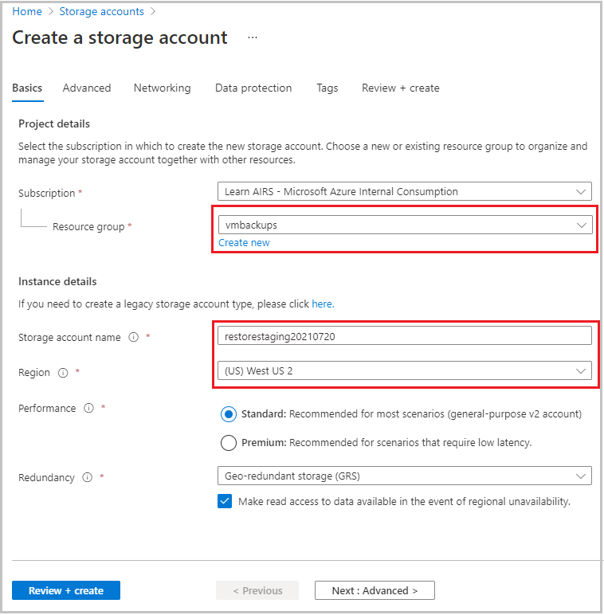
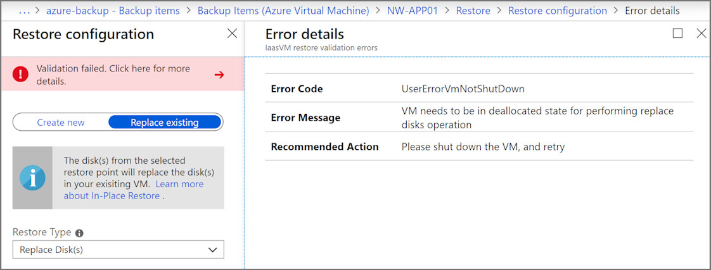
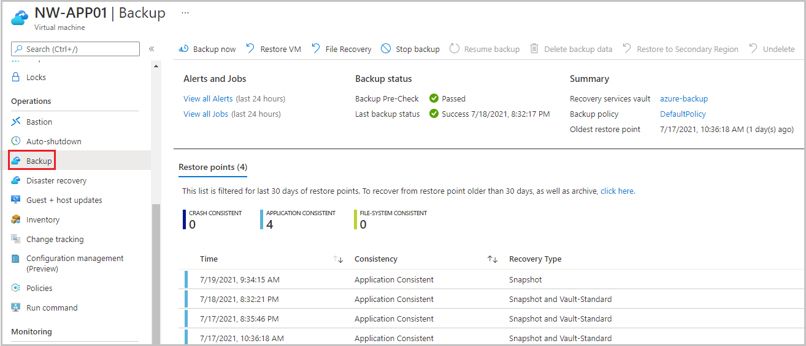

A few days after you backed up your first Azure virtual machine, the server had issues. It needs to be restored from a backup. You want to restore the virtual machine's disk and attach it to the problematic live server, and then track the restore to ensure that it has finished successfully.

In this exercise, you'll see how to restore a successful backup to replace a VM that has become corrupted, and monitor its progress.

## Restore a virtual machine in the Azure portal

### Create a storage account to use as a staging location

1. Sign in to the [Azure portal](https://portal.azure.com/?azure-portal=true) by using the same account that you used in the previous exercise.

1. In the Azure portal, search for and select **Storage accounts**.

    

1. Select **+ Add**, and then use the following information to create a storage account:

    | | |
    |-|-|
    | **Resource group** | Select **vmbackups**. |
    | **Storage account name** | Enter a unique name like **restorestagingYYYYMMDD**, where YYYYMMDD is replaced with today's date. |
    | **Location** | Select **(US) West US 2**. |

    

1. Select **Review + create**.

1. On the **Create storage account** page, select **Create**.

1. Wait for the storage account to be deployed.

### Stop the VM to allow for the restore

A backup can't be restored if the VM is allocated and running. If you forget to stop the VM, you'll see an error that's similar to the following example.

To prevent this error, use the following steps:

1. In the Azure portal, search for and select **Virtual machines**, and then select **NW-APP01**.

    

1. Select **Stop** to shut down the VM.

    

1. In the **Stop this virtual machine** dialog box, select **OK**.

    

### Restore the VM

The Recovery Services vaults are accessible at the subscription level. When you're viewing the VM, Azure provides a quick link to the specific vault under **Operations**.

1. On the left menu, under **Operations**, select **Backup**.

    

1. To restore the virtual machine, select **Restore VM**.

    

1. Select the restore point to use for the recovery, and then select **OK**.

    

1. In the **Restore Configuration** window, select **Replace Existing** and use the following information to configure the restore:

    | | |
    |-|-|
    | **Restore Type** | Select **Replace Disk(s)**. This is the restore point that will be used to replace the existing VM's disks. |
    | **Staging Location** | Select the storage account that you created previously. |

    

1. Select **OK**.

1. On the confirmation screen, select **Restore**.

## Track a restore

1. At the top of the page, select **View all Jobs**.

    

1. Select the restore job. You can now monitor the progress of the VM restore:
    - **Job Progress**: Real-time percentage of the job as a whole.
    - **Sub Tasks**: Status of the current task within the job.
