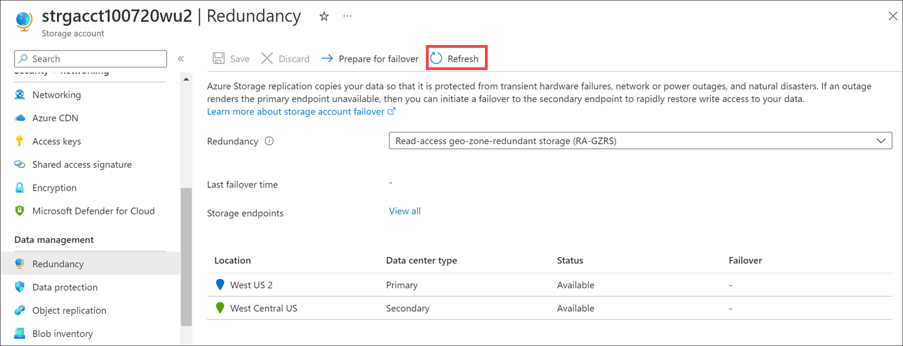

In this unit, you'll create a storage account and configure a blob container for it. You'll create a blob file and upload it to your storage account. You can then view the replication status in the Azure portal.

## Create a storage account

Create a storage account with Geo-zone-redundant storage (GZRS).

1. Run the following command to set the storage account name where you replace "storageaccountname" and the brackets with a unique Storage account name.

    ```Bash
    export AZURE_STORAGE_ACCOUNT=<storageaccountname> 
     ```
1. Set the location. Replace the centralus value with a location near you.
    ```bash
    export LOCATION=westus2
    ```
    The following list has some location values you can use:

    - southeastasia
    - northeurope
    - westeurope
    - japaneast
    - uksouth
    - centralus
    - eastus2
    - westus2
1. Run the following command to create a storage account:

    ```Bash
    az storage account create \
    --name $AZURE_STORAGE_ACCOUNT \
    --resource-group <rgn>[sandbox resource group name]</rgn> \
    --location $LOCATION \
    --sku Standard_GZRS \
    --encryption-services blob \
    --kind StorageV2
    ```

1. For the rest of the steps in this exercise, you'll need your storage credentials. Run the following command to list your storage account keys:

    ```Bash
    az storage account keys list \
    --account-name $AZURE_STORAGE_ACCOUNT \
    --resource-group <rgn>[sandbox resource group name]</rgn> \
    --output table
    ```

1. Copy the keys listed.
1. Set an environment variable to hold your storage key. Replace "account-key" and the brackets with one of your key values.

    ```Bash
    export AZURE_STORAGE_KEY="<account-key>"
    ```

## Create a blob container

You need a container to upload blobs to Azure Storage. You use containers to logically group your blobs. A container helps you organize blobs, like a folder organizes files on your computer.

1. Run the following command to set a container name where you replace "blob-container-name" and the brackets with another name.

    ```Bash
    export BLOB_CONTAINER_NAME=<blob-container-name>
    ```

1. Run the following command to create a container for your storage account:

    ```Bash
    az storage container create --name $BLOB_CONTAINER_NAME
    ```

1. You'll see the following message returned in your terminal when your storage account container has been created:

    ```Bash
    {
        "created": true
    }
    ```

## Create a file (blob)

Your company uploads its music files as blobs in the container. A blob can represent a file of any type. For the purposes of this exercise, you'll upload a text file as a blob.

1. Run the following command to create a file you can upload to your storage account:

    ```bash
    cat > song.mp3
    ```

1. An empty file is created that you can write to. Type "This is a song!", press <kbd>ENTER</kbd>, then press <kbd>CTRL+D</kbd> .

1. Run the following command to see the contents of your `song.mp3` file:

    ```bash
    cat song.mp3
    ```

1. You'll see "This is a song!" returned to you in the terminal. You've created a file you can now upload to your storage account.

## Upload your file

Upload the file to your storage account via your container.

1. Run the following command to upload your file:

    ```bash
    az storage blob upload \
        --container-name $BLOB_CONTAINER_NAME \
        --name song \
        --file song.mp3
    ```

1. When the upload is complete, you verify the file is in your storage account by running the following command:

    ```bash
    az storage blob list \
    --container-name $BLOB_CONTAINER_NAME  \
    --output table
    ```

1. You'll see details about your file, like its name, blob type and when it was last modified.

## View the replication status

1. Sign into the [Azure portal](https://portal.azure.com/learn.docs.microsoft.com?azure-portal=true) using the same account you activated the sandbox with.

1. Select or search for **Resource groups**.
1. Select **<rgn>[sandbox resource group name]</rgn>**.
1. Select the storage account you created from the list of resources in your resource group.
1. Under **Settings**, select **Geo-replication**. You see the replication status of your Azure Storage account's primary and secondary regions. If the status shows as "available" for a region, it means your region is responsive.

1. Select **Refresh** to ensure you're seeing the latest status updates.

    

You've now made sure your storage account remains available even if a region fails.
