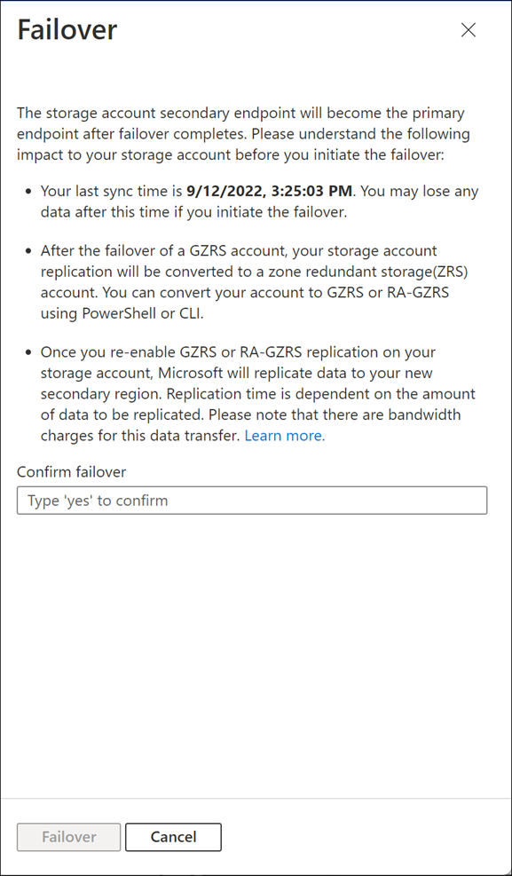
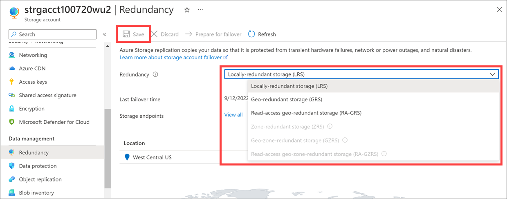
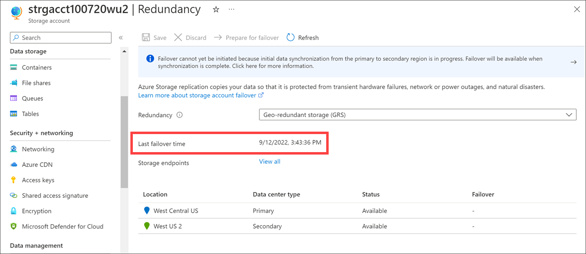

As the Azure administrator for your company, you've been asked to do failovers to secondary regions for the storage accounts that hold the music data, and manage those failovers.

In this unit, you'll start a failover. When the failover is complete, you'll reconfigure the storage account to use geo-zone-redundant storage for replication. You'll use the **Last Sync Time** property to estimate potential data loss.

## Start a failover

Let's simulate a region-wide failure by manually initiating a failover.

1. Sign into the [Azure portal](https://portal.azure.com/learn.docs.microsoft.com?azure-portal=true) using the same account you activated the sandbox with.

1. Select or find **Resource groups**.
1. Select **<rgn>[sandbox resource group name]</rgn>**.

1. Select the storage account you created from the list of resources in your resource group.

1. In the pane on the left, under the **Settings** section, select **Geo-replication**.

1. Select **Prepare for failover** at the bottom to start a failover.

   :::image type="content" source="../media/5-portal-failover-prepare.png" alt-text="Screenshot of the prepare for failover button at the bottom of the geo-replication page.":::

1. A confirmation message appears. This message includes the **Last Sync Time**, which is a timestamp in the GMT time zone. Make a note of the last sync time. You use the last sync time to estimate how much data loss you'll have after failover is complete.

1. Type **Yes** in the **Confirm failover** field.

    

1. Select **Failover (preview)**, to start the failover.  Wait until your failover has finished.

1. You can check that your failover is complete by selecting **Refresh** at the top of the map.

## Reconfigure replication mode

When failover is complete, you'll see that your geo-replication map only shows one region. This region is your new primary. You'll need to reconfigure your account to use geo-zone-redundant storage.

1. Select **Configuration**.
1. Under **Replication**, select **Geo-zone-redundant storage (GZRS)**.

    

1. Select **Save** at the top of the form.

## Estimate the data loss

Now you need to estimate potential data loss. You'll view the **Last failover time**, and compare it with the **Last Sync time** value.

1. In the pane on the left, under the **Settings** section, select **Geo-replication**.
1. Note the **Last failover time** value on the left side of the map.

    

1. Compare this value with the **Last Sync time** value. If you'd written data to the primary region between these two points in time, it could have been lost.