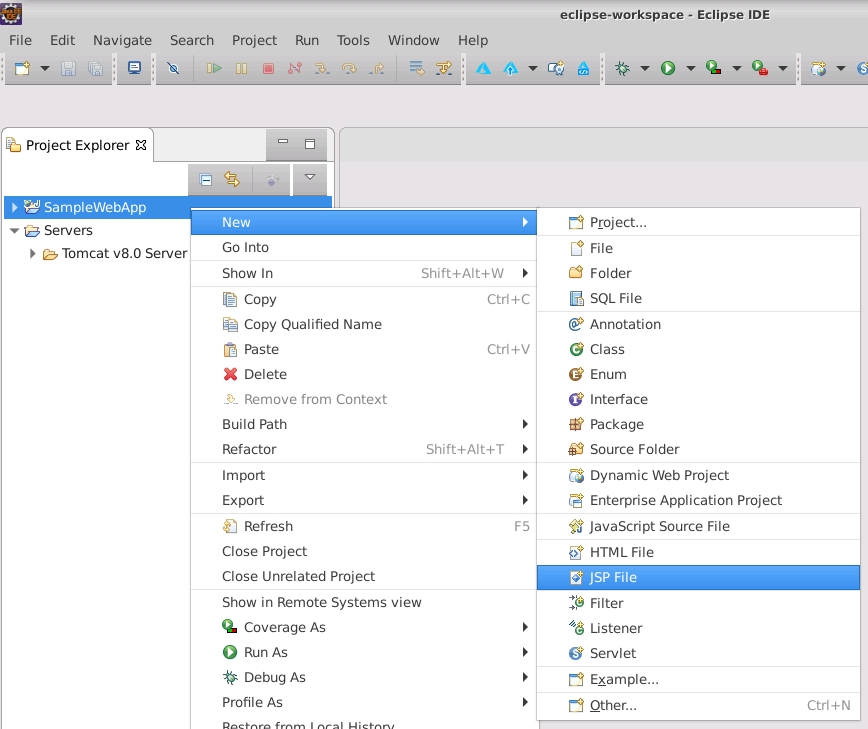
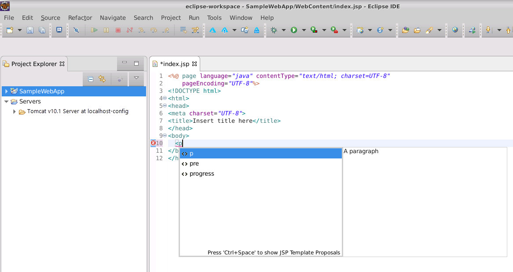
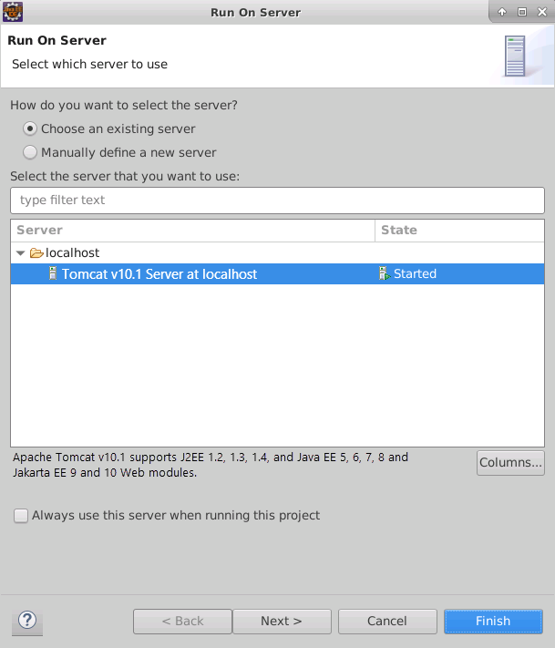
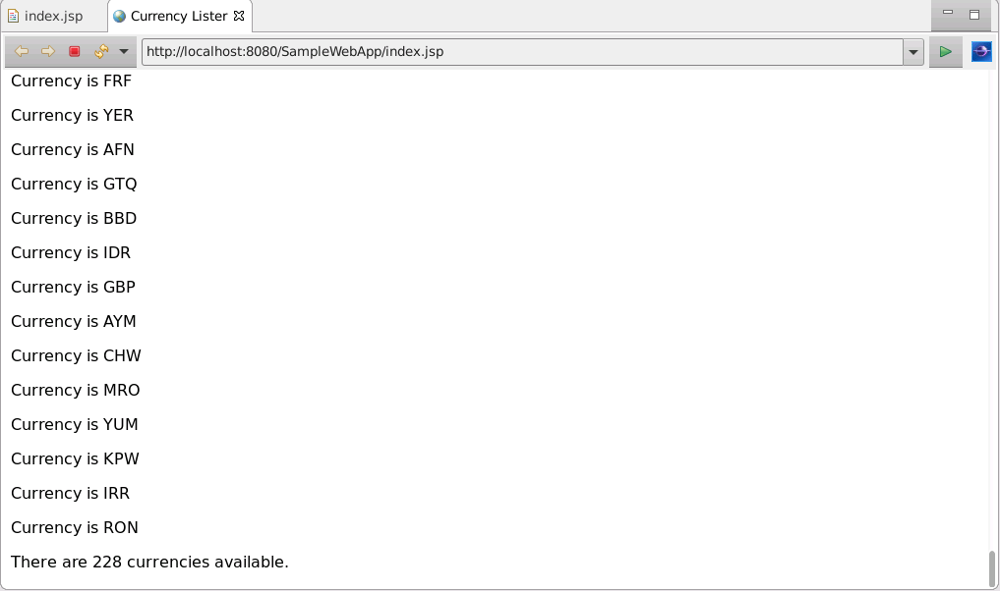

Eclipse provides project templates for building static and dynamic web projects. Static web projects include files that contain HTML and client-side JavaScript code. Dynamic web projects typically include files that contain Java Server Pages (JSP), which run at the server. Azure App Service supports both static and dynamic web projects.

In this unit, you'll learn the basics for how to use Eclipse to create dynamic web projects. In the next unit, you will complete an exercise where you create a dynamic web project, which you can deploy as an Azure web app.

## How to create dynamic web apps

To create a dynamic web app, on the **File** menu in Eclipse, select **New**, and then select **Dynamic Web Project**.

> [!div class="mx-imgBorder"]
> 

The **Dynamic Web Project** wizard prompts you for the basic details of the project. The only mandatory item is the project name; the wizard provides default values for all remaining properties and configuration details. However, you should verify the target runtime in order to determine the functionality that you will use in your web app. In the following screenshot, the user has selected the **Apache Tomcat v8.0** server. This server is useful for testing and debugging locally. You can deploy the web app to Azure after you've tested it.

> [!div class="mx-imgBorder"]
> 

## How to create static and dynamic web pages

After you have created a dynamic web app, you add resources to the project - such as HTML files, JSP files, and CSS style sheets - using the **Project Explorer** window. For example, to add a new JSP page to the project, right-click the project name in the **Project Explorer** window, select **New**, and then select **JSP File**.

> [!div class="mx-imgBorder"]
> 

Eclipse generates the basic boilerplate code for a web page. You can then use the HTML editor to create the HTML markup that defines the main part of your web page. To help you, the editor includes IntelliSense-style prompts, and code completion.

> [!div class="mx-imgBorder"]
> 

A dynamic web page contains a mixture of HTML markup and Java code. You add Java code to a web page using JSP tags. For example, the following steps describe how and when you might use these tags:

- To import Java libraries, you would use the `<%@ page ... %>` directive. In the following example, the *java.util* library is imported by adding the directive to the start of the page:

    ```java
    <%@ page import ="java.util.*" %>
    ```

- To declare static variables, you would use a pair of `<%!` and `%>` tags, and you can initialize variables at the same time. For example, in the following code excerpt, *counter* is an integer variable, and *currencies* is a set that contains the details of each currency that is available in the *java.util* library.
  
    ```java
    <%! int counter;
        Set<Currency> currencies = Currency.getAvailableCurrencies(); %>
    ```

    Note the values of these static variables are only initialized once, and they're preserved between invocations of the web app.

- To add procedural code, you would include your code within a pair of `<%` and `%>` tags, and procedural code can be wrapped around regular HTML markup. For example, in the following code excerpt, the `for` loop iterates through the contents of the *currencies* set, and outputs an HTML paragraph during each iteration. The *counter* variable keeps track of the number of iterations made:

    ```java
    <% counter = 1;
       for(Currency currency : currencies){ %>
        <p>Currency is TBD </p>
    <%  counter++;
      } %>
    ```

- To display the results of a Java function or expression, you can use a pair of `<%=` and `%>` expression tags, as shown below:

    ```java
    <% for(Currency currency : currencies){ %>
       <p>Currency is <%= currency.toString() %> </p>
    <%   counter++;
      } %>
    <p> There are <%= counter %> currencies available.</p>
    ```

The following JSP page shows a complete example, which retrieves a list of currencies using the **Currency.getAvailableCurrencies** method from the **java.util** library. The code generates HTML markup that displays the currencies as a set of HTML paragraphs, with a summary at the end that counts the number of currencies displayed:

```java
<%@ page language="java" contentType="text/html; charset=UTF-8"
    pageEncoding="UTF-8"%>
<%@ page import ="java.util.*" %>
<!DOCTYPE html>
<html>
<head>
<meta charset="UTF-8">
<title>Currency Lister</title>
</head>
<body>
  <%! int counter;
      Set<Currency> currencies = Currency.getAvailableCurrencies(); %>
  
  <% counter = 1;
   for(Currency currency : currencies){ %>
        <p>Currency is <%= currency.toString() %> </p>
  <%    counter++;
    } %>
  <p> There are <%= counter %> currencies available.</p>

</body>
</html>
```

The output generated by this code is shown in the next section.

## How to test a web app locally

To test a web app, on the **Run** menu, select **Run**, or select the **Run** button in the toolbar. You'll be prompted for the server to use to run the web app. The default is the same as the server runtime that you specified when you created the project.

> [!div class="mx-imgBorder"]
> 

Select **Finish** to start the web app. If the server is currently stopped, it will be started. Then, the web app will run, and the results will appear in a browser window in Eclipse. The results should look similar to the following illustration:

> [!div class="mx-imgBorder"]
> 
