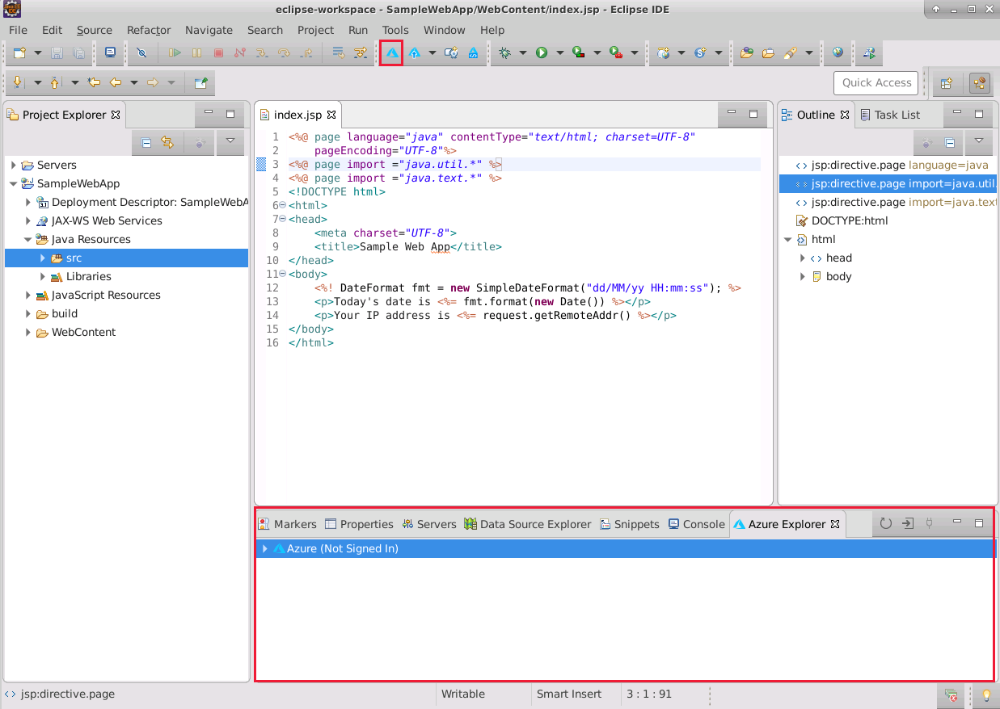
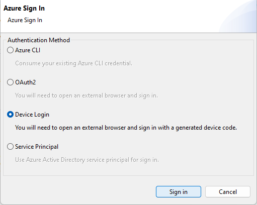
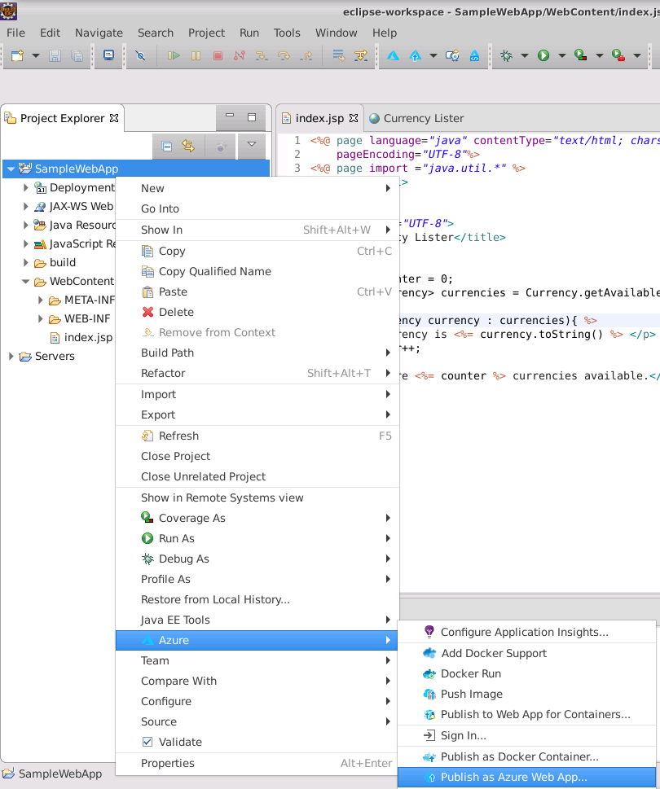
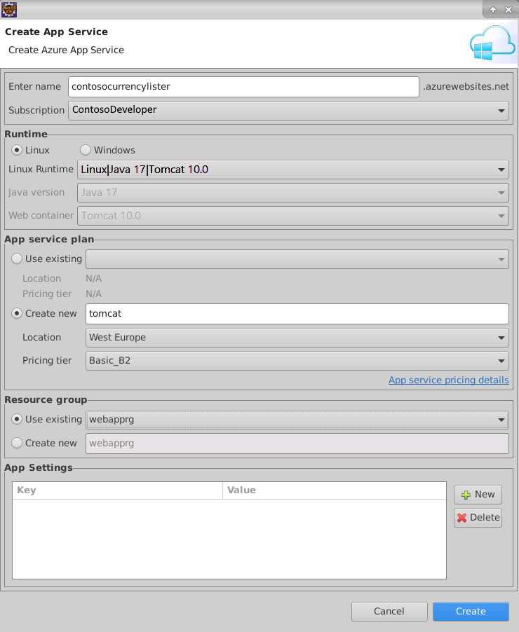
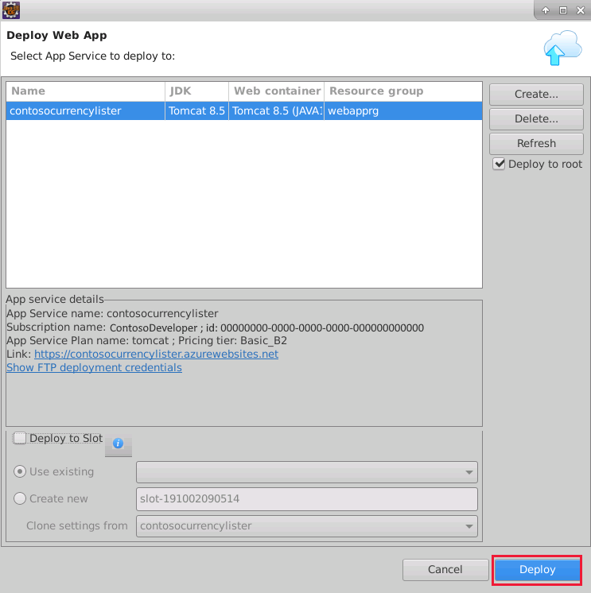
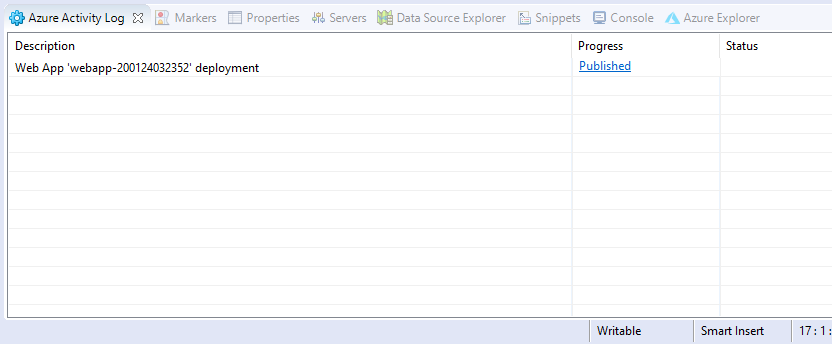
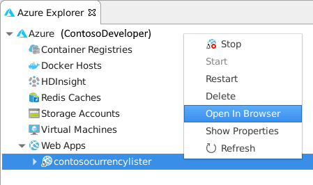
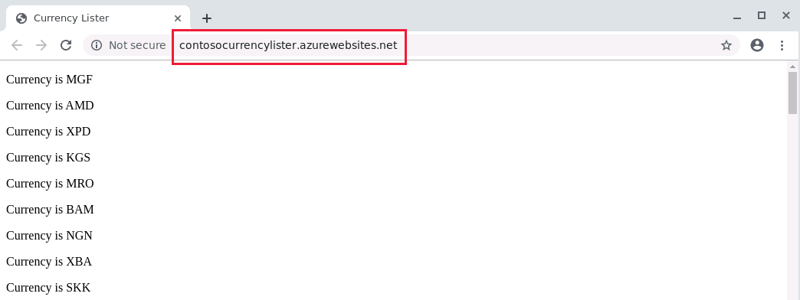

Azure App Service provides a scalable, highly available environment for hosting web apps. An Azure web app is a service that can run one or more web applications, and it uses the resources that are defined within an App Service Plan. The App Service Plan defines the environment for running a web app; it specifies resources such as CPU availability, memory allocation, disk storage capacity, how to scale the system according to demand, how and when to create backups, etc. When you deploy a web app to Azure, you can reuse an existing web app instance, or create a new one.

In this unit, you'll learn the basics for how to use the Azure Toolkit for Azure to create an Azure App Service and App Service Plan. In the next unit, you will complete an exercise where you will deploy your web app to an Azure App Service.

## How to connect to Azure from Eclipse

Before you deploy a web app to Azure, you must first sign in to your Azure account from Eclipse. You can do this using **Azure Explorer**. To open the **Azure Explorer** window, click **Show Azure Explorer** in the Eclipse toolbar. The **Azure Explorer** window appears at the bottom of the IDE:

> [!div class="mx-imgBorder"]
> 

If the **Azure Explorer** window indicates that you have not signed in, use the following steps:

1. Right-click **Azure (Not Signed In)**, and then click **Sign In**.

    > [!div class="mx-imgBorder"]
    > 

2. You'll be prompted to connect. You can either use a device login, in which case you'll be given a code and directed to a login page using the web browser, or you can specify an authentication file containing credentials for an Azure Active Directory service principal.

    > [!div class="mx-imgBorder"]
    > 

3. Finally, in the **Your Subscriptions** page, select the subscription you want to use for hosting your web app.

## How to deploy a web app to Azure

The Azure Toolkit for Eclipse provides a couple of ways in which you can start web app deployment to Azure:

- You can use the **Publish** button in the toolbar and select the **Publish as Azure Web App** command.

    > [!div class="mx-imgBorder"]
    > 

- You can right-click the project in the **Project Explorer** window, then click the **Azure** menu, and then select the **Publish as Azure Web App** command.

    > [!div class="mx-imgBorder"]
    > 

The **Deploy Web App** wizard will start running. You're asked for the Azure App Service to use to deploy your project. You can specify an existing App Service (if one is available), or you can create a new one.

To create a new Azure App Service, you would use the following steps:

1. Click **Create** to set up a new App Service.

    > [!div class="mx-imgBorder"]
    > 

1. In the **Create App Service** wizard, you would specify the hosting environment and choose or create the App Service Plan for your App Service.

    > [!div class="mx-imgBorder"]
    > 

    If you create a new Web App service, note the following points:

    - The App Service name is used to generate the URL for your web app, which must be a unique name. You can enter a name manually, although the wizard will generate an example for you. The suffix *.azurewebsites.net* is appended to the name to form the complete URL; for example: *contoso.azurewebsites.net*.

    - Azure App Service supports both Windows and Linux runtime environments, and you should select the runtime that matches your development environment.

    - You can reuse an existing App Service plan, or you can create a new one. If you create a new plan, the plan name doesn't have to be globally unique. The pricing tier defines the resources available. For example, a basic pricing tier might provide two CPU cores, 3.50 GB of memory, and 10 GB of disk storage, but no autoscaling.
  
        > [!NOTE]
        > Different pricing tiers accrue different charges. For the latest information, visit the [App Service pricing](https://azure.microsoft.com/pricing/details/app-service/windows/) page.

    - You can add the App Service and App Service plan to an existing Azure resource group, or you can create a new one.

1. After you've selected or created a new App Service, you can choose whether to deploy the web app to a deployment slot inside the App Service.

    > [!NOTE]
    > Deployment slots are only available in the standard pricing tiers and above.

    Deployment slots enable you to run multiple versions of the web app simultaneously. For example, you can deploy a new version of an app with additional features to a new deployment slot for staging while the original version of the app remains available to users in production. After you have tested the new version of the web app and everything works as expected, you can quickly direct the App Service to use the new web app – just tell it which deployment slot to use. The switch is immediate and transparent, which minimizes your app downtime.
    
    Deployment slots are an optional feature for Azure, but here are a few ideas to consider if you decide not to use deployment slots in a production environment:
    
    - Your web application will be unavailable while you deploy a new version.
    - It may be difficult to roll back to an earlier version of your web app if the new version is problematic.

1. When you have finished configuring your App Service, you would click **Deploy** to upload the web app in your project to the Web Apps service.

    > [!div class="mx-imgBorder"]
    > 

    While your web app is being deployed, the **Azure Activity Log** will display the progress, and report any errors that occur.

    > [!div class="mx-imgBorder"]
    > 

    When the **Progress** changes to **Published**, your web app has been successfully deployed.

## How to test a web app running in Azure

To test your web app on Azure from Eclipse, you can use one of the following methods:

- Click the **Published** link in the **Azure Activity Log** window.

    > [!div class="mx-imgBorder"]
    > 

- Use the following steps in **Azure Explorer**:

    1. Expand the **Web Apps** folder, right-click your newly deployed web app, and then click **Open In Browser**.

        > [!div class="mx-imgBorder"]
        > 

    1. Your web browser will open and connect to your web app running in Azure. For example, the following illustration shows what the Currency Lister web app from an earlier unit might look like when running in Azure.

        > [!div class="mx-imgBorder"]
        > 

In the next unit, you will complete an exercise where you will create an Azure App Service and App Service Plan, then you will deploy the web app that you created in the previous exercise to your Azure App Service.