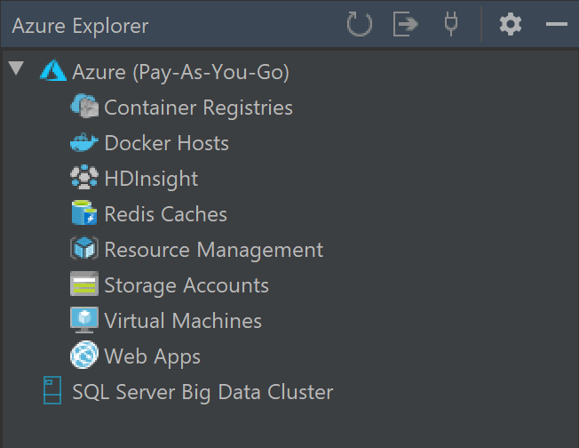

If you prefer to use IntelliJ IDEA to write code, you can work with Azure resources by installing the Azure Toolkit for IntelliJ.

Suppose your team of Java developers uses IntelliJ IDEA to create web apps with the Java Server Pages (JSP) framework. Your manufacturing company has been migrating to Azure, but you want to migrate with as little disruption as possible to your current development environment. You've been asked to evaluate the easiest way to enable your developers to work with Azure. 

In this unit, you'll learn about the Azure Toolkit for IntelliJ and what developers can use it to do. But first, let's review the technologies and components that are used to build a typical Java web site. 

## Java Web Applications

There are several different technologies that you can use to create web applications using the Java language; for example:

- **Java Servlets**

    A servlet is a Java component that extends the capabilities of a server. Often servlets extend the capabilities of a web server by implementing a container for a web application. A servlet that implements a web application usually has HTML code embedded in the Java code.

- **Java Server Pages (JSP)**

    JSP is a standard technology where you can embed Java code into HTML pages to create dynamic content. JSP pages must be deployed in a specific type of Java servlet called a web container, and Apache Tomcat is a commonly used web container.

    To deploy a JSP web application using IntelliJ IDEA, you will package it as a Web Application Resource (WAR) file. This file is a standard form of archive file that defines the content and structure of the web application. Tomcat and other web containers can use this file as an installation source for the web application.

## The Azure Toolkit for IntelliJ

The Azure Toolkit for IntelliJ is an extension for IntelliJ IDEA that provides templates and tools for those developers who want to work with Azure resources from their preferred IDE. When you install the toolkit, you can perform these tasks in IntelliJ IDEA without using any other tools or software:

- Manage Azure resources such as:
    - Virtual Machines, which are virtualized servers that you can use to run Windows or Linux operating system and can host any application.
    - Azure Storage Accounts, which can store files, queues of messages, or tables of data.
    - Redis Cache, which is a caching system that is popular for increasing the performance of databases.
- Deploy a web app to these types of hosts:
    - Azure App Service
    - Azure Functions
    - Azure Spring Cloud

You also use the Azure Explorer with the Azure Toolkit for IntelliJ, which provides an additional window within IntelliJ IDEA where you can see and manage the resources that exist in your Azure subscription. In the Azure Explorer window you can create new web apps, storage accounts, and other resources, or configure Azure resources that you have created.

There are alternatives to the Azure Toolkit for IntelliJ to deploy your web app. For example, you could use `git` to deploy code and publish it to Azure. However, the Azure Toolkit for IntelliJ provides close integration within IntelliJ IDEA itself. Developers can package and deploy an app, and create and configure resources in Azure, all without leaving their favorite IDE.

In the following exercises, you'll use the Azure Toolkit for IntelliJ to deploy a web app, based on a Maven archetype, to Azure App Service, and manage that web app using the Azure Explorer from within IntelliJ IDEA.
