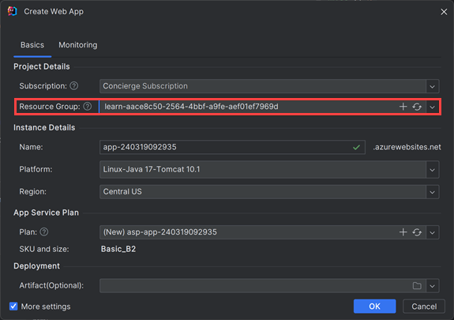
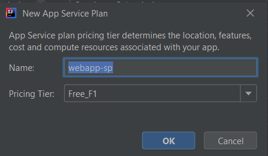

Suppose you have a simple Java web app that you've written in IntelliJ IDEA. You want to test the app in Azure, and you want to make the deployment as simple as possible so that your developers don't need to use extra tools. The Azure Toolkit for IntelliJ includes a wizard that makes it easier to deploy web apps.

In this exercise, you'll use the deployment wizard to deploy a web app to Azure.

## Sign into Azure

To explore your Azure resources, you must first sign into Azure. By signing in, you specify the subscription and directory where you want to create resources:

1. In **IntelliJ IDEA**, on the **View** menu, select **Tool windows** and then select **Azure Explorer**.

1. In the **Azure Explorer** window, select the **Azure Sign In** button:

    

1. Select **Device Login** and then select **Sign in**.

1. In the **Azure Device Login** page, select **Copy&Open**.

1. In the browser, press <kbd>CTRL-V</kbd> to paste the code, and then select **Next**.

1. Sign into your Azure account with your user credentials.

1. When you see the sign-in acknowledgment, close the browser window.

1. In **IntelliJ IDEA**, in the **Select Subscriptions** dialog, select the **Concierge Subscription**. This is a subscription created specifically for the sandbox.

    

The **Azure Explorer** now displays objects in your Azure subscription. You can explore the different types of objects, such as storage accounts.

## Configure and deploy the web app

Now, you can use the **Deploy to Azure** wizard to create a new app in Azure App Service and then deploy your project to it:

1. In IntelliJ IDEA, in the **Project** window, right-click the **webapp** project, select **Azure**, and then select **Deploy to Azure Web Apps**.

1. In the **Deploy to Azure** dialog, Click the **+** button for **Web App**.

    :::image type="content" source="../media/5-deploy-to-azure-dialog.png" alt-text="Deploy WebApp dialog." loc-scope="other":::

1. In the **Create Web App** dialog, click **More Settings**, Select **Resource Group** and select *<rgn>[sandbox resource group name]</rgn>*, and then select **OK**:

    

1. In the **Create Web App** dialog, click the **+** button for **Plan**, type any name in **Name** and select **Free_F1** for **Pricing Tier**.

    

1. In the **Create Web App** dialog, select **OK**. In the **Deploy to Azure** dialog, select **Run**. The Azure Toolkit for IntelliJ deploys the web app to Azure and displays the site in your default web browser.

    :::image type="content" source="../media/5-deployed-webapp.png" alt-text="The deployed web app running in Azure App Service." loc-scope="other":::

## Redeploy the web app

1. Once you have deployed the web app to Azure, the settings will be saved as run configurations in your IDE. To re-deploy, simply click the green **Run** icon on the top right or hit **Shift+F10**.

    :::image type="content" source="../media/5-redeploy-webapp.png" alt-text="Redeploy web app running in Azure App Service." loc-scope="other":::
