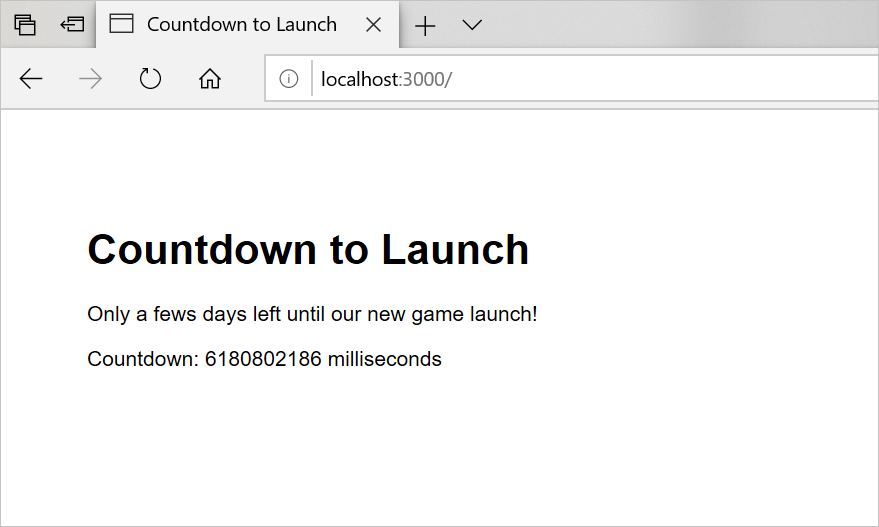

With Node.js and Express.js, you can create a webapp very quickly. 

Suppose you've been asked to start building the website to promote the new video game launch. You've decided to use Node.js to run server-side code and, to make the development as quick as possible, you're going to use the Express.js framework for webapps. You want to create a quick, proof-of-concept webapp that displays a countdown to the launch date.

Here, you'll install the necessary software and then use Visual Studio Code to create and test a website.

> [!NOTE]
> You must have Visual Studio Code installed on your Windows computer before you begin this exercise.

## Install Node.js

Express.js is a webapp framework that extends the Node.js server-side JavaScript runtime. Let's start by installing Node.js:

1. Open a browser and go to the [Node.js download page](https://nodejs.org/en/download/). Download the right .msi installer for your operating system.
1. When the .msi file has downloaded, double-click on it to start the installation wizard, and then select **Next**.
1. Accept the license agreement and then select **Next**.
1. Accept the default installation location and then select **Next**.
1. Accept the default installation options, select **Next**, and then select **Install**.
1. If the **User Account Control** dialog appears, select **Yes**.
1. When the installation is complete, select **Finish**.

## Create an app folder and install Express.js

You can use Visual Studio Code to run all the commands and edit all the code for your webapp. Here, you'll use its integrated terminal to set up a folder with Express.js installed:

1. Start Visual Studio Code. 
1. To bring up the command palette, press CTRL + SHIFT + P.
1. Type **Terminal** and then select **View: Toggle Integrated Terminal**.

    

1. To check your version of `npm` type this command, and then press Enter:

    ```PowerShell
    npm --version
    ```

1. To create a new folder, type the following commands:

    ```PowerShell
    cd ~
    mkdir countdownExpressApp
    cd countdownExpressApp
    ```

1. To initialize the `npm` tool, type this command, and then accept all the defaults:

    ```PowerShell
    npm init
    ```

 1. To install Express.js, type this command:

    ```PowerShell
    npm install express --save
    ```

## Scaffold an Express.js application

Express in now installed, but you can use the Express Generator tool to create all the components of a boiler-plate webapp:

1. To check the contents of the folder, type this command:

    ```PowerShell
    ls
    ```

1. To run the Express Generator, use this command:

    ```PowerShell
    npx express-generator
    ```

1. To see the default Express.js scaffolding, type this command:

    ```PowerShell
    ls
    ```

## Calculate the countdown

You now have a functional webapp that Node.js can run. Let's modify its code to calculate the amount of time to display:

1. To edit the **index.js** file in Code, type the following commands:

    ```PowerShell
    cd routes
    code ./index.js
    ```

1. Add the following code, immediately after the `var router = express.Router();` line. In the first line of the inserted code, use a date around a month in the future:

    ```JavaScript
    var launchTime = new Date("January, 1, 2020").getTime();
    var currentTime = new Date().getTime();
    var numberOfMilliseconds = parseInt(launchTime - currentTime);
    ```

1. Locate this line of code:

    ```JavaScript
    res.render('index', { title: 'Express' });
    ```

1. Replace that line with this line of code:

    ```JavaScript
    res.render('index', { title: 'Countdown to Launch', countDown: numberOfMilliseconds });
    ```

1. On the **File** menu, select **Save**, then close the **index.js** file.

## Render the countdown 

Now, modify the default homepage for the webapp to display the countdown:

1. In the Code integrated terminal, to edit the **index.jade** view, type these commands:

    ```PowerShell
    cd ../views
    code ./index.jade
    ```

1. Locate the following line of code:

    ```jade
    p Welcome to #{title}
    ```

1. Replace that line with this code:
  
    ```jade
    p Only a fews days left until our new game launch!
    ```

1. Add this new line of code at the end of the file:

    ```jade
    p Countdown: #{countDown} milliseconds
    ```

1. On the **File** menu, select **Save** and then close the **index.jade** file.

## Run the webapp

Now the app is complete, let's run it on your local computer and see if it shows the countdown:

1. In the Code integrated terminal, to install the webapp's dependencies, type these commands:

    ```PowerShell
    cd ..
    npm install
    ```

1. To run the webapp on your local computer, type this command:

    ```PowerShell
    npm start
    ```

1. Open a web browser and navigate to the address **http://localhost:3000**.

    

1. Close the web browser and then, in the Code integrated terminal, press CTRL-C to stop the webapp.
