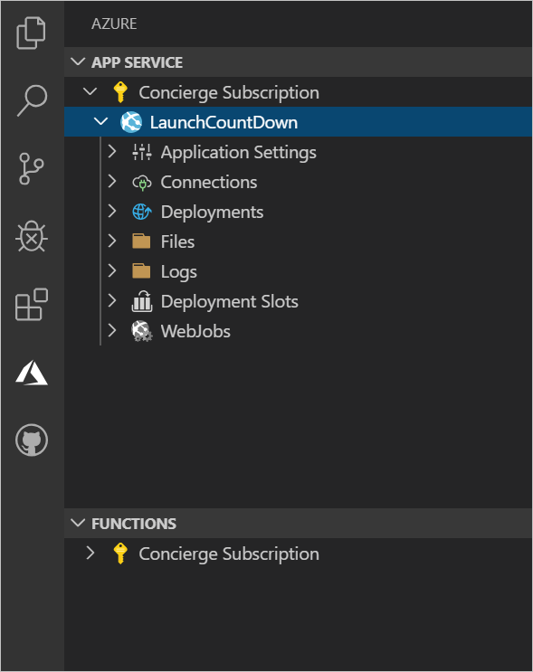
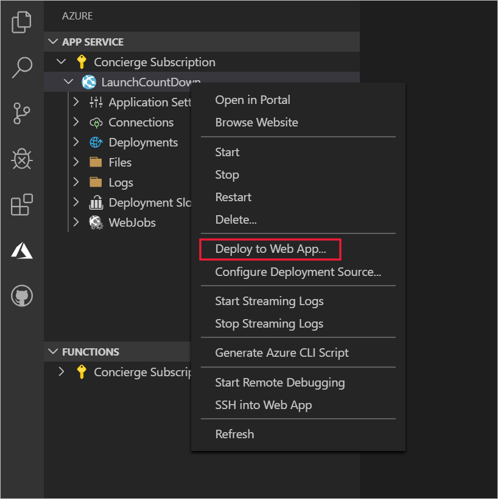

If you want to deploy your Express.js webapp to the Azure App Service, there is an Azure App Service extension for Visual Studio Code that makes your work easier.

Suppose, you've completed your proof-of-concept webapp that provides a countdown to the new video game's launch date. Now, you want to show that it works in the Azure App Service, which you want to use as the final host. You want a quick way to deploy the app and you'd llike to be able to debug it in Azure as well.

In this unit, you'll learn about the Azure App Service and how to work with it by using Visual Studio Code. 

## What is the Azure App Service?

The Azure App Service is a Platform-as-a-Service (PaaS) implementation of a web server, and can host websites, REST APIs, and back-end services for mobile apps. Almost any service that you address using HTTP can be hosted in the App Service. Because the App Service is a PaaS system, you don't have to set up, run, and maintain virtual servers or underlying software such as operating systems and web servers. All of this infrastructure is managed by Azure and Microsoft engineers to provide high availability. Instead, you can concentrate on your code and how it responds to user requests. 

The Azure App Service supports a wide range of languages and frameworks, that include:

- ASP.NET and .NET Framework languages such as C# and Visual Basic.
- Node.js and JavaScript.
- Ruby on Rails and the Ruby language.
- JSP and Java.
- PHP and Python.

So developers can work with the Azure App Service, regardless of their preferred technologies.

The App Service also integrates with many different code management and DevOps systems, including GitHub, Azure DevOps, BitBucket, and Docker Hub. So it's likely that you'll be able to continue using the same toolset when you migrate the the App Service.

In this module, we're developing a Node.js webapp, which executes server-side JavaScript code. We've used the Express.js web application framework to make that task easier. Such a webapp is easy to publish to the Azure App Service.

## What is an App Service Plan?

When you set up a web farm on-premises, you design and install a set of servers that will host the website. In the App Service, it's not necessary to set up the physical hardware or the operating systems but you do need to define the compute resources that will run your website. You define resources by choosing an App Service plan.

Each App Service plan sets properties such as:

- The Azure region where the website will run.
- The number of virtual machine instances that will host the website.
- The size of the virtual machine instances.
- The pricing tier. 

Use pricing tiers to control costs and match the scalability of your app to the demand:

- **Shared compute tiers.** Webapps in a shared compute App Service plan run on virtual machines that are shared with other Azure customers. When you run a webapp in the **Free** pricing tier, you incur no costs but cannot scale out your app. In the **Shared** pricing tier, you incur low costs and can scale a little more. Use this tiers only for development and testing.
- **Dedicated compute tiers.** Webapps in a dedicated compute App Service plan run on virtual machines that are dedicated to that plan and do not run apps for other customers. The **Basic**, **Standard**, **Premium**, and **PremiumV2** tiers are all dedicated. Each of these tiers includes more virtual machine instances for scaling out. 
- **Isolated.** Webapps in the **Isolated** tier run on dedicated virtual machines in dedicated virtual networks. This tier provides network isolation and the maximum ability to scale out. Use this tier for the largest and most critical webapps. 

## What is the Visual Studio Code Azure App Service extension?

Visual Studio Code is a free Integrated Development Environment (IDE) for Windows, macOS, and Linux. It has support for JavaScript, TypeScript, and Node.js out-of-the-box, and you can install many extensions for other languages and runtimes. 

If you are working with the Azure App Service, you can consider installing the Azure App Service extension for Visual Studio Code. With this extension, you get an extra explorer window that displays all the webapps in your subscription. You can use this explorer to connect your app to a backend database or configure GitHub deployment. You can also create deployment slots or define new application settings. You can also create new webapps and deploy source code straight from your local hard drive to Azure.

## Deploy a website to Azure

You have many options when you want to deploy a website to the Azure App service. For example, you could use git to upload the source code to a GitHub repository, then use the Kudu deployment system to roll it out to the Azure App Service. Alternatively, you could implement a complete DevOps continous deployment pipeline, by using Azure DevOps.

However, if you want to complete the deployment fast, entirely within Visual Studio Code, you can by using the Azure App Service extension:

1. In the Azure explorer, connect to your Azure subscription and sign in.
1. Create a new app in the Azure App service, with a globally unique name.
1. Select an operating system and version for the virtual machines. The extension creates a new App Service plan and resource group to contain your web app.
1. Select a folder that contains the source code. The extension deploys this code and starts that webapp.

## Debug a website in Azure

Once you've installed the Azure App Service extension, you can also use Visual Studio Code to debug a webapp running in Azure. This technique is often helpful when you're developing and testing the app. 

To start a debugging session, right-click the app in the Azure explorer and then select **Start Remote Debugging**:

Visual Studio Code connects to the app's debugging port through a Secure Shell (SSH) connection. It may take longer to make this connection than it does to start the local debugger. Once the connection is made, you can use tools such as the debugging console and break points in exactly the same way as you do when debugging locally. 