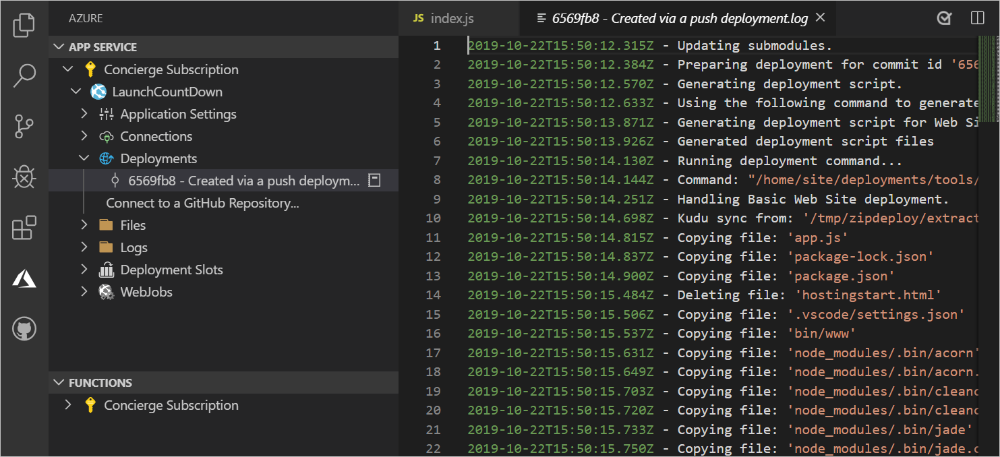

A busy website is rarely considered finished: instead code is updated regularly to fix issues and add new features. You can deploy new versions by using Visual Studio Code and manage them by using deployment slots.

Suppose you've been making updates to your launch countdown website that will promote your new video game. You want to deploy these changes to Azure and test them. Then, if the new code passes the tests, you want to move it into the production website.

In this unit, you'll learn how to deploy new versions and roll back a version in the event of failures.

## Push updates with Visual Studio Code

To deploy a new version of your code to an existing webapp in the Azure App service, right-click on it in the Code Azure explorer window and then select **Deploy to Web App**. This operation overwrites the previous version of the app:

In the Azure explorer, you can also see a list of deployments for your webapp under the **Deployments** node. For each log you can view the deployment log, which shows all the steps that Code took to deploy and run your webapp:

If you right-click on any deployment in the list, you can choose **Redeploy**. This technique is a good way to roll back to a previous version of the code in case any error arises with a new version. However, it requires the old code to be reuploaded so it can take time.

## Use deployment slots in the Azure App Service

You can separate testing, staging, and production environments by placing them in separate webapp instances within the App Service. In this configuration, when you have finished your testing and staging, a new deployment is required to move your code into the production site. It's also up to you to provide a mechanism to roll back the website to the previous version, if undetected bugs or problems arise with the new version.

You can use deployment slots to mitigate these issues. A deployment slot is a separate instance of a webapp, within the same App Service plan, with a different URL. Each webapp has a production slot, and you can create other slots for testing, staging, and other purposes. It's easy to swap the deployed code in one slot with another.

Suppose you have a production webapp that works well, but you have a new version ready to test, which implements a new feature. You can deploy this new version to a test slot, and run your suite of tests there. When you are ready to deploy, you can swap the code with the production slot, so that users see the new version and can use the new feature. Before the swap, Azure compiles and warms up the new version to ensure that there is no drop in performance. 

Notice that the original production webapp code is now swapped into the test slot. If a bug arises in the new version, it's easy to roll back to the previous webapp: you can swap the slots for a second time. Users can continue to use the old version without problems, albeit without the new feature. Unlike the **Redeploy** feature in Visual Studio Code, this swap doesn't involve reuploading the code and it often completes more quickly. 

> [!NOTE]
> Deployment slots are not supported in the Free or Shared service plan tiers.