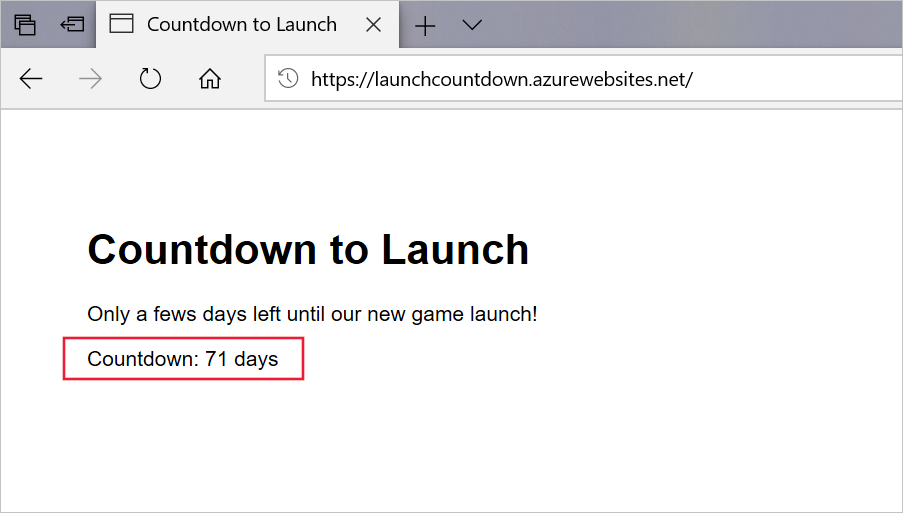

When you have changes to deploy to the webapp, you can use the same tools in Visual Studio Code.

Suppose you want to make an improvement to the proof-of-concept website: Instead of displaying the count down in milliseconds, you want to display it in days. You want to make this change and deploy it to Azure before you display the page to stakeholders.

In this unit, you'll modify the code and redeploy the website.

## Modify the code to calculate the countdown in days

Let's start by modifying the code, so that it calculates a whole number of days:

1. Start Visual Studio Code. 
1. To bring up the command palette, press CTRL + SHIFT + P.
1. Type **Terminal** and then select **View: Toggle Integrated Terminal**.
1. To open the **index.js** file, type this command:

    ``` PowerShell
    code ~/countdownExpressApp/routes/index.js
    ```

1. Locate this line of code:

    ``` JavaScript
    var numberOfMilliseconds = parseInt(launchTime - currentTime);
    ```

1. On the next line, type this new code:

    ``` JavaScript
    var numberOfDays = parseInt(numberOfMilliseconds/(24 * 3600 * 1000));
    ```

1. Locate this line of code:

    ``` JavaScript
    res.render('index', { title: 'Countdown to Launch', countDown: numberOfMilliseconds });
    ```

1. Replace that line with this line of code:

    ```JavaScript
    res.render('index', { title: 'Countdown to Launch', countDown: numberOfDays });
    ```

1. On the **File** menu, select **Save**, then close the **index.js** file.

## Modify the view to display the countdown in days

You must also alter the view slightly:

1. In Visual Studio Code, in the integrated terminal, type this command:

    ``` PowerShell
    code ~/countdownExpressApp/views/index.jade
    ```

1. Locate this line of code:

    ```jade
    p Countdown: #{countDown} milliseconds
    ```

1. Replace that line with this line of code:

    ```jade
    p Countdown: #{countDown} days
    ```

1. On the **File** menu, select **Save**, then close the **index.jade** file.

## Publish the new version

Your changes are complete. Let's deploy the finished website to Azure:

1. In Visual Studio Code, in the **Azure** Explorer, right-click the webapp you created, and then select **Deploy to Web App**.
1. Select the **countdownExpressApp** folder, and then select **Deploy**.
1. When the deployment is complete, select **Browse Website**, and then select **Open Link**. Then Azure website is displayed in your browser. Notice that the countdown is now displayed in days.

    
