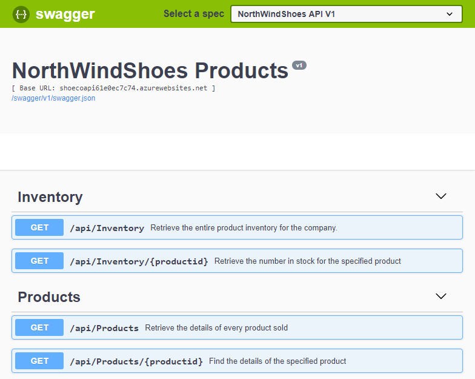

To share an API, you must first configure an API gateway.

In the shoe company example, NorthWind Shoes have decided to share an inventory API with partners. This API enables partners to access inventory and product information. 

Here, you'll create an API gateway to publish an inventory app that exposes an OpenAPI endpoint.

## Deploy the ShoeCompany Web API
You have developed a .NET Core app that generates inventory and product information. The app includes Swashbuckle to generate OpenAPI Swagger documentation.

To save time, let's start by running a script to host our RESTful API in Azure. The script performs the following steps:

- Create an Azure App Service plan in the free tier
- Create a Web API within an Azure App Service, configured for Git deployment from a local repo
- Set account-level deployment credentials for our app
- Configure Git locally
- Deploy our Web API to our App Service instance

1. Run the following git clone command in the Cloud Shell to clone the repo that contains the source for our app, as well as our setup script from GitHub.

    ```bash
    git clone https://github.com/MicrosoftDocs/mslearn-publish-manage-apis-with-azure-api-management.git
    ```

2. Navigate into the repo folder locally by running the following cd command.

    ```bash
    cd mslearn-publish-manage-apis-with-azure-api-management
    ```

3. As its name suggests, setup.sh is the script we'll run to create our test API. This will generate a public web app that exposes an OpenAPI interface

    ```bash
    bash setup.sh
    ```

The script takes about a minute to run. When the script finishes, it will display two URLs that you can use to test the app deployment. Observe that during deployment, all dependencies needed for our app to run are automatically installed on the remote App Service.

4. To test that our app deployed correctly, firstly copy and paste the first URL from the Cloud Shell output into your favorite browser. The browser should display the swagger UI for our app and declare the following RESTful endpoints

    - **api/inventory**, which generates a list of products and the number in stock
    - **api/inventory/{productid}**, which returns the number in stock for the specified productid (an integer) 
    - **api/Products**, which generates a list of products
    - **api/Products/{productid}**, which returns the details for the specified productid



Finally, copy the last URL from the Cloud Shell output, this is the swagger JSON URL, you will need this in the next exercise

## Deploy an API gateway
The final step in this exercise is to create an API gateway in the Azure portal. In the next exercise, you'll use this gateway to publish your API.

1. Sign into the [Azure portal](https://portal.azure.com/learn.docs.microsoft.com?azure-portal=true) using the same account you activated the sandbox with.

1. On the Azure portal menu or from the **Home** page, select **+ Create a resource**.

1. Click **Integration**, and then click **API management**.

1. In the **API Management service** page, enter the following details: 

   Field | Details
   --- | ---
   **Name** | `apim-NorthWindShoes<random number>`; the random number is to ensure that the name is globally unique.
   **Subscription** | Concierge Subscription
   **Resource group** | Select the existing resource group **<rgn>[sandbox resource group name]</rgn>**
   **Location** | Select from one of the following: North Central US, West US, West Europe, North Europe, Southeast Asia, and Australia East. The Consumption tier used in this exercise is only available in these regions.
   **Organization Name** | `NorthWindShoes`. This name is used to identify your resources in the developer portal.
   **Administrator Email** | This address is used for system notifications, and defaults to your Azure account email address.
   **Pricing Tier** | `Consumption (preview)`.

   > [!NOTE]
   > Note: You're using the consumption plan because it is much faster to create whilst testing. The overall experience is very similar to the other pricing tiers.

1. Click **Create**.

1. Deployment may take several minutes. You'll get a message to your specified email address when the deployment has completed. You'll also see the gateway listed in Azure resources.