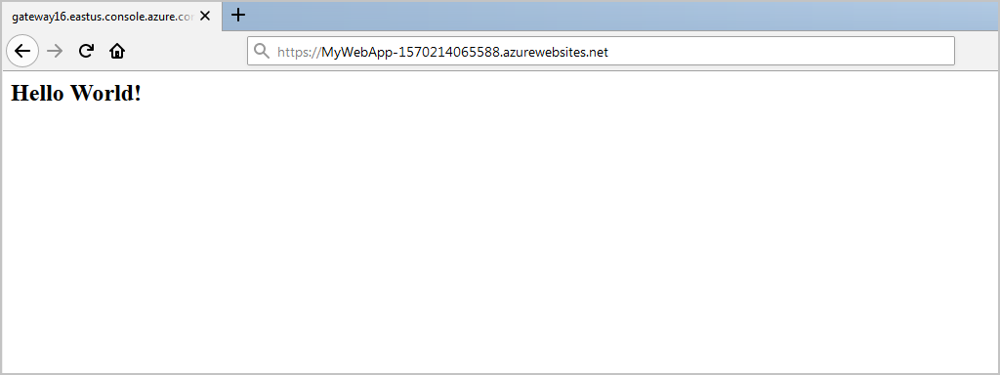

In the preceding unit, you learned how the Maven Plugin for Azure App Service provides makes it easy for Java developers to automate the build and deployment of their web apps to Azure. Once you've created your web app tested it locally, your next step is to deploy it to Azure App Service.

In this exercise, you'll add the `azure-webapp-maven-plugin` plugin to your project and configure the requisite settings to deploy your app to Azure App Service. After you've successfully deployed your web app to Azure, you'll test your web app running on Azure App Service.

## Add the `azure-webapp-maven-plugin` plugin to your project

1. Use `code` to edit the `pom.xml` file.

    ```bash
    cd ~/MyWebApp
    code pom.xml
    ```

1. Add the `azure-webapp-maven-plugin` plugin XML inside the closing `</plugins>` tag.

    ```xml
    <plugin>
      <groupId>com.microsoft.azure</groupId>
      <artifactId>azure-webapp-maven-plugin</artifactId>
      <version>1.9.0</version>
    </plugin>
    ```

1. The `<build>` section of your `pom.xml` file should resemble the following example.

    ```xml
    <build>
      <finalName>MyWebApp</finalName>
      <plugins>
        <plugin>
          <groupId>org.apache.tomcat.maven</groupId>
          <artifactId>tomcat7-maven-plugin</artifactId>
          <version>2.2</version>
          <configuration>
            <!-- http port needed in the sandbox is 8000 -->
            <port>8000</port>
          </configuration>
        </plugin>
        <plugin>
          <groupId>com.microsoft.azure</groupId>
          <artifactId>azure-webapp-maven-plugin</artifactId>
          <version>1.9.0</version>
        </plugin>
      </plugins>
    </build>
    ```

1. Save your changes by typing <kbd>Ctrl</kbd>+<kbd>S</kbd>.

1. Quit the code editor by typing <kbd>Ctrl</kbd>+<kbd>Q</kbd>.

## Configure the App Service for your project

1. Use the `azure-webapp-maven-plugin` to add configuration settings interactively to your Maven `pom.xml` file:

    ```bash
    mvn azure-webapp:config
    ```

    Enter the following values for each of the interactive prompts:

    | Prompt | Value |
    |---|---|
    | **Define value for OS** | _Enter the corresponding number for **Linux**_ |
    | **Define value for javaVersion** | _Enter the corresponding number for **Java 8**_ |
    | **Define value for runtimeStack** | _Enter the corresponding number for **TOMCAT 8.5**_ |
    | **Confirm (Y/N)** | _Enter **Y**_ |

    The plugin will add the appropriate settings that reflect your choices to your `pom.xml` file.

1. For this exercise, you'll need to determine the name and location of the resource group for your sandbox. To do so, use the following command.

    ```azurecli
    az group list --query [0].name
    az group list --query [0].location
    ```

    Copy these values for use later in this exercise.

1. Use the `azure-webapp-maven-plugin` again to configure additional settings interactively to your Maven `pom.xml` file:

    ```bash
    mvn azure-webapp:config
    ```

    Enter the following values for each of the interactive prompts:

    | Prompt | Value |
    |---|---|
    | **Please choose which part to config** | _Enter the corresponding number to configure the **Application**_ |
    | **Define value for appName** | _Accept the default_ |
    | **Define value for resourceGroup** | _Enter the **name** of the resource group that you copied earlier (which should be **<rgn>[sandbox resource group name]</rgn>**)_ |
    | **Define value for region** | _Enter the **location** for the resource group that you copied earlier_ |
    | **Define value for pricingTier** | _Enter the corresponding number for the **f1** tier_ |
    | **Confirm (Y/N)** | _Enter **Y**_ |

    The plugin will update the settings in your `pom.xml` file.

## Deploy and test the web app

1. Use Maven to build and deploy your web app to Azure App Service.

    ```bash
    mvn azure-webapp:deploy
    ```

    Maven displays a series of build messages, and the final message should indicate successful deployment to Azure.

    ```console
    [INFO] Successfully deployed the artifact to https://MyWebApp-1570214065588.azurewebsites.net
    [INFO] ------------------------------------------------------------------------
    [INFO] BUILD SUCCESS
    [INFO] ------------------------------------------------------------------------
    [INFO] Total time: 01:43 min
    [INFO] Finished at: 2020-02-12T21:12:00+00:00
    [INFO] Final Memory: 49M/347M
    [INFO] ------------------------------------------------------------------------
    ```

1. Visit the deployed app by selecting the URL in the shell.

    

In the next exercise, you'll update your web app and redeploy it to Azure App Service.
