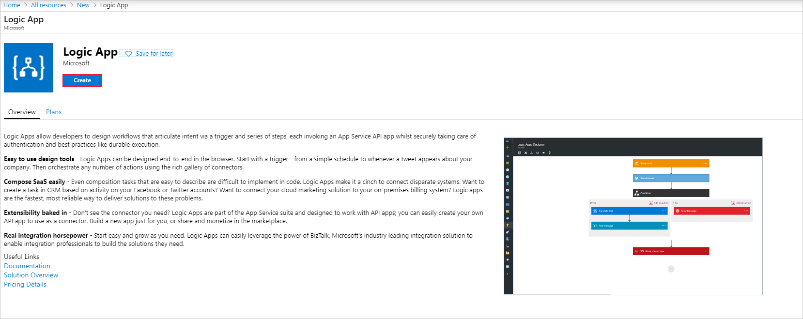

You want to ensure that administrators are notified about configuration changes to virtual machines. These notifications are essential to ensure that the virtual machines remain compliant with regulatory requirements.

Here, you'll learn how Azure Event Grid helps to achieve the required event handling.

## What is Event Grid?

Event Grid aggregates all your events and provides routing from any source to any destination. Event Grid is a service that manages the routing and delivery of events from many sources and subscribers. This process eliminates the need for polling, and results in minimized cost and latency.

Event publishers and subscribers are decoupled by using the publisher/subscriber pattern.

## Capabilities

Event Grid doesn't require provisioning or managing. It's native to Azure, with the ability to be extended and customized. Some of the main advantages are:

- **It's simple.** Point and click in the Azure portal to add and collect your events from Azure resources.
- **It can filter events.** Filter events so that handlers receive only relevant events.
- **It supports multiple subscribers.** Attach multiple handlers to a single event from a single source.
- **It's reliable.** Take advantage of 24-hour retries to ensure events are delivered.
- **Its throughput is high.** Handle a high volume of events, in the range of millions per second.
- **It has built-in events.** Use built-in events to get started quickly and easily.
- **It supports custom events.** Use Event Grid to reliably deliver events for your custom components.

## Event sources and event handlers

Azure offers many event sources or publishers. For example, Azure Storage is the event source for blob-created events.

Sources can be configured from anywhere, and include on-premises custom applications or virtual machines within your Azure account. A source allows a single mechanism for event management through all your systems, whether they're in an on-premises datacenter or with other cloud providers.

There are event handlers for many services in Azure, and more are being added all the time. You can also use a *webhook handler* to call a custom endpoint outside Azure.

Some examples of event handlers within Azure are:

- Azure Functions
- Azure Logic Apps
- Azure Automation
- Azure Event Hubs
- Azure Service Bus

## Topics and event subscriptions

Topics provide the core mechanism for managing the various events being raised throughout your system's life cycle. Think of them as subject areas that define the topic of a conversation. You can create as many topics as you need in Event Grid to provide the granularity required to manage events in your system.

When the topics have been defined, you can subscribe to them. Subscriptions convey which events on a topic you're interested in receiving. These events can then be filtered by type or subject.

## Subscribe to events

To understand how an event handler subscribes to events, you can create a subscriber. You can use the Azure Logic Apps service as an example subscriber. A logic app is a way of scheduling or orchestrating tasks. It's a solution that you use to orchestrate a set of jobs when a trigger is run.

1. Open your web app in the Azure portal.
1. Select the **Add Resource** page.
1. Select **Add** and search for **Logic App**.
1. Select **Create**.

    

1. Name the logic app.

    

1. Select the **When an Event Grid resource event occurs** tile.

    

## Configure connectors and triggers

Now that you have an event handler that deals with an event, you can configure the connectors and triggers associated to it. You can configure the Event Grid connector on the logic app to look for any events of a certain topic. The following screenshot shows the configuration options available on an Event Grid connector. When an event that contains this topic is created, it will trigger the logic app through the Event Grid connector.

