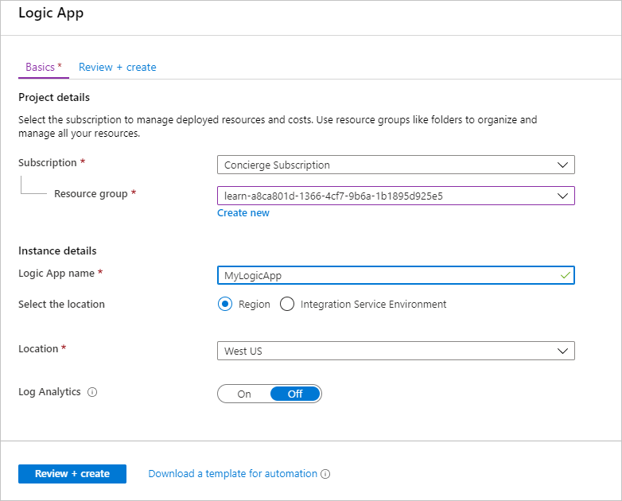

Organizations often need to handle many different types of events within their system and provide notification or other automated triggers that can handle the repsonse to these events

Suppose you're trying to create an event for any kind of change to your Virtual Machines, in order to understand the changes that are being performed and analyse the impact.

Here you'll learn how Event Grid helps in achieving the required event handling

## What is Event Grid

Event Grid aggregates all your events and provides routing from any source to any destination. At its simplest view, Event Grid is an event routing service that manages the routing and delivery of events from numerous sources and subscribers. This eliminates the need for polling and results in minimised cost and latency.

Event publishers and subscribers are decoupled by using the publisher/subscriber pattern.

<!--https://docs.microsoft.com/en-us/archive/msdn-magazine/2018/february/azure-event-driven-architecture-in-the-cloud-with-azure-event-grid-->

## Capabilities

Event Grid doesn't require provisioning or managing, it is native to Azure, with the ability to extend out and customise. 

## Event sources and Event handlers

There are many event sources or publishers within azure, for example, Azure Storage is the event source for blob created events.

Sources can be configured from anywhere, they can be on-premise custom applications or Virtual Machines within your Azure account. This allows a single mechanism for event management through all your systems whether on-premise, datacenter or other cloud providers. 

Event handlers have now been created for many services in azure and more are being added all the time. You can also use the WebHooks handler to call a custom endpoint outside of azure.

> [!IMPORTANT]
> Currently only https calls are allowed from WebHooks

Some examples of event handlers within Azure are:

- Azure Functions
- Logic Apps
- Azure automation
- Event Hubs
- Service bus

## Topics and event subscriptions

Topics provide the core mechanism for managing the various events being raised throughout your systems lifecycle. You can think of them as subject areas that define the topic of a conversation. You are able to create as many topics as you need in Event Grid in order to provide the granularity required to manage the events within your system.

Once the topics have been defined, you are then able to subscribe to these topics. Subscriptions convey which events on a topic you are interested in receiving. These can then be filtered by type or subject.

## Create a Logic App

In order to understand how an event handler subscribes to events, you need to create a subscriber. You can use a Logic App as an example subscriber. A Logic App is a way of scheduling or orchestrating tasks. It is a common solution used when orchestrating a set of jobs when a trigger is run.

1. Open your web app in the Azure portal.
1. Select the **Add Resource** page. 
1. Select **Add** and search for **Logic App**.
1. Click **Create**

1. Name the Logic App.

1. Select the **When an event grid resource event occurs** tile

## Configure connectors and triggers

Now that you have an event handler capable of dealing with an event, you can configure the connectors and triggers associated to it. The simplest way to connect is to configure the Event Grid connector on the Logic App to look for any events of a certain Topic. The screenshot below shoes the configuration options available on an Event Grid connector. When an event containing this topic is created it will trigger the Logic App through the Event Grid connector

