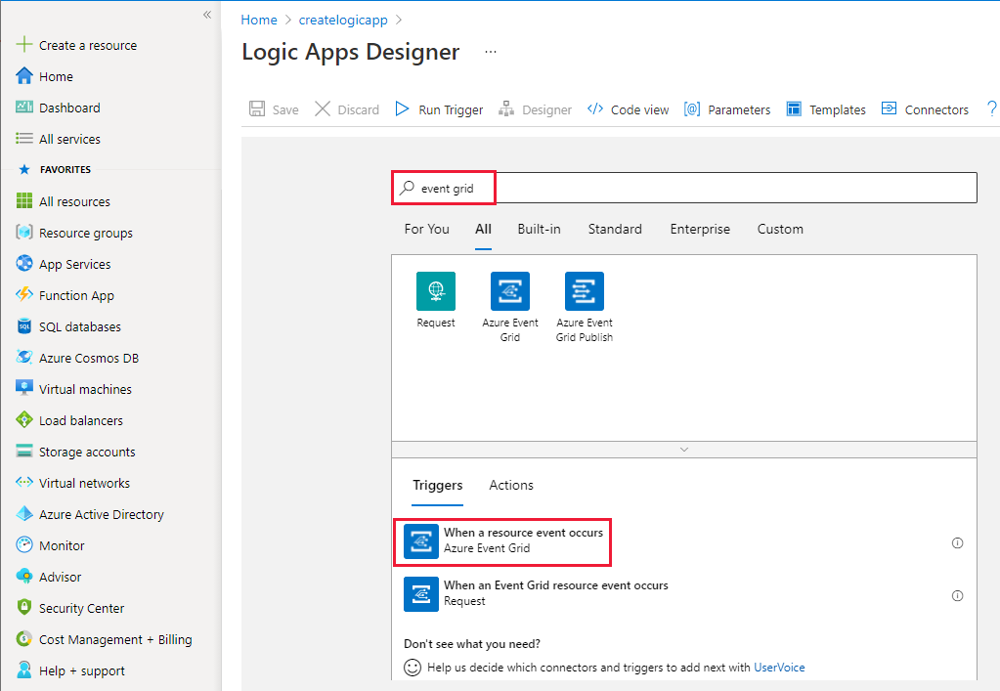

Suppose you've chosen to use Azure Event Grid to provide the mechanism to alert you when a virtual machine change is triggered. 

Here you'll set up a Virtual Machine and create a Logic App with an Event Grid trigger that will respond to the events produced by the Virtual Machine.

[!INCLUDE [Activate the sandbox](../../../includes/azure-sandbox-activate.md)]

[!INCLUDE [Select an Azure region](../../../includes/azure-sandbox-regions-first-mention-note-friendly.md)]

## Create a Virtual Machine

Start by creating a new Virtual Machine in the Azure portal:

1. Sign in to the [Azure portal](https://portal.azure.com/learn.docs.microsoft.com?azure-portal=true) by using the account that you used to activate the sandbox.
1. Select **Create a resource**.
1. Select **Compute** > **Virtual Machine**.
1. Fill out the wizard like this:

    | Field                | Value                                                    |
    |----------------------|----------------------------------------------------------|
    | **Subscription**     | Concierge Subscription                                   |
    | **Resource Group**   | Select <rgn>[Sandbox resource group]</rgn> from the menu |
    | **Name**             | *Enter a unique name*                                    |   
    | **Region**           | *Select a region*                                        |
    | **Availability options** | *Leave default*                                      |
    | **Image**            | Windows Server 2019 Datacenter                         |
    | **Size**             | *Leave default*                                          |
    | **Username**         | *Enter any username*                                     |
    | **Password**         | *A strong password at least 12 characters*               |
    | **Public inbound ports**  | *Leave default*                                     |
    | **Select inbound ports**  | HTTP (80) and RDP (3389)                            |

1. Select **Review and create**, then select **Create** on the resulting page. Wait while Azure creates the virtual machine.

## Create a Logic App

The next step is to create the Logic App that will run when a virtual machine change is detected.
You will achieve this by creating a blank Logic App

1. Select **Create a resource**.
1. Select **Integration** > **Logic App**.
1. Provide information about your Logic App

        | Field                | Value                                                    |
        |----------------------|----------------------------------------------------------|
        | **Name**             | *Enter a unique name*                                    | 
        | **Subscription**     | Concierge Subscription                                   |
        | **Resource Group**   | Select <rgn>[Sandbox resource group]</rgn> from the menu |          
        | **Location**         | *Select a region*                                        |

1. Click **Create**

## Configure the Logic App 

At this point, the Logic App and the Virtual Machine have been created. You will now configure the LogicApp so that triggers can  be added

1. Select **All Resources**
1. Click the Logic App created in the previous step
1. Under **Templates**, select **Blank Logic App**

You now have a LogicApp ready for triggers and connectors to be added

## Add an EventGrid Trigger

Whilst still in the LogicApp from the previous step, you will now add an EventGrid trigger that will handle the eventing mechanism

1. Within the designer, use the search box, enter event grid as your filter. From the triggers list, select the **When a resource event occurs trigger**

    

1. When prompted, sign in to the Event Grid using your Azure account credentials
1. You will now subscribe your Logic app to publisher events

    

        | Field                | Value                                                    |
        |----------------------|----------------------------------------------------------| 
        | **Subscription**     | Concierge Subscription                                   |
        | **Resource Group**   | Select `Microsoft.Resources.ResourceGroups` from the menu |          
        | **Resource Name**    | *Select the default resource group*                      |
        | **Event Type Item - 1**    | Select `Microsoft.Resources.ResourceActionSuccess` |
        | **Event Type Item - 2**    | Select `Microsoft.Resources.ResourceDeleteSuccess` |
        | **Event Type Item - 3**    | Select `Microsoft.Resources.ResourceWriteSuccess` |

1. Click **Save**

    

Your Logic App is now ready and is setup to be a subscriber to the events from EventGrid.
