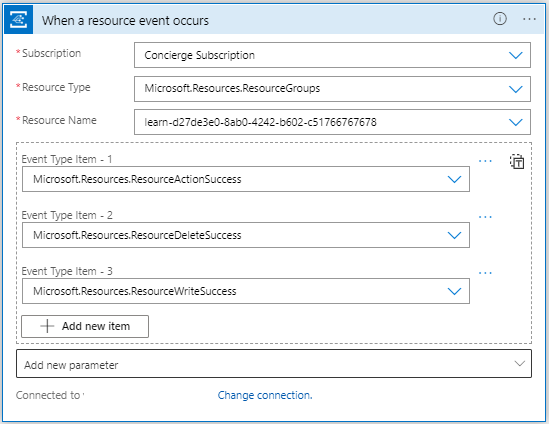

One easy way to use Azure Event Grid is to include it in a logic app.

Suppose you've chosen to use Event Grid to alert your administrators when a virtual machine is reconfigured. 

Here, you'll set up a virtual machine and create a logic app with an Event Grid trigger that responds to the events produced by the virtual machine.

## Create a virtual machine

Let's start by creating a new virtual machine in the Azure portal.

1. Sign in to the [Azure portal](https://portal.azure.com/learn.docs.microsoft.com?azure-portal=true) with the account that you used to activate the sandbox.

1. Select **Create a resource**.

1. In the left menu pane, select **Compute**, and then select **Virtual machine**. The **Create a virtual machine** pane appears.

1. On the **Basics** tab, enter the following values for each setting.

    | Setting | Value |
    | --- | --- |
    | **Project details** |
    | Subscription | Concierge subscription |
    | Resource group  | From the dropdown list, <rgn>[sandbox resource group]</rgn> |
    | **Instance details** |
    | Virtual machine name | vm1 |
    | Region | Select a region near you |
    | Availability options | No infrastructure redundancy required |
    | Image | Windows Server 2019 Datacenter - Gen1 |
    | Azure Spot instance | No checkmark |
    | Size | Standard DS1 v2 |
    | **Administrator account** |
    | Username | vmadmin |
    | Password | Enter a complex password |
    | **Inbound port rules** |
    | Public inbound ports | None |

1. Select **Review and create**, and after validation passes, select **Create**.

## Create a logic app

The next step is to create the logic app that will run when a virtual machine change is detected. Let's create a blank logic app.

1. From the **Home** page, select **Create a resource**.

1. In the left menu pane, select **Integration**, search for and select **Logic App**, and then select **Create**. The **Create a logic app** page appears.

1. On the **Basics** tab, enter the following values for each setting.

    | Setting | Value |
    | --- | --- |
    | **Project details** |
    | Subscription | Concierge subscription |
    | Resource group | From the dropdown list, select **<rgn>[sandbox resource group]</rgn>** |
    | **Instance details** |
    | Logic app name | Enter a name |
    | Region | Select a region near you |
    | Enable log analytics | Off (unchecked) |

1. Select **Review + create**, and then select **Create**.

## Add an Event Grid trigger to the logic app

After your logic app is created, you add triggers for Event Grid events.

1. After your deployment successfully completes, select **Go to resource**. The **Logic Apps Designer** pane appears.

1. Under **Templates**, select **Blank Logic App**.

    

1. Within the designer, in the search box, enter **Event Grid** as your filter. From the list of triggers, select **When a resource event occurs**.

    

1. When you're prompted, sign in to the **Microsoft Learn Sandbox** organization by using your Azure account credentials.

1. Enter these values to subscribe your logic app to publisher events.

    | Field | Value |
    | --- | --- |
    | **Subscription** | Concierge Subscription |
    | **Resource Type** | `Microsoft.Resources.ResourceGroups` |
    | **Resource Name** | <rgn>[sandbox resource group]</rgn> |
    | **Event Type Item - 1** | `Microsoft.Resources.ResourceActionSuccess`, and then select **Add new item** |
    | **Event Type Item - 2** | `Microsoft.Resources.ResourceDeleteSuccess`, and then select **Add new item** |
    | **Event Type Item - 3** | `Microsoft.Resources.ResourceWriteSuccess` |
    | | |

    

1. On the top menu bar, select **Save**.

    

Your logic app is now ready and set up to be a subscriber to the events from Azure Event Grid.
